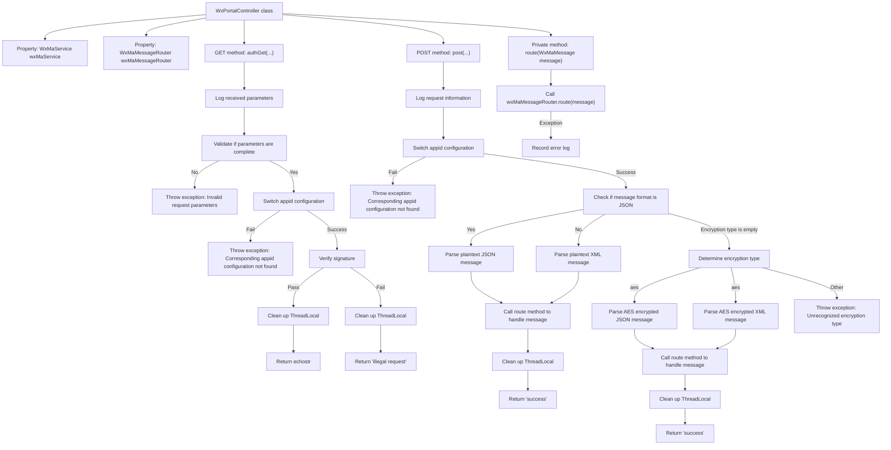

# Basic Information

|      |      |
|------|------|
| Name | WxPortalController |
| Language | .java |
| Code Path | weixin-java-miniapp-demo/src/main/java/com/github/binarywang/demo/wx/miniapp/controller/WxPortalController.java |
| Package Name | com.github.binarywang.demo.wx.miniapp.controller |
| Dependencies | ['cn.binarywang.wx.miniapp.api.WxMaService', 'cn.binarywang.wx.miniapp.bean.WxMaMessage', 'cn.binarywang.wx.miniapp.constant.WxMaConstants', 'cn.binarywang.wx.miniapp.message.WxMaMessageRouter', 'cn.binarywang.wx.miniapp.util.WxMaConfigHolder', 'lombok.AllArgsConstructor', 'lombok.extern.slf4j.Slf4j', 'org.apache.commons.lang3.StringUtils', 'org.springframework.web.bind.annotation', 'java.util.Objects'] |
| Brief Description | This controller is used to handle GET and POST requests from WeChat Mini Programs, implementing server verification and message decryption routing functions. |

# Description

This controller is used to handle WeChat Mini Program access verification and message reception. It completes server validity verification through GET requests, returning echostr to confirm the request is legitimate; POST requests receive and parse messages pushed by WeChat, supporting both plaintext and AES encryption transmission methods. It automatically switches between JSON or XML format parsing based on configuration, and routes messages to specified processors. All operations will be logged and thread context resources will be cleaned up.

# Class Summary

| Name   | Type  | Description |
|-------|------|-------------|
| WxPortalController | class | This controller is used to handle GET and POST requests from WeChat Mini Programs, implementing server verification and message routing. The GET method is used for access verification, while the POST method is used to receive and parse messages sent by users (supporting both plaintext and AES encryption). It automatically switches to the corresponding appid based on configuration and processes messages, ultimately returning success or error information. Request details are logged, and thread-local variables are cleaned up after processing is complete. |

## Class WxPortalController

|      |      |
|------|------|
| Access Modifier | @RestController;@AllArgsConstructor;@RequestMapping("/wx/portal/{appid}");@Slf4j;public |
| Type | class |
| Name | WxPortalController |
| Description | This controller is used to handle GET and POST requests from WeChat Mini Programs, implementing server verification and message routing. The GET method is used for access verification, while the POST method is used to receive and parse messages sent by users (supporting both plaintext and AES encryption). It automatically switches to the corresponding appid based on configuration and processes messages, ultimately returning success or error information. Request details are logged, and thread-local variables are cleaned up after processing is complete. |

### UML Class Diagram

```mermaid
classDiagram
    class WxPortalController {
        -WxMaService wxMaService
        -WxMaMessageRouter wxMaMessageRouter
        +authGet(String appid, String signature, String timestamp, String nonce, String echostr) String
        +post(String appid, String requestBody, String msgSignature, String encryptType, String signature, String timestamp, String nonce) String
        -route(WxMaMessage message) void
    }

    class WxMaService {
        <<Interface>>
        +switchover(String appid) boolean
        +checkSignature(String timestamp, String nonce, String signature) boolean
        +getWxMaConfig() WxMaConfig
    }

    class WxMaMessageRouter {
        <<Interface>>
        +route(WxMaMessage message) void
    }

    class WxMaMessage {
        <<Interface>>
        +fromJson(String json) WxMaMessage
        +fromXml(String xml) WxMaMessage
        +fromEncryptedJson(String json, WxMaConfig config) WxMaMessage
        +fromEncryptedXml(String xml, WxMaConfig config, String timestamp, String nonce, String msgSignature) WxMaMessage
    }

    class WxMaConfig {
        <<Interface>>
        +getMsgDataFormat() String
    }

    class WxMaConstants {
        <<Interface>>
        +MsgDataFormat JSON
    }

    class WxMaConfigHolder {
        <<Interface>>
        +remove() void
    }

    class StringUtils {
        <<Interface>>
        +isAnyBlank(String... strings) boolean
        +isBlank(String string) boolean
    }

    class Objects {
        <<Interface>>
        +equals(Object a, Object b) boolean
    }

    class RequestParam {
        <<Interface>>
    }

    class PathVariable {
        <<Interface>>
    }

    class RestController {
        <<Interface>>
    }

    class RequestMapping {
        <<Interface>>
    }

    class GetMapping {
        <<Interface>>
    }

    class PostMapping {
        <<Interface>>
    }

    class RequestBody {
        <<Interface>>
    }

    class Slf4j {
        <<Interface>>
    }

    class AllArgsConstructor {
        <<Interface>>
    }

    WxPortalController --> WxMaService : Dependency
    WxPortalController --> WxMaMessageRouter : Dependency
    WxPortalController --> WxMaMessage : Dependency
    WxPortalController --> WxMaConfigHolder : Dependency
    WxPortalController --> StringUtils : Dependency
    WxPortalController --> Objects : Dependency
    WxPortalController --> WxMaConstants : Dependency
    WxMaMessage --> WxMaConfig : Dependency
```

This class diagram illustrates the structure of the WeChat Mini Program portal controller `WxPortalController` and its interaction with other key components. It uses dependency injection to utilize the service interface `WxMaService` and message routing interface `WxMaMessageRouter`, and handles authentication and message push requests from the WeChat server. Additionally, it involves multiple utility classes and constant definitions to support signature verification, encryption/decryption, and message parsing functionalities.

### Internal Method Call Graph

This flowchart illustrates the core logic of WeChat Official Account access authentication and message receiving processing. The controller divides into two processing paths based on the request method: GET and POST, which separately complete signature verification and message decryption/parsing, and then route to specific handlers via routing distribution. It covers both plaintext and encrypted transmission modes while emphasizing cleanup work for thread context.

### Field List

| Name  | Type  | Description |
|-------|-------|------|
| wxMaMessageRouter | WxMaMessageRouter | This is a private constant instance of a WeChat Mini Program message router, used to handle and route message requests for WeChat Mini Programs. |
| wxMaService | WxMaService | This is a private constant field declaration for a WeChat Mini Program service interface, used to provide WeChat Mini Program related function calls within the class. |

### Method List

| Name  | Type  | Description |
|-------|-------|------|
| route | void | This method is used to route WeChat Mini Program messages, processing incoming messages through wxMaMessageRouter. If an exception occurs during processing, an error log will be recorded. |
| post | String | This interface handles WeChat Mini Program message push notifications, supporting both plaintext and AES encryption transmission methods. It parses and routes messages based on their format (JSON or XML), ensuring thread safety. |
| authGet | String | This interface is used to handle GET authentication requests from the WeChat server, verify the legitimacy of the signature, and return the echostr or error information. |

