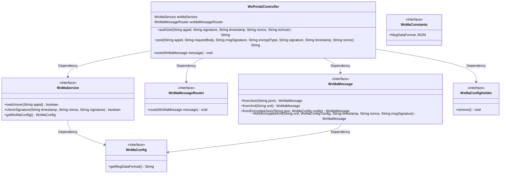
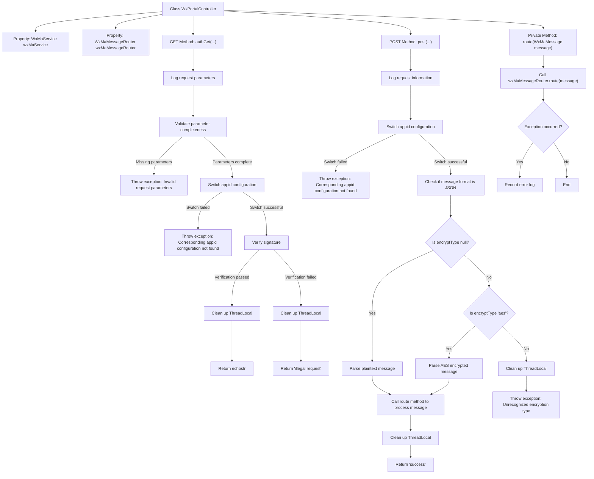

# Basic Information

|      |      |
|------|------|
| Name | WxPortalController |
| Language | .java |
| Code Path | weixin-java-miniapp-demo/src/main/java/com/github/binarywang/demo/wx/miniapp/controller/WxPortalController.java |
| Package Name | com.github.binarywang.demo.wx.miniapp.controller |
| Dependencies | ['cn.binarywang.wx.miniapp.api.WxMaService', 'cn.binarywang.wx.miniapp.bean.WxMaMessage', 'cn.binarywang.wx.miniapp.constant.WxMaConstants', 'cn.binarywang.wx.miniapp.message.WxMaMessageRouter', 'cn.binarywang.wx.miniapp.util.WxMaConfigHolder', 'lombok.AllArgsConstructor', 'lombok.extern.slf4j.Slf4j', 'org.apache.commons.lang3.StringUtils', 'org.springframework.web.bind.annotation', 'java.util.Objects'] |
| Brief Description | This controller is used to handle GET and POST requests from WeChat Mini Programs, supporting message signature verification, decryption, and routing processing. The GET method is used for server authentication, while the POST method is used to receive and parse user messages. It supports both plaintext and AES encryption transmission methods, and automatically switches between JSON or XML format data processing based on configuration. |

# Description

This controller is used to handle WeChat Mini Program access authentication and message push. Server validity verification is completed through GET requests, returning echostr to confirm the legitimacy of the request; POST requests receive and parse messages sent by users, supporting both plaintext and AES encryption methods. It automatically switches between JSON or XML format parsing based on configuration, and routes messages to designated processors. All operations verify appid legitimacy to ensure security.

# Class Summary

| Name   | Type  | Description |
|-------|------|-------------|
| WxPortalController | class | This controller is used to handle GET and POST requests from WeChat Mini Programs, implementing server verification and message receiving functions. The GET method is used to verify signatures and return echostr, while the POST method parses plaintext or AES-encrypted message content and distributes processing through routing. It supports JSON and XML format data, ensures thread safety, and cleans up context. |

## Class WxPortalController

|      |      |
|------|------|
| Access Modifier | @RestController;@AllArgsConstructor;@RequestMapping("/wx/portal/{appid}");@Slf4j;public |
| Type | class |
| Name | WxPortalController |
| Description | This controller is used to handle GET and POST requests from WeChat Mini Programs, implementing server verification and message receiving functions. The GET method is used to verify signatures and return echostr, while the POST method parses plaintext or AES-encrypted message content and distributes processing through routing. It supports JSON and XML format data, ensures thread safety, and cleans up context. |

### UML Class Diagram

This class diagram shows the structure of the WeChat Mini Program portal controller `WxPortalController` and its related dependencies. It handles GET and POST requests through interface calls, completing functions such as signature verification, message parsing, and routing forwarding. It also depends on multiple WeChat Mini Program service interfaces and configuration classes to implement a complete business logic processing flow.

### Internal Method Call Graph

This flowchart illustrates the main logic of the WeChat public account access controller `WxPortalController`. It includes the GET request for server authentication and the POST request for receiving and processing user messages, covering key steps such as parameter validation, configuration switching, message decryption, and routing. ThreadLocal cleanup is performed at critical nodes to prevent memory leaks.

### Field List

| Name  | Type  | Description |
|-------|-------|------|
| wxMaMessageRouter | WxMaMessageRouter | This is a private constant instance of a WeChat Mini Program message router, used to handle and route message requests for WeChat Mini Programs. |
| wxMaService | WxMaService | This is a private constant field declaration for a WeChat Mini Program service interface, used to provide WeChat Mini Program related function calls within the class. |

### Method List

| Name  | Type  | Description |
|-------|-------|------|
| authGet | String | This interface is used to handle GET authentication requests from the WeChat server, verify the legitimacy of the signature, and return the echostr or error information. |
| post | String | This interface handles WeChat Mini Program message push notifications, supporting both plaintext and AES encryption transmission methods. It parses and routes messages based on their format (JSON or XML), ensures thread safety, and returns a successful response. |
| route | void | This method is used to route WeChat Mini Program messages, processing messages through wxMaMessageRouter, and logging error logs if exceptions occur during processing. |

