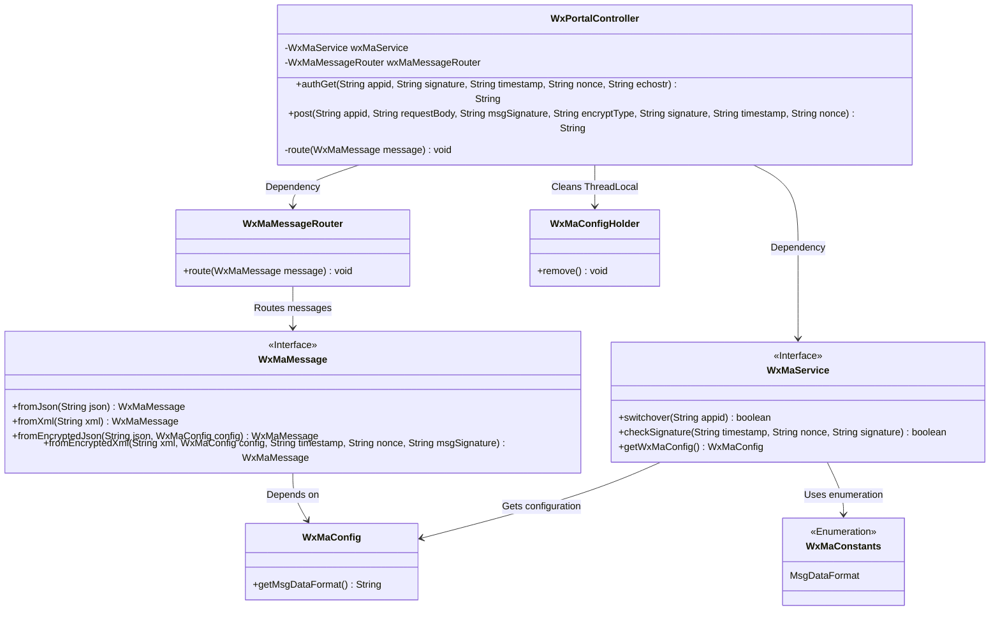
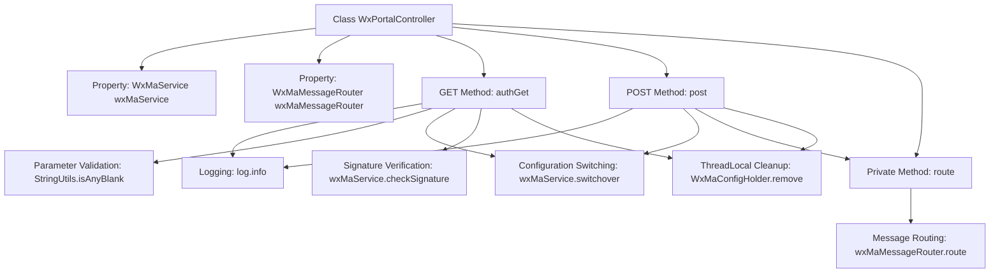
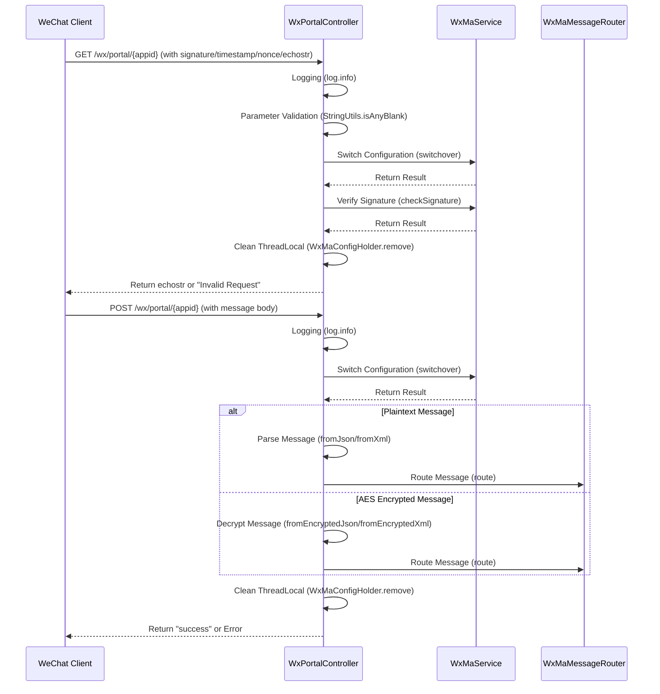

# Basic Information

|      |      |
|------|------|
| Name | WxPortalController |
| Language | .java |
| Code Path | weixin-java-miniapp-demo\src\main\java\com\github\binarywang\demo\wx\miniapp\controller\WxPortalController.java |
| Package Name | com.github.binarywang.demo.wx.miniapp.controller |
| Dependencies | ['cn.binarywang.wx.miniapp.api.WxMaService', 'cn.binarywang.wx.miniapp.bean.WxMaMessage', 'cn.binarywang.wx.miniapp.constant.WxMaConstants', 'cn.binarywang.wx.miniapp.message.WxMaMessageRouter', 'cn.binarywang.wx.miniapp.util.WxMaConfigHolder', 'lombok.AllArgsConstructor', 'lombok.extern.slf4j.Slf4j', 'org.apache.commons.lang3.StringUtils', 'org.springframework.web.bind.annotation', 'java.util.Objects'] |
| Brief Description | WeChat Mini Program Controller, handling authentication and message requests, verifying signatures and routing messages, supporting plaintext and AES encryption, and cleaning up ThreadLocal. |

# Description

This is a WeChat Mini Program portal controller class containing two core methods. The GET method handles WeChat server authentication requests, verifying signature parameters before returning the echostr string. The POST method processes WeChat messages, supporting both plaintext and AES-encrypted formats, routing them after parsing based on the message format, and finally returning a success response. Both methods validate appid validity and clear ThreadLocal-stored configuration information upon completion. The controller logs all request parameters and throws exceptions for illegal requests.

# Class Summary

| Name   | Type  | Description |
|-------|------|-------------|
| WxPortalController | class | WeChat Mini Program Controller, handling authentication and message requests, verifying signatures and routing messages, supporting plaintext and AES encryption, returning success or error messages. |

## Class WxPortalController

|      |      |
|------|------|
| Access Modifier | @RestController;@AllArgsConstructor;@RequestMapping("/wx/portal/{appid}");@Slf4j;public |
| Type | class |
| Name | WxPortalController |
| Description | WeChat Mini Program Controller, handling authentication and message requests, verifying signatures and routing messages, supporting plaintext and AES encryption, returning success or error messages. |

### UML Class Diagram

Class Diagram Description: This diagram illustrates the core structure of a WeChat Mini Program Portal Controller (WxPortalController), which depends on the WeChat Mini Program Service interface (WxMaService) and a Message Router (WxMaMessageRouter). The controller handles two types of HTTP requests: GET for authentication and POST for message processing. The system manages thread-local configurations through WxMaConfigHolder, supports both JSON and XML message formats, and implements two message processing methods: plaintext and AES encryption. The components interact through well-defined interfaces, demonstrating a clear layered design.

### Internal Method Call Graph

This code implements a WeChat Mini Program message processing controller, primarily containing two core methods: GET and POST. The GET method is used for WeChat server authentication verification, ensuring request legitimacy through signature parameter validation. The POST method handles various messages pushed by WeChat, supporting both plaintext and AES encrypted formats, and distributes messages to corresponding handlers via a routing mechanism. The entire process strictly adheres to WeChat development specifications, incorporating comprehensive logging, parameter validation, configuration switching, and resource cleanup mechanisms, demonstrating a highly reliable message processing architecture.

### Field List

| Name  | Type  | Description |
|-------|-------|------|
| wxMaMessageRouter | WxMaMessageRouter | Private immutable instance of the WeChat Mini Program message router. |
| wxMaService | WxMaService | WeChat Mini Program service instance, private and immutable. |

### Method List

| Name  | Type  | Description |
|-------|-------|------|
| post | String | POST interface for handling WeChat requests, supporting plaintext and AES-encrypted messages. After verifying the appid, it parses and routes messages based on the format (JSON/XML), then cleans up ThreadLocal and returns success or error. |
| route | void | The method `route` receives a `WxMaMessage` message, calls `wxMaMessageRouter.route` for processing, and logs an error log in case of an exception. |
| authGet | String | Process WeChat authentication requests, verify signature parameters, return echostr or error messages. Check the validity of appid and parameters, and clean up ThreadLocal. |

