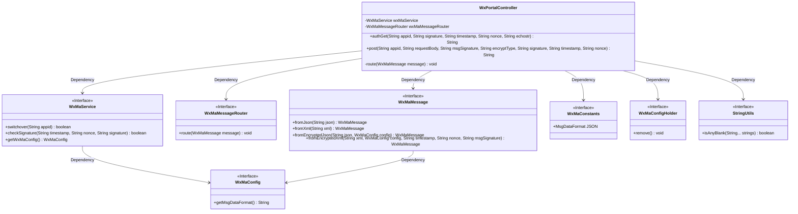
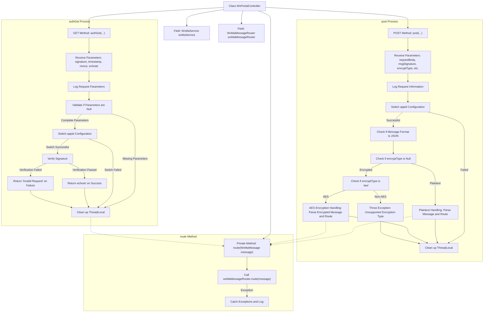

# Basic Information

|      |      |
|------|------|
| Name | WxPortalController |
| Language | .java |
| Code Path | weixin-java-miniapp-demo/src/main/java/com/github/binarywang/demo/wx/miniapp/controller/WxPortalController.java |
| Package Name | com.github.binarywang.demo.wx.miniapp.controller |
| Dependencies | ['cn.binarywang.wx.miniapp.api.WxMaService', 'cn.binarywang.wx.miniapp.bean.WxMaMessage', 'cn.binarywang.wx.miniapp.constant.WxMaConstants', 'cn.binarywang.wx.miniapp.message.WxMaMessageRouter', 'cn.binarywang.wx.miniapp.util.WxMaConfigHolder', 'lombok.AllArgsConstructor', 'lombok.extern.slf4j.Slf4j', 'org.apache.commons.lang3.StringUtils', 'org.springframework.web.bind.annotation', 'java.util.Objects'] |
| Brief Description | This controller is used to handle GET and POST requests for WeChat Mini Programs, supporting message signature verification, decryption, and routing processing. |

# Description

This controller is used to handle WeChat Mini Program access requests, supporting both GET and POST methods. GET requests are used to verify server validity, receiving parameters such as signature, timestamp, nonce, and echostr, and returning echostr after verification passes. POST requests are used to receive WeChat messages, supporting both plaintext and AES encryption methods. The message content is judged and parsed based on encrypt_type, and finally processed by the message router. After all operations are completed, the thread context will be cleaned up.

# Class Summary

| Name   | Type  | Description |
|-------|------|-------------|
| WxPortalController | class | This controller is used to handle GET and POST requests from WeChat Mini Programs, implementing server verification and message receiving functions. The GET method is used to verify signatures and return echostr, while the POST method parses plaintext or AES-encrypted message bodies and routes them for processing. It supports JSON and XML formats, switches configurations through appid, and ensures thread safety. |

## Class WxPortalController

|      |      |
|------|------|
| Access Modifier | @RestController;@AllArgsConstructor;@RequestMapping("/wx/portal/{appid}");@Slf4j;public |
| Type | class |
| Name | WxPortalController |
| Description | This controller is used to handle GET and POST requests from WeChat Mini Programs, implementing server verification and message receiving functions. The GET method is used to verify signatures and return echostr, while the POST method parses plaintext or AES-encrypted message bodies and routes them for processing. It supports JSON and XML formats, switches configurations through appid, and ensures thread safety. |

### UML Class Diagram

This class diagram illustrates the structure of the WeChat Mini Program portal controller `WxPortalController` and its interaction with other key components. The controller depends on service layer interfaces (such as `WxMaService`), message routing (`WxMaMessageRouter`), and message parsing utility classes (such as `WxMaMessage`) to implement authentication and message processing logic for the WeChat server. It also utilizes `WxMaConfigHolder` to manage configuration context, ensuring thread safety. The overall design follows the dependency inversion principle, facilitating extensibility and testing.

### Internal Method Call Graph

This flowchart illustrates the execution logic of two main interfaces `authGet` and `post` in the `WxPortalController` class. It includes core processes such as WeChat authentication verification, message decryption and parsing, and ultimately dispatching messages to the router via the `route` method, along with key steps for cleaning up thread context.

### Field List

| Name  | Type  | Description |
|-------|-------|------|
| wxMaService | WxMaService | This is a private constant field declaration for a WeChat Mini Program service interface, used to provide WeChat Mini Program related function calls within the class. |
| wxMaMessageRouter | WxMaMessageRouter | This is a private immutable instance variable of a WeChat Mini Program message router, used to handle the message routing and forwarding functionality of WeChat Mini Programs. |

### Method List

| Name  | Type  | Description |
|-------|-------|------|
| route | void | This method is used to route WeChat Mini Program messages, processing incoming messages through wxMaMessageRouter, and logging error logs if exceptions occur during processing. |
| post | String | This interface handles WeChat Mini Program message push notifications, supporting both plaintext and AES encryption transmission methods. It parses and routes messages based on their format (JSON or XML), ensures thread safety, and returns a successful response. |
| authGet | String | This interface is used to handle authentication requests from the WeChat server, verify the legitimacy of the signature, and return the echostr or error information. |

