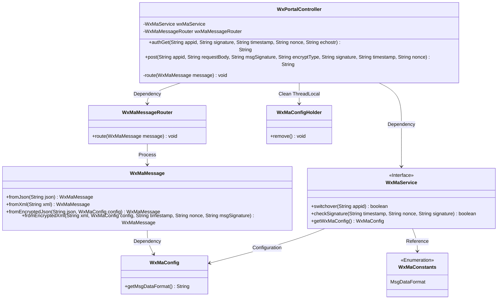
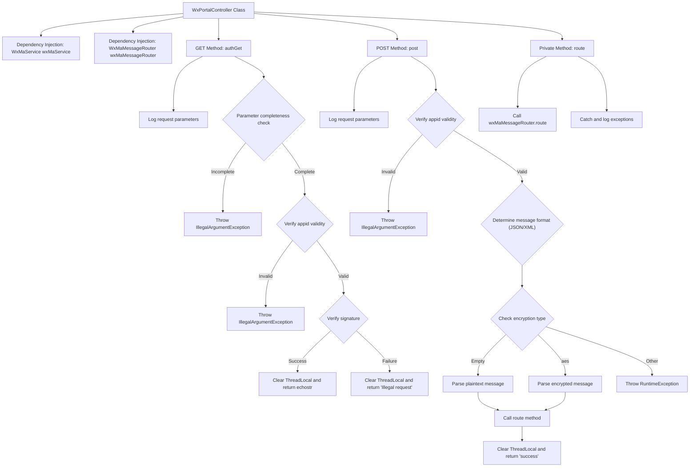

# Basic Information

|      |      |
|------|------|
| Name | WxPortalController |
| Language | .java |
| Code Path | weixin-java-miniapp-demo/src/main/java/com/github/binarywang/demo/wx/miniapp/controller/WxPortalController.java |
| Package Name | com.github.binarywang.demo.wx.miniapp.controller |
| Dependencies | ['cn.binarywang.wx.miniapp.api.WxMaService', 'cn.binarywang.wx.miniapp.bean.WxMaMessage', 'cn.binarywang.wx.miniapp.constant.WxMaConstants', 'cn.binarywang.wx.miniapp.message.WxMaMessageRouter', 'cn.binarywang.wx.miniapp.util.WxMaConfigHolder', 'lombok.AllArgsConstructor', 'lombok.extern.slf4j.Slf4j', 'org.apache.commons.lang3.StringUtils', 'org.springframework.web.bind.annotation', 'java.util.Objects'] |
| Brief Description | WeChat Mini Program Controller, handling authentication and message requests, verifying signatures and routing messages, supporting plaintext and AES encrypted formats. |

# Description

The code defines a WeChat Mini Program backend controller, WxPortalController, which includes two interfaces: GET and POST. The GET interface is used for WeChat server authentication, verifying the signature parameters and returning the echostr string. The POST interface handles WeChat messages, supporting both plaintext and AES-encrypted formats. It converts the messages into message objects based on configuration, routes them for processing, and finally returns a "success" response. Both interfaces will clear the configuration information stored in ThreadLocal and validate the appid's validity.

# Class Summary

| Name   | Type  | Description |
|-------|------|-------------|
| WxPortalController | class | WeChat Mini Program controller class, handling authentication and message requests, verifying signatures and routing messages, supporting plaintext and AES encryption, returning success or error messages. |

## Class WxPortalController

|      |      |
|------|------|
| Access Modifier | @RestController;@AllArgsConstructor;@RequestMapping("/wx/portal/{appid}");@Slf4j;public |
| Type | class |
| Name | WxPortalController |
| Description | WeChat Mini Program controller class, handling authentication and message requests, verifying signatures and routing messages, supporting plaintext and AES encryption, returning success or error messages. |

### UML Class Diagram

This diagram illustrates the class structure and dependencies of a WeChat Mini Program portal controller. The WxPortalController serves as the core controller, handling WeChat interface authentication and message routing through WxMaService, while relying on WxMaMessageRouter for message distribution. The WxMaMessage class is responsible for parsing messages in different formats, WxMaConfig provides configuration information, and WxMaConfigHolder manages thread-local variables. The overall structure clearly demonstrates the complete workflow of WeChat message processing.

### Internal Method Call Graph

Flowchart Description: This flowchart illustrates the complete processing flow of the WeChat portal controller, including both GET and POST request handling paths. The GET request is primarily used for WeChat server authentication, involving steps such as parameter validation and signature verification. The POST request handles business messages, supporting both plaintext and AES encryption methods, with message routing for distribution. All processes ultimately clear ThreadLocal resources and return appropriate responses or throw exceptions based on different scenarios. The controller relies on two core dependency components, wxMaService and wxMaMessageRouter, to fulfill its key functionalities.

### Field List

| Name  | Type  | Description |
|-------|-------|------|
| wxMaMessageRouter | WxMaMessageRouter | Private constant instance of the WeChat Mini Program message router. |
| wxMaService | WxMaService | WeChat Mini Program Service Instance Private Constants. |

### Method List

| Name  | Type  | Description |
|-------|-------|------|
| route | void | This method is used to route WeChat Mini Program messages, capturing and logging exceptions. |
| post | String | POST interface for handling WeChat requests, supporting plaintext and AES-encrypted messages. It validates configurations based on appid, parses XML or JSON formats, routes processing, and returns "success." Clears ThreadLocal and reports errors in case of exceptions. |
| authGet | String | This is a WeChat authentication interface that receives the appid and signature parameters, returning the echostr upon successful verification, otherwise it reports an error. |

