# Basic Information

|      |      |
|------|------|
| Name | WxPortalController |
| Language | .java |
| Code Path | weixin-java-miniapp-demo/src/main/java/com/github/binarywang/demo/wx/miniapp/controller/WxPortalController.java |
| Package Name | com.github.binarywang.demo.wx.miniapp.controller |
| Dependencies | ['cn.binarywang.wx.miniapp.api.WxMaService', 'cn.binarywang.wx.miniapp.bean.WxMaMessage', 'cn.binarywang.wx.miniapp.constant.WxMaConstants', 'cn.binarywang.wx.miniapp.message.WxMaMessageRouter', 'cn.binarywang.wx.miniapp.util.WxMaConfigHolder', 'lombok.AllArgsConstructor', 'lombok.extern.slf4j.Slf4j', 'org.apache.commons.lang3.StringUtils', 'org.springframework.web.bind.annotation', 'java.util.Objects'] |
| Brief Description | This controller is used to handle GET and POST requests from WeChat Mini Programs, implementing server verification and message receiving functions. The GET method is used to verify signatures and return echostr, while the POST method is used to receive and parse user messages, supporting both plaintext and AES encryption modes, ultimately distributing messages through routing. |

# Description

This controller is used to handle WeChat Mini Program access authentication and message reception. Server validity verification is completed via GET requests, returning echostr to confirm access; POST requests are used to receive and parse messages pushed by WeChat, supporting both plaintext and AES encryption methods. It automatically switches between JSON or XML format parsing according to configuration, dispatches to corresponding handlers through routing, and finally returns success to indicate successful reception. All operations validate appid legitimacy and clear thread context after processing.

# Class Summary

| Name   | Type  | Description |
|-------|------|-------------|
| WxPortalController | class | This controller is used to handle GET and POST requests from WeChat Mini Programs, supporting message signature verification, decryption, and routing processing to ensure request legitimacy and clean up thread variables. |

## Class WxPortalController

|      |      |
|------|------|
| Access Modifier | @RestController;@AllArgsConstructor;@RequestMapping("/wx/portal/{appid}");@Slf4j;public |
| Type | class |
| Name | WxPortalController |
| Description | This controller is used to handle GET and POST requests from WeChat Mini Programs, supporting message signature verification, decryption, and routing processing to ensure request legitimacy and clean up thread variables. |

### UML Class Diagram

```mermaid
classDiagram
    class WxPortalController {
        -WxMaService wxMaService
        -WxMaMessageRouter wxMaMessageRouter
        +authGet(String appid, String signature, String timestamp, String nonce, String echostr) String
        +post(String appid, String requestBody, String msgSignature, String encryptType, String signature, String timestamp, String nonce) String
        -route(WxMaMessage message) void
    }

    class WxMaService {
        <<Interface>>
        +switchover(String appid) boolean
        +checkSignature(String timestamp, String nonce, String signature) boolean
        +getWxMaConfig() WxMaConfig
    }

    class WxMaMessageRouter {
        <<Interface>>
        +route(WxMaMessage message) void
    }

    class WxMaMessage {
        <<Interface>>
        +fromJson(String json) WxMaMessage
        +fromXml(String xml) WxMaMessage
        +fromEncryptedJson(String json, WxMaConfig config) WxMaMessage
        +fromEncryptedXml(String xml, WxMaConfig config, String timestamp, String nonce, String msgSignature) WxMaMessage
    }

    class WxMaConfig {
        <<Interface>>
        +getMsgDataFormat() String
    }

    class WxMaConstants {
        <<Interface>>
        +MsgDataFormat JSON
    }

    class WxMaConfigHolder {
        <<Interface>>
        +remove() void
    }

    class StringUtils {
        <<Interface>>
        +isAnyBlank(String... strings) boolean
        +isBlank(String str) boolean
    }

    class Objects {
        <<Interface>>
        +equals(Object a, Object b) boolean
    }

    class Log {
        <<Interface>>
        +info(String format, Object... arguments)
        +error(String msg, Throwable t)
    }

    WxPortalController --> WxMaService : Dependency
    WxPortalController --> WxMaMessageRouter : Dependency
    WxPortalController --> WxMaMessage : Dependency
    WxPortalController --> WxMaConfig : Dependency
    WxPortalController --> WxMaConstants : Dependency
    WxPortalController --> WxMaConfigHolder : Dependency
    WxPortalController --> StringUtils : Dependency
    WxPortalController --> Objects : Dependency
    WxPortalController --> Log : Dependency
```

This class diagram illustrates the structure of the WeChat Mini Program portal controller `WxPortalController` and its interaction relationships with other key components. The controller obtains service instances through dependency injection and calls these services to perform signature verification, message parsing, and routing when handling GET and POST requests. Meanwhile, it also depends on utility classes for string and object judgment, and uses logging to record request information, reflecting the core process of receiving and processing WeChat messages.

### Internal Method Call Graph

This flowchart illustrates the core logic of the WeChat Mini Program portal controller, including the GET request for server authentication and the POST request for receiving and processing user messages. The process covers key steps such as parameter validation, signature verification, message decryption, and routing, and cleans up thread-local variables at the end of each path to ensure security.

### Field List

| Name  | Type  | Description |
|-------|-------|------|
| wxMaService | WxMaService | This is a private constant instance of a WeChat Mini Program service interface, used to handle WeChat Mini Program related business logic. |
| wxMaMessageRouter | WxMaMessageRouter | This is a private constant instance of a WeChat Mini Program message router, used to handle and route message requests for WeChat Mini Programs. |

### Method List

| Name  | Type  | Description |
|-------|-------|------|
| route | void | This method is used to route WeChat Mini Program messages, processing messages through wxMaMessageRouter, and logging error logs if exceptions occur during processing. |
| authGet | String | This interface is used to handle GET authentication requests from the WeChat server, verify the legitimacy of the signature, and return either the echostr or an error message. |
| post | String | This interface handles message push from WeChat Mini Programs, supporting both plaintext and AES encryption transmission methods. It parses and routes messages based on their format (JSON or XML), ensures thread safety, and returns a successful response. |

