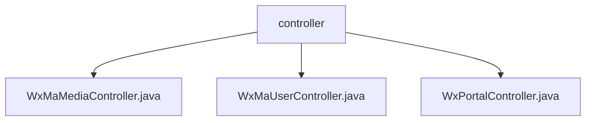

# Basic Information

|      |      |
|------|------|
| Name | controller |
| Language | .java |
| Code Path | weixin-java-miniapp-demo/src/main/java/com/github/binarywang/demo/wx/miniapp/controller |
| Package Name | docs.src.main.java.com.github.binarywang.demo.wx.miniapp.controller |
| Brief Description | This controller implements the media file upload and download functionality for WeChat Mini Programs. It supports uploading temporary image materials and returning a list of media_ids, provides the capability to download materials based on mediaId, receives files in multipart format and processes requests through CommonsMultipartResolver, cleans up thread-local variables after each operation, and throws an exception prompt when the corresponding appid configuration is not found. |

# Description

## Overview

This module provides core backend services for WeChat Mini Programs, covering media file upload and download, user login and information management, as well as message push processing functionalities. It supports multiple mini program instances through an AppId routing mechanism, uses thread-local variables to isolate different request contexts, and performs resource cleanup after operations are completed.

The interfaces follow RESTful style design, supporting Multipart file uploads, JSON/XML data parsing, and AES encryption/decryption communication. It primarily relies on CommonsMultipartResolver to handle file streams, combined with the WxJava SDK to implement WeChat protocol integration. For example: uploading image materials returns a list of MediaIds; exchanging user sessions based on Codes; receiving and routing user messages to designated handlers.

Key data structures include WxMaConfig (configuration object), WxMaUserInfo (user information), WxMaJscode2SessionResult (login result), and WxMpXmlMessage (message entity). External dependencies include commons-fileupload, wx-java-miniapp-spring-boot-starter, and related logging frameworks.

## Main Business Scenarios

The module integrates three core interaction flows of WeChat Mini Programs: media resource management, user identity authentication, and message subscription & push. Its interaction pattern resembles an event bus architecture, where a Portal Controller serves as the unified entry point to distribute requests, while UserController and MediaController handle user-state and resource-state operations respectively.

Functionality covers the entire closed-loop process from access verification to business response. For instance, server URL validation is completed via GET requests, while POST methods receive and parse user behavior data. API types include HTTP interfaces exposed at the Controller layer and internal Service components invoked within, suitable for rapid integration cases in Spring Boot microservice deployment environments.

### Package Internal Structure View

This flowchart shows the structural relationship of the controller layer in the WeChat Mini Program Demo project, where `controller` as the parent directory contains three specific controller class files, namely media, user, and portal related control logic implementations.

# File List

| Name   | Type  | Description |
|-------|------|-------------|
| [WxMaMediaController.java](WxMaMediaController.md) | file | This controller provides upload and download functions for WeChat Mini Program temporary media files, supports configuration switching via appid, the upload interface returns a list of media_ids, and the download interface retrieves files based on media_id. |
| [WxMaUserController.java](WxMaUserController.md) | file | This class is a controller for WeChat Mini Program user-related interfaces, providing login, user information retrieval, and phone number binding functions. It switches configurations through appid and processes data returned by WeChat. |
| [WxPortalController.java](WxPortalController.md) | file | This controller is used to handle GET and POST requests from WeChat Mini Programs, supporting message signature verification, decryption, and routing processing. The GET method is used for server authentication, while the POST method is used to receive and parse user messages. It supports both plaintext and AES encryption transmission methods, and automatically switches between JSON or XML format data processing based on configuration. |

