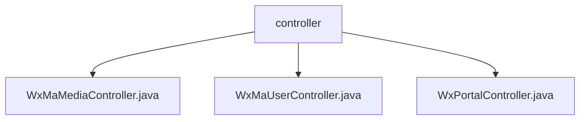

# Basic Information

|      |      |
|------|------|
| Name | controller |
| Language | .java |
| Code Path | weixin-java-miniapp-demo/src/main/java/com/github/binarywang/demo/wx/miniapp/controller |
| Package Name | docs.src.main.java.com.github.binarywang.demo.wx.miniapp.controller |
| Brief Description | This controller implements the media file upload and download functionality for WeChat Mini Programs, supporting configuration switching via appid. It uploads temporary image materials and returns a unique media_id, retrieves files based on media_id during download, and automatically cleans up thread-local variables after interface processing is complete. |

# Description

## Overview

This module provides core backend interface support for WeChat Mini Programs, covering three major functions: media file upload and download, user authentication and information retrieval, and message receiving and routing.  
The interfaces follow RESTful style and switch between multi-tenant configurations through AppID, use JSON format for communication, and ensure thread safety.

All controllers clean up ThreadLocal resources after operations are completed, ensuring a clean runtime environment, similar to ServletContext lifecycle management mechanisms.  
Key data structures include WxMaConfig (configuration object), WxMaJscode2SessionResult (login result), and WxMaMessage (message entity).  

External dependencies mainly include the weixin-java-miniapp SDK and Spring Boot framework components, without introducing other third-party libraries.  
For example: uploading images through the /media/upload interface to obtain media_id; calling /wxa/business/getuserphonenumber to decrypt phone numbers.

## Main Business Scenarios

The module primarily supports three major business processes of WeChat Mini Programs: access verification, user identity management, and multimedia resource interaction.  
The access layer supports GET signature verification and POST reception of plaintext/AES encrypted messages, which are then distributed by the router for processing, forming an event bus-like pattern.  

User-related interfaces complete login status maintenance and sensitive information decryption, such as exchanging code for openid and session_key.  
Media controllers are responsible for uploading and downloading temporary materials, suitable for typical application scenarios such as avatar upload and voice download.  

API types cover HTTP GET/POST requests, with integration cases including full-link closed-loop processing from WeChat callbacks to business logic responses.  
The overall system features high cohesion and low coupling, making it suitable for embedding in microservice architectures as independent service capability units.

### Package Internal Structure View

This flowchart shows the structure relationship of the controller layer in the WeChat Mini Program Demo project, including three specific controller class files, all located under the controller directory, used to handle different business requests.

# File List

| Name   | Type  | Description |
|-------|------|-------------|
| [WxMaMediaController.java](WxMaMediaController.md) | file | This controller provides upload and download functions for WeChat Mini Program temporary media files, supports configuration switching via appid, the upload interface returns a list of media_ids, and the download interface retrieves files based on media_id. |
| [WxMaUserController.java](WxMaUserController.md) | file | This class is a controller for WeChat Mini Program user-related interfaces, providing login, user information retrieval, and phone number binding functions. It switches configurations through appid and processes data returned by WeChat. |
| [WxPortalController.java](WxPortalController.md) | file | This controller is used to handle GET and POST requests for WeChat Mini Programs, supporting message signature verification, decryption, and routing processing. |

