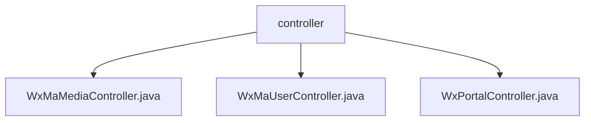

# Basic Information

|      |      |
|------|------|
| Name | controller |
| Language | .java |
| Code Path | weixin-java-miniapp-demo\src\main\java\com\github\binarywang\demo\wx\miniapp\controller |
| Package Name | docs.src.main.java.com.github.binarywang.demo.wx.miniapp.controller |
| Brief Description | The three controller classes in WeChat Mini Program: the Media Management class handles file uploads and downloads; the User Management class handles login, user information, and phone numbers; the Portal class handles WeChat authentication and message routing. All verify the appid and clean up ThreadLocal. |

# Description

## Overview  
This module serves as the core controller group for the WeChat Mini Program backend, handling three major functionalities: media file management, user session management, and WeChat portal interaction. All interfaces adhere to AppID validity verification and ThreadLocal resource cleanup mechanisms, resembling a gateway pattern to ensure thread safety. Key data structures include media_id lists, user session information objects, and WeChat message encapsulation bodies. It relies on the official WeChat SDK for encryption and decryption operations, such as AES-decrypting user information and verifying message signatures.  

## Key Business Scenarios  
The media file module supports batch uploading of temporary materials and returns media_id lists, while downloads retrieve files via mediaId, such as image/video management. The user module implements the standard WeChat login flow, including code validation, information decryption (e.g., obtaining phone numbers), and session maintenance. The portal module handles both WeChat server authentication (GET validation) and message routing (POST processing), supporting plaintext/encrypted dual-mode parsing. All interactions are based on AppID-isolated configurations, resembling a multi-tenant architecture.

### Package Internal Structure View

This flowchart illustrates the file structure of three controller files under the controller directory in the WeChat Mini Program demo project. All Java controller files (WxMaMediaController, WxMaUserController, and WxPortalController) are directly subordinate to the controller node, clearly presenting the file organization of the backend interface control layer in the WeChat Mini Program. This flat structure facilitates developers in quickly locating core functional modules such as media processing, user management, and portal entry.

# File List

| Name   | Type  | Description |
|-------|------|-------------|
| [WxMaMediaController.java](WxMaMediaController.md) | file | WeChat Mini Program media controller, providing functions for uploading and downloading temporary materials. Uploading returns a list of media_ids, while downloading returns files. It checks the validity of the appid and cleans up ThreadLocal. |
| [WxMaUserController.java](WxMaUserController.md) | file | WeChat Mini Program User Controller, providing interfaces for login, retrieving user information, and phone number. Requires validation of appid and user data, returns results in JSON format, and clears ThreadLocal after use. |
| [WxPortalController.java](WxPortalController.md) | file | WeChat Mini Program Controller, handling authentication and message requests, verifying signatures and routing messages, supporting plaintext and AES encryption, and cleaning up ThreadLocal. |

