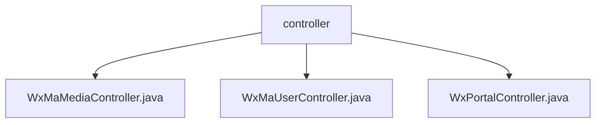

# Basic Information

|      |      |
|------|------|
| Name | controller |
| Language | .java |
| Code Path | weixin-java-miniapp-demo/src/main/java/com/github/binarywang/demo/wx/miniapp/controller |
| Package Name | docs.src.main.java.com.github.binarywang.demo.wx.miniapp.controller |
| Brief Description | This controller implements media file upload and download functionality for WeChat Mini Programs, supporting multi-file processing and exception handling. Another controller provides user login, information retrieval, and phone number binding interfaces, handling JSCode validation and decryption of sensitive information. The third controller is responsible for Mini Program access authentication and message reception, supporting plaintext and AES-encrypted message parsing, automatically switching between JSON or XML formats and distributing processing. All interfaces validate appid legitimacy and clean up thread context. |

# Description

## Overview

This module provides core backend interface support for WeChat Mini Programs, covering media file upload and download, user login and information retrieval, as well as access authentication and message receiving functions. It implements multi-mini-program instance management through Appid routing, and employs a thread local variable cleanup mechanism to ensure service stability.

The interfaces follow RESTful style design, supporting GET/POST requests, and integrate the WXJava SDK to handle credential verification, encryption/decryption, and message parsing. Key data structures include WeChat standard fields such as MediaId, JSCode, and Echostr, along with custom encapsulated response objects.

External dependencies mainly include the WXJava Miniapp SDK, Spring Boot framework, and related logging components. For example: using WxMaService to handle login credential verification, and calling WxMaConfig to implement multi-tenant configuration switching.

## Main Business Scenarios

The module supports three main business processes: first, media resource management, such as uploading images to obtain MediaId and subsequently downloading them; second, user identity interaction, for example, exchanging JSCode for OpenId and decrypting phone numbers; third, access layer communication, distributing different types of WeChat messages to designated processors in an event bus-like mode.

The system routes requests among multiple mini-programs through Appid, supports plaintext or AES encrypted transmission, and can automatically recognize JSON/XML formats. All interfaces have exception capture capabilities, and clean up ThreadLocal context after execution to prevent memory leaks.

Typical application scenarios include third-party platforms operating multiple mini-programs on behalf of clients, enterprise portal integration with the WeChat ecosystem, and compliance scenarios requiring secure transmission of user sensitive information. API types cover Controller layer HTTP interfaces and underlying SDK calls, supporting integration with infrastructure such as Nginx reverse proxy and HTTPS gateways.

### Package Internal Structure View

This flowchart shows the structural relationship of the controller layer in the WeChat Mini Program Demo project, where `controller` as the parent directory contains three specific controller class files, respectively used to handle media, user, and portal related request logic.

# File List

| Name   | Type  | Description |
|-------|------|-------------|
| [WxMaMediaController.java](WxMaMediaController.md) | file | This controller provides upload and download functions for WeChat Mini Program temporary media files, supports configuration switching via appid, the upload interface returns a list of media_id, and the download interface retrieves files based on media_id. |
| [WxMaUserController.java](WxMaUserController.md) | file | This controller provides WeChat Mini Program user login, information retrieval, and phone number decryption functions. It switches configurations through appid and handles session validation and data decryption. |
| [WxPortalController.java](WxPortalController.md) | file | This controller is used to handle GET and POST requests from WeChat Mini Programs, implementing server verification and message receiving functions. The GET method is used to verify the signature and return the echostr, while the POST method is used to receive and parse user messages, supporting both plaintext and AES encryption modes, and finally distributing messages through routing. |

