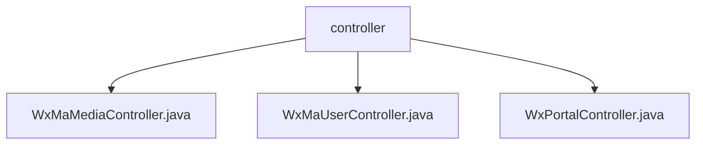

# Basic Information

|      |      |
|------|------|
| Name | controller |
| Language | .java |
| Code Path | weixin-java-miniapp-demo/src/main/java/com/github/binarywang/demo/wx/miniapp/controller |
| Package Name | docs.src.main.java.com.github.binarywang.demo.wx.miniapp.controller |
| Brief Description | This controller implements the media file upload and download functionality for WeChat Mini Programs, supporting multi-file processing and exception handling. It provides user login, information retrieval, and phone number binding interfaces, handling JSCode validation and session management. Additionally, it is responsible for Mini Program access verification and message reception processing, supporting both plaintext and AES encrypted transmission, automatically switching between JSON or XML format parsing, routing data to designated processors, and ensuring stable service operation. |

# Description

## Overview  
This module provides core backend interface support for WeChat Mini Programs, covering user authentication, media file management, and message processing functionalities. It achieves multi-application isolation and secure access control by dynamically switching configurations via AppID.

The module exposes RESTful APIs externally, uniformly responding in JSON format, and clears ThreadLocal variables after each request to prevent memory leaks. For example: WxMaUserController handles login and user information decryption, WxMaMediaController processes material upload and download, and WxPortalController implements access verification and message routing.

Key data structures include WxMaJscode2SessionResult (used to store login credential validation results), WxMaUserInfo (encapsulating user sensitive information), and WxMpXmlMessage (representing received WeChat push messages). External dependencies mainly involve the weixin-java-miniapp SDK and its underlying HTTP client libraries.

## Main Business Scenarios  
The module supports three typical business workflows: Mini Program user identity verification and session management, temporary media resource operation flow, and message subscription and event distribution from the WeChat platform. For example: UserController completes credential validation when users scan QR codes to log in, while MediaController handles avatar uploads.

The interaction pattern resembles MVC architecture, where the frontend initiates HTTP requests to specified Controllers, which after parameter parsing and logic processing, call the Service layer to complete specific tasks. All operations follow the "receive-process-clean" lifecycle model to ensure system stability.

Integration cases show that developers can load different configuration instances on-demand through a unified entry point, thereby adapting to multiple Mini Program projects. API types cover GET/POST methods, compatible with plaintext/AES encryption transmission mechanisms, meeting diverse access requirements.

### Package Internal Structure View

This flowchart shows the structural relationship of the controller layer in the WeChat Mini Program Demo project, where `controller` as the parent directory contains three specific controller files, respectively used to handle media, user, and portal related requests.

# File List

| Name   | Type  | Description |
|-------|------|-------------|
| [WxMaMediaController.java](WxMaMediaController.md) | file | This controller provides upload and download functions for WeChat Mini Program temporary media assets, supports configuration switching via appid, the upload interface returns a list of media_ids, and the download interface retrieves files based on media_id. |
| [WxMaUserController.java](WxMaUserController.md) | file | This controller provides WeChat Mini Program user login, information retrieval, and phone number decryption functions. It switches configurations through appid and handles session validation and data decryption. |
| [WxPortalController.java](WxPortalController.md) | file | This controller is used to handle GET and POST requests from WeChat Mini Programs, implementing server verification and message decryption routing functions. |

