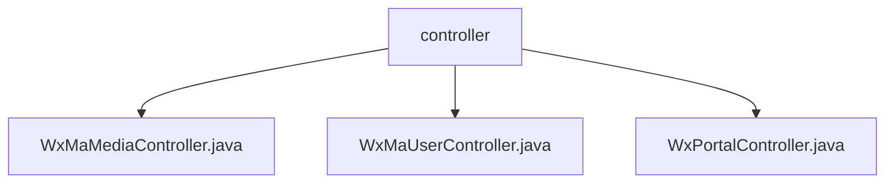

# Basic Information

|      |      |
|------|------|
| Name | controller |
| Language | .java |
| Code Path | weixin-java-miniapp-demo/src/main/java/com/github/binarywang/demo/wx/miniapp/controller |
| Package Name | docs.src.main.java.com.github.binarywang.demo.wx.miniapp.controller |
| Brief Description | Three controller classes in WeChat Mini Program: The Media Controller handles file uploads and downloads; the User Controller provides login, user information retrieval, and phone number functionality; the Portal Controller manages WeChat server authentication and message routing. All are configured based on appid and clean up ThreadLocal. |

# Description

## Overview  
This module is a collection of core backend controllers for WeChat Mini Programs, primarily responsible for three major functions: media file management, user session services, and WeChat message routing. The interface specifications uniformly adopt an appid-based configuration switching mechanism, and all operations include ThreadLocal cleanup logic. Key data structures include media_id lists, user session information JSON, and WeChat message objects. External dependencies include WeChat SDK's encryption/decryption services, HTTP request handling, and JSON parsing. For example, the upload interface returns a media_id list, while the login interface returns JSON containing a sessionKey.  

## Main Business Scenarios  
The module supports multiple business flows: media file upload/download (similar to CDN management), user authentication (similar to the OAuth2.0 flow), and WeChat message processing (similar to an event bus pattern). The typical interaction mode involves receiving a request → verifying the appid → executing the business → cleaning up resources → returning a response. It fully covers the core requirements of Mini Program backend development, including user information retrieval, temporary media management, and message routing. API types include RESTful interfaces and WeChat callback interfaces, such as exchanging a code for session information or handling encrypted WeChat messages.

### Package Internal Structure View

This flowchart illustrates the controller hierarchy in the WeChat Mini Program demo project. The root node is the controller folder, which contains three Java controller files: WxMaMediaController handles media-related functionalities, WxMaUserController manages user operations, and WxPortalController serves as the entry controller. All controllers reside at the same directory level within the miniapp module, with no extraneous path nodes displayed.

# File List

| Name   | Type  | Description |
|-------|------|-------------|
| [WxMaMediaController.java](WxMaMediaController.md) | file | WeChat Mini Program Media Controller, providing functionality for uploading and downloading temporary materials. Uploading returns a list of media_ids, while downloading returns media files. Requires validation of appid validity and cleanup of ThreadLocal after operations. |
| [WxMaUserController.java](WxMaUserController.md) | file | WeChat Mini Program User Controller, providing interfaces for login, retrieving user information, and phone number. It requires validation of appid and user data, returns results in JSON format, handles exceptions, and cleans up ThreadLocal. |
| [WxPortalController.java](WxPortalController.md) | file | WeChat Mini Program Controller, handling authentication and message requests, verifying signatures and routing messages, supporting plaintext and AES encrypted formats. |

