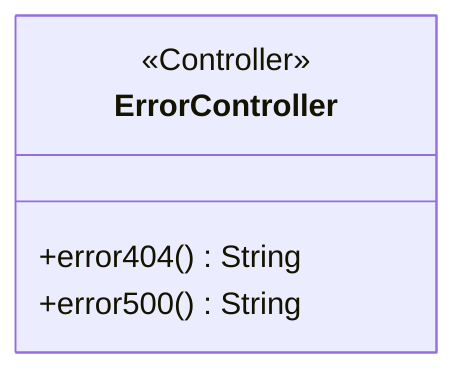
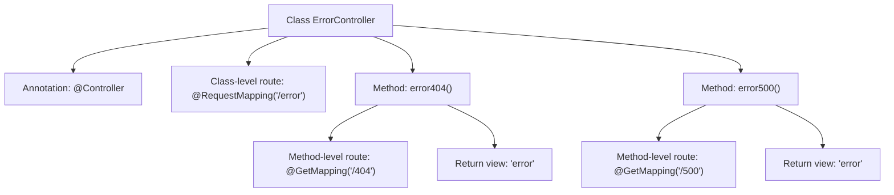

# Basic Information

|      |      |
|------|------|
| Name | ErrorController |
| Language | .java |
| Code Path | weixin-java-miniapp-demo/src/main/java/com/github/binarywang/demo/wx/miniapp/error/ErrorController.java |
| Package Name | com.github.binarywang.demo.wx.miniapp.error |
| Dependencies | ['org.springframework.stereotype.Controller', 'org.springframework.web.bind.annotation.GetMapping', 'org.springframework.web.bind.annotation.RequestMapping'] |
| Brief Description | Error controller class, handling 404 and 500 errors, returning error pages. |

# Description

This is a Spring MVC controller class specifically designed to handle error page requests. The class is annotated with `@Controller`, indicating it is a controller component. The `@RequestMapping` annotation maps the root path to "/error". The class contains two methods: the `error404()` method handles GET requests for HTTP 404 errors, mapped to the path "/error/404"; the `error500()` method handles GET requests for HTTP 500 errors, mapped to the path "/error/500". Both methods return a view string named "error", indicating the rendering of an error template page.

# Class Summary

| Name   | Type  | Description |
|-------|------|-------------|
| ErrorController | class | The ErrorController handles 404 and 500 errors, returning an error page. |

## Class ErrorController

|      |      |
|------|------|
| Access Modifier | @Controller;@RequestMapping("/error");public |
| Type | class |
| Name | ErrorController |
| Description | The ErrorController handles 404 and 500 errors, returning an error page. |

### UML Class Diagram

This code defines a Spring MVC controller class `ErrorController` for handling error page requests. The class is annotated with `@Controller` indicating it's a controller, and mapped to the "/error" path via `@RequestMapping`. It contains two public methods: `error404()` and `error500()`, which handle 404 and 500 errors respectively, both returning the "error" view name. The class has no private member variables, representing a typical stateless controller solely responsible for routing requests to corresponding error pages.

### Internal Method Call Graph

This code defines a Spring MVC controller class ErrorController for handling error page requests. The class is annotated with @Controller and root path /error, containing two handler methods: error404() processes 404 error path /error/404, and error500() processes 500 error path /error/500, both returning a view template named "error". The flowchart clearly illustrates the class structure, annotation hierarchy, and method invocation relationships, demonstrating the typical routing mapping pattern of a Spring MVC controller.

### Field List

| Name  | Type  | Description |
|-------|-------|------|

### Method List

| Name  | Type  | Description |
|-------|-------|------|
| error500 | String | Spring MVC controller method, handling GET request path "/500", returns the string "error". |
| error404 | String | This is a Spring MVC controller method that maps to a GET request on the "/404" path and returns the string "error" as the response. |

