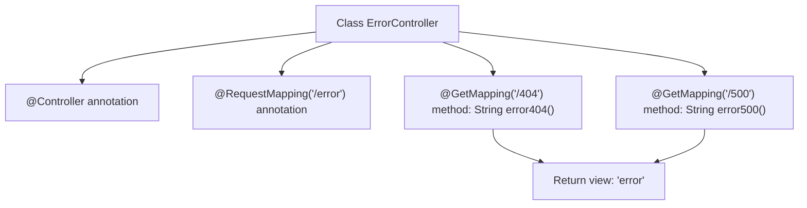

# Basic Information

|      |      |
|------|------|
| Name | ErrorController |
| Language | .java |
| Code Path | weixin-java-miniapp-demo/src/main/java/com/github/binarywang/demo/wx/miniapp/error/ErrorController.java |
| Package Name | com.github.binarywang.demo.wx.miniapp.error |
| Dependencies | ['org.springframework.stereotype.Controller', 'org.springframework.web.bind.annotation.GetMapping', 'org.springframework.web.bind.annotation.RequestMapping'] |
| Brief Description | This is a Spring Boot error handling controller that maps 404 and 500 error page requests under the /error path, uniformly returning the error view. |

# Description

This is a Spring Boot error handling controller class located under the /error path. The controller contains two GET request mapping methods: error404 handles 404 error page requests, and error500 handles 500 error page requests. Both methods return the same view name "error" for unified display of error page content.

# Class Summary

| Name   | Type  | Description |
|-------|------|-------------|
| ErrorController | class | This is a Spring Boot error handling controller that maps 404 and 500 error requests under the /error path, and uniformly returns the error page view. |


## Class ErrorController

|      |      |
|------|------|
| Access Modifier | @Controller;@RequestMapping("/error");public |
| Type | class |
| Name | ErrorController |
| Description | This is a Spring Boot error handling controller that maps 404 and 500 error requests under the /error path, and uniformly returns the error page view. |


### UML Class Diagram

```mermaid
classDiagram
    class ErrorController {
        +String error404()
        +String error500()
    }

    <<Annotation>> Controller
    <<Annotation>> RequestMapping
    <<Annotation>> GetMapping

    // ErrorController is a Spring controller that handles HTTP error page requests
    // Provides mapping handling for 404 and 500 errors, returning the logical view name "error"
```

This class diagram shows the `ErrorController` controller class, which uses Spring MVC annotations to handle specific HTTP error status code requests. The `@Controller` annotation indicates that this is a controller component, `@RequestMapping("/error")` defines the base path, and the two methods respectively map to specific error handling logic through `@GetMapping`, both returning a view named "error".


### Internal Method Call Graph



This flowchart shows the structure and request mapping relationship of the `ErrorController` class. The controller binds the path `/error` through the `@RequestMapping` annotation, and defines two GET request handling methods corresponding to 404 and 500 error pages respectively, both returning a view template named `error`.

### Field List

| Name  | Type  | Description |
|-------|-------|------|

### Method List

| Name  | Type  | Description |
|-------|-------|------|
| error500 | String | This code defines a method that handles HTTP GET requests. When the access path is "/500", it returns a view page named "error" to handle server internal error situations. |
| error404 | String | This code defines a GET request method for handling 404 errors, returning an error page. |


