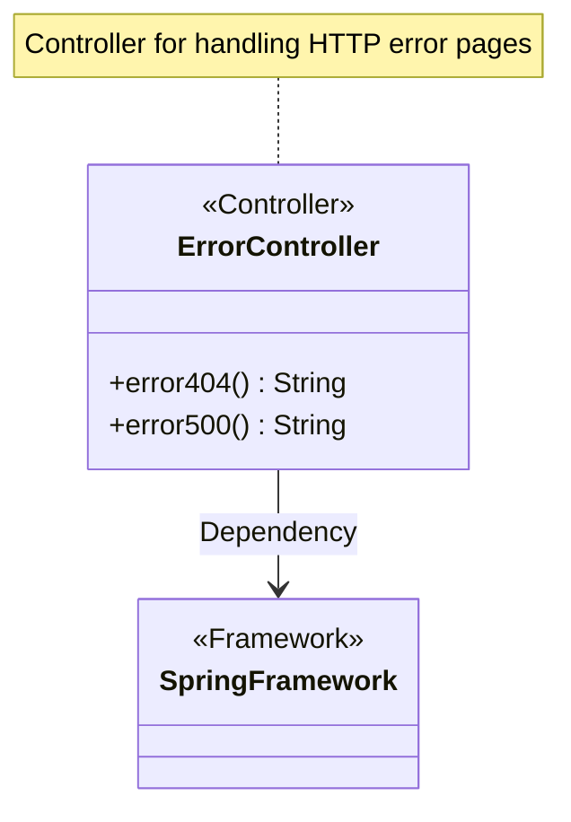
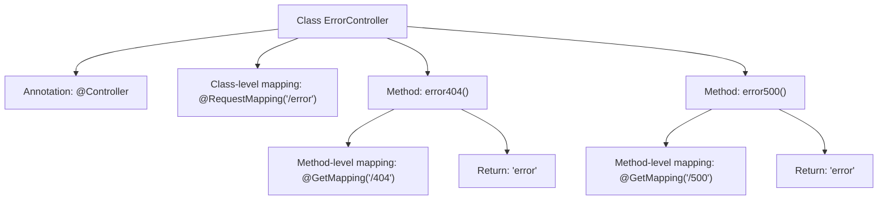

# Basic Information

|      |      |
|------|------|
| Name | ErrorController |
| Language | .java |
| Code Path | weixin-java-miniapp-demo\src\main\java\com\github\binarywang\demo\wx\miniapp\error\ErrorController.java |
| Package Name | com.github.binarywang.demo.wx.miniapp.error |
| Dependencies | ['org.springframework.stereotype.Controller', 'org.springframework.web.bind.annotation.GetMapping', 'org.springframework.web.bind.annotation.RequestMapping'] |
| Brief Description | The ErrorController handles 404 and 500 errors, returning a unified error page. |

# Description

This is a Spring MVC controller class specifically designed to handle error page requests. The class is annotated with `@Controller`, indicating it is a controller component. The `@RequestMapping` annotation maps the root path to "/error". The class contains two methods for handling GET requests: the `error404()` method processes the 404 error path "/error/404", while the `error500()` method handles the 500 error path "/error/500". Both methods return a view string named "error", indicating they use the same error page template for responses.

# Class Summary

| Name   | Type  | Description |
|-------|------|-------------|
| ErrorController | class | The ErrorController handles 404 and 500 errors, returning a unified error page. |

## Class ErrorController

|      |      |
|------|------|
| Access Modifier | @Controller;@RequestMapping("/error");public |
| Type | class |
| Name | ErrorController |
| Description | The ErrorController handles 404 and 500 errors, returning a unified error page. |

### UML Class Diagram

This class diagram illustrates a Spring MVC ErrorController with two methods for handling HTTP errors: error404() and error500(). Both methods return the same error view name "error". The class is marked as a Spring component via @Controller annotation and defines a base path /error through @RequestMapping. It relies on functionalities provided by the Spring Framework to handle request mappings for HTTP 404 and 500 errors. This represents a typical Spring MVC controller design pattern for centralized handling of specific types of HTTP error responses.

### Internal Method Call Graph

This flowchart illustrates the structure of the ErrorController class in Spring MVC, containing two error handling methods. The class is marked as a controller with the @Controller annotation and has a root path set to "/error". The error404() method handles the 404 error path, while error500() handles the 500 error path, both returning the "error" view. Arrows clearly indicate the hierarchical relationships between the class and its annotations/methods, as well as the logical flow of method-level mappings and return values.

### Field List

| Name  | Type  | Description |
|-------|-------|------|

### Method List

| Name  | Type  | Description |
|-------|-------|------|
| error500 | String | This is a Spring MVC controller method that handles the GET request path "/500" and returns the string "error". |
| error404 | String | This is a Spring MVC controller method mapped to a GET request at the "/404" path, returning the string "error". |

