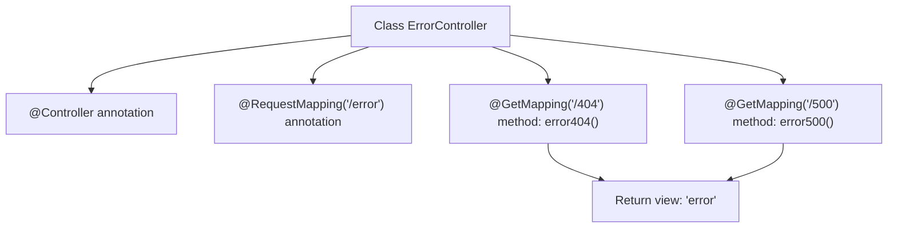

# Basic Information

|      |      |
|------|------|
| Name | ErrorController |
| Language | .java |
| Code Path | weixin-java-miniapp-demo/src/main/java/com/github/binarywang/demo/wx/miniapp/error/ErrorController.java |
| Package Name | com.github.binarywang.demo.wx.miniapp.error |
| Dependencies | ['org.springframework.stereotype.Controller', 'org.springframework.web.bind.annotation.GetMapping', 'org.springframework.web.bind.annotation.RequestMapping'] |
| Brief Description | This is a Spring Boot error handling controller that maps 404 and 500 error page requests under the /error path, uniformly returning the error view. |

# Description

This is a Spring Boot error handling controller class located under the /error path. The controller contains two GET request mapping methods: error404 handles 404 error page requests, and error500 handles 500 error page requests. Both methods return the same view name "error" for unified display of error page content.

# Class Summary

| Name   | Type  | Description |
|-------|------|-------------|
| ErrorController | class | This is a Spring Boot error handling controller that maps 404 and 500 error requests under the /error path, and uniformly returns the error page view. |


## Class ErrorController

|      |      |
|------|------|
| Access Modifier | @Controller;@RequestMapping("/error");public |
| Type | class |
| Name | ErrorController |
| Description | This is a Spring Boot error handling controller that maps 404 and 500 error requests under the /error path, and uniformly returns the error page view. |


### UML Class Diagram

```mermaid
classDiagram
    class ErrorController {
        +String error404()
        +String error500()
    }

    <<Interface>> Controller
    <<Interface>> RequestMapping
    
    note for ErrorController "// @Controller\n// @RequestMapping(\"/error\")"
    
    ErrorController -->|implements| Controller : depends on
    ErrorController -->|maps to path /error| RequestMapping : depends on
```

This class diagram describes a controller class `ErrorController` in Spring Boot that is annotated to handle error page requests. Through the `@Controller` and `@RequestMapping` annotations, it indicates its role as a controller and the base routing path. It contains two GET request methods corresponding to 404 and 500 error pages respectively, both returning the "error" view name. This class depends on the annotation support provided by the Spring MVC framework to complete URL mapping and response handling.


### Internal Method Call Graph



This flowchart illustrates the structure and processing logic of the `ErrorController` class. The controller binds the path `/error` through the `@RequestMapping` annotation, and defines two GET request handling methods corresponding to HTTP status codes 404 and 500 respectively, both returning a view page named `error`.

### Field List

| Name  | Type  | Description |
|-------|-------|------|

### Method List

| Name  | Type  | Description |
|-------|-------|------|
| error500 | String | This code defines a controller method that handles HTTP GET requests, returning the string "error" when accessing the path "/500", which is used for handling server internal error page redirection. |
| error404 | String | This code defines a GET request mapping method for handling 404 errors, returning the error page view name "error". |


