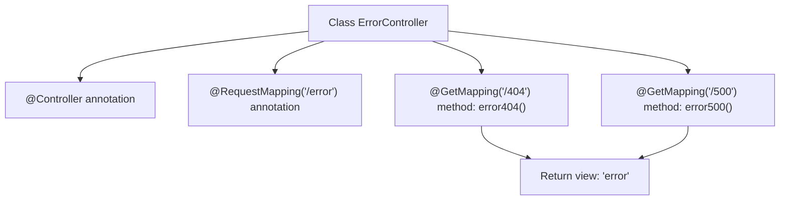

# Basic Information

|      |      |
|------|------|
| Name | ErrorController |
| Language | .java |
| Code Path | weixin-java-miniapp-demo/src/main/java/com/github/binarywang/demo/wx/miniapp/error/ErrorController.java |
| Package Name | com.github.binarywang.demo.wx.miniapp.error |
| Dependencies | ['org.springframework.stereotype.Controller', 'org.springframework.web.bind.annotation.GetMapping', 'org.springframework.web.bind.annotation.RequestMapping'] |
| Brief Description | This is a Spring Boot error controller that handles 404 and 500 error page requests, returning the error view uniformly. |

# Description

This is a Spring Boot error handling controller class located under the /error path. The controller contains two GET request mapping methods: error404 for handling 404 Not Found errors, and error500 for handling 500 Internal Server errors. Both methods return a view page named error, implementing unified error page display functionality.

# Class Summary

| Name   | Type  | Description |
|-------|------|-------------|
| ErrorController | class | This is a Spring Boot error handling controller that maps 404 and 500 error requests under the /error path, and uniformly returns the error page view. |


## Class ErrorController

|      |      |
|------|------|
| Access Modifier | @Controller;@RequestMapping("/error");public |
| Type | class |
| Name | ErrorController |
| Description | This is a Spring Boot error handling controller that maps 404 and 500 error requests under the /error path, and uniformly returns the error page view. |


### UML Class Diagram

```mermaid
classDiagram
    class ErrorController {
        +String error404()
        +String error500()
    }

    <<Interface>> org.springframework.stereotype.Controller
    <<Interface>> org.springframework.web.bind.annotation.RequestMapping

    ErrorController --|> org.springframework.stereotype.Controller : implements
    ErrorController --|> org.springframework.web.bind.annotation.RequestMapping : uses annotation
```

This class diagram shows the structure of the `ErrorController` controller class, which contains two methods for handling different error codes (404 and 500), and implements Spring MVC's routing mapping functionality through annotations. This class depends on the Controller and RequestMapping annotation interfaces provided by the Spring framework to fulfill its responsibilities.


### Internal Method Call Graph



This flowchart shows the structure and request mapping logic of the `ErrorController` class. The controller defines the base path `/error` through the `@RequestMapping` annotation, and includes two GET request handling methods corresponding to 404 and 500 error pages respectively, both returning a view named `error`.

### Field List

| Name  | Type  | Description |
|-------|-------|------|

### Method List

| Name  | Type  | Description |
|-------|-------|------|
| error404 | String | This code defines a GET request mapping method for handling 404 errors, returning the error page view name "error". |
| error500 | String | This code defines a method that handles HTTP GET requests. When the access path is "/500", it returns the string "error". This is typically used to handle server internal error response pages. |


