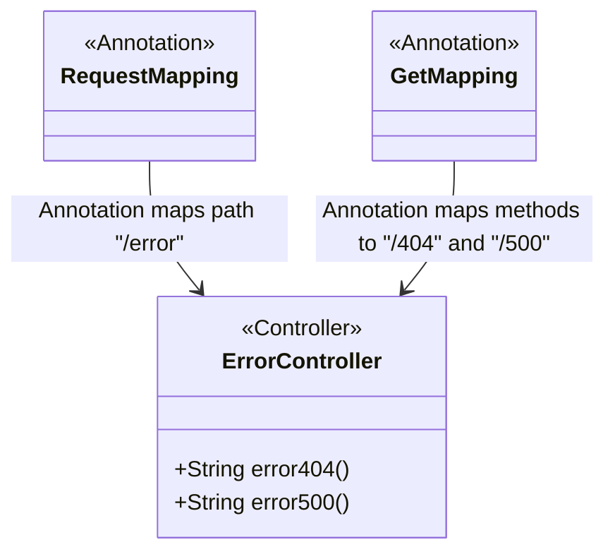
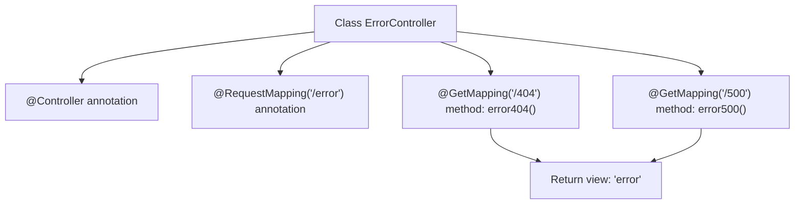

# Basic Information

|      |      |
|------|------|
| Name | ErrorController |
| Language | .java |
| Code Path | weixin-java-miniapp-demo/src/main/java/com/github/binarywang/demo/wx/miniapp/error/ErrorController.java |
| Package Name | com.github.binarywang.demo.wx.miniapp.error |
| Dependencies | ['org.springframework.stereotype.Controller', 'org.springframework.web.bind.annotation.GetMapping', 'org.springframework.web.bind.annotation.RequestMapping'] |
| Brief Description | This is a Spring Boot error handling controller that maps 404 and 500 error requests under the /error path, and uniformly returns the error view page. |

# Description

This is a Spring Boot error handling controller class used to uniformly handle system exception situations. The controller is identified as a Spring MVC controller component through the @Controller annotation, and uses the @RequestMapping annotation to map all requests to the /error path. Two GET request handling methods are defined within the controller, corresponding respectively to error page redirects for HTTP 404 status code and 500 status code. When a page not found error occurs in the system, the error404 method returns a view page named error; when an internal server error occurs, the error500 method also returns the error view page, implementing a unified error page display function.

# Class Summary

| Name   | Type  | Description |
|-------|------|-------------|
| ErrorController | class | This is a Spring Boot error handling controller that maps 404 and 500 error requests under the /error path, and uniformly returns the error page view. |

## Class ErrorController

|      |      |
|------|------|
| Access Modifier | @Controller;@RequestMapping("/error");public |
| Type | class |
| Name | ErrorController |
| Description | This is a Spring Boot error handling controller that maps 404 and 500 error requests under the /error path, and uniformly returns the error page view. |

### UML Class Diagram

This class diagram shows a controller class `ErrorController` in Spring Boot, which is used to handle HTTP requests and return error page views. By using `@RequestMapping` and `@GetMapping` annotations, specific URL paths are mapped to corresponding handler methods, implementing unified responses for 404 and 500 error status codes.

### Internal Method Call Graph

This flowchart shows the structure and request mapping relationship of the `ErrorController` class. The controller binds the path `/error` through the `@RequestMapping` annotation, and defines two GET request handling methods corresponding to 404 and 500 error pages respectively, both returning a view template named `error`.

### Field List

| Name  | Type  | Description |
|-------|-------|------|

### Method List

| Name  | Type  | Description |
|-------|-------|------|
| error404 | String | This code defines a GET request method for handling 404 errors, returning the string "error". When users access non-existent pages, the system will call this method and display an error page. |
| error500 | String | This code defines a controller method that handles HTTP GET requests. When the access path is "/500", it returns a view page named "error" for displaying server internal errors. |

