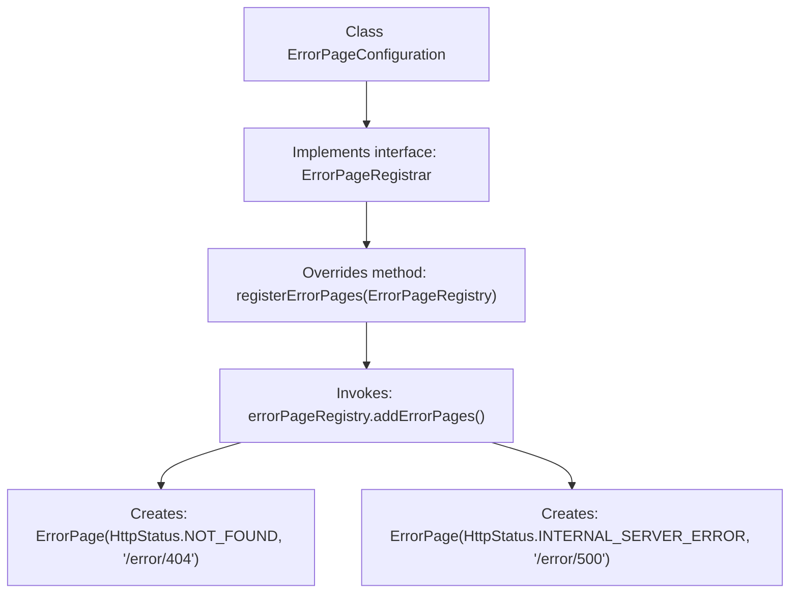

# Basic Information

|      |      |
|------|------|
| Name | ErrorPageConfiguration |
| Language | .java |
| Code Path | weixin-java-miniapp-demo\src\main\java\com\github\binarywang\demo\wx\miniapp\error\ErrorPageConfiguration.java |
| Package Name | com.github.binarywang.demo.wx.miniapp.error |
| Dependencies | ['org.springframework.boot.web.server.ErrorPage', 'org.springframework.boot.web.server.ErrorPageRegistrar', 'org.springframework.boot.web.server.ErrorPageRegistry', 'org.springframework.http.HttpStatus', 'org.springframework.stereotype.Component'] |
| Brief Description | The ErrorPageConfiguration class registers 404 and 500 error pages, mapping them to the /error/404 and /error/500 paths respectively. |

# Description

This is a Spring component class used for configuring custom error pages. The class implements the ErrorPageRegistrar interface and overrides the registerErrorPages method to register two error pages: when a 404 status code occurs, it redirects to the /error/404 path, and when a 500 status code occurs, it redirects to the /error/500 path. This configuration adds error page mappings through the ErrorPageRegistry object.

# Class Summary

| Name   | Type  | Description |
|-------|------|-------------|
| ErrorPageConfiguration | class | Define the error page configuration class and register the handling paths for 404 and 500 errors. |


## Class ErrorPageConfiguration

|      |      |
|------|------|
| Access Modifier | @Component;public |
| Type | class |
| Name | ErrorPageConfiguration |
| Description | Define the error page configuration class and register the handling paths for 404 and 500 errors. |


### UML Class Diagram

```mermaid
classDiagram
    class ErrorPageConfiguration {
        +registerErrorPages(ErrorPageRegistry errorPageRegistry) void
    }
    <<interface>> ErrorPageRegistrar {
        +registerErrorPages(ErrorPageRegistry errorPageRegistry) void
    }
    class ErrorPageRegistry {
        +addErrorPages(ErrorPage... errorPages) void
    }
    class ErrorPage {
        +ErrorPage(HttpStatus status, String path)
    }
    class HttpStatus {
        <<enumeration>>
        NOT_FOUND
        INTERNAL_SERVER_ERROR
        // ...other status codes
    }

    ErrorPageConfiguration --> ErrorPageRegistrar : implements
    ErrorPageConfiguration --> ErrorPageRegistry : depends on
    ErrorPageConfiguration --> ErrorPage : creates
    ErrorPage --> HttpStatus : uses
```

This code defines a Spring component `ErrorPageConfiguration` that implements the `ErrorPageRegistrar` interface, used for registering custom error pages. When the application encounters 404 or 500 errors, it will redirect to the corresponding error handling path. The class diagram illustrates the dependency relationships between this component and related interfaces and classes, including the error page registry, error page entity, and HTTP status enumeration.


### Internal Method Call Graph



This flowchart illustrates the core logic of a Spring Boot error page configuration class. The ErrorPageConfiguration class implements the ErrorPageRegistrar interface, overrides the registerErrorPages method, and registers two standard error pages with the container: a 404 Not Found error mapped to the "/error/404" path, and a 500 Internal Server Error mapped to the "/error/500" path. When the web application encounters errors corresponding to these HTTP status codes, this configuration automatically redirects to the predefined error handling paths.

### Field List

| Name  | Type  | Description |
|-------|-------|------|

### Method List

| Name  | Type  | Description |
|-------|-------|------|
| registerErrorPages | void | Registration error page, 404 errors redirect to /error/404, and 500 errors redirect to /error/500. |


