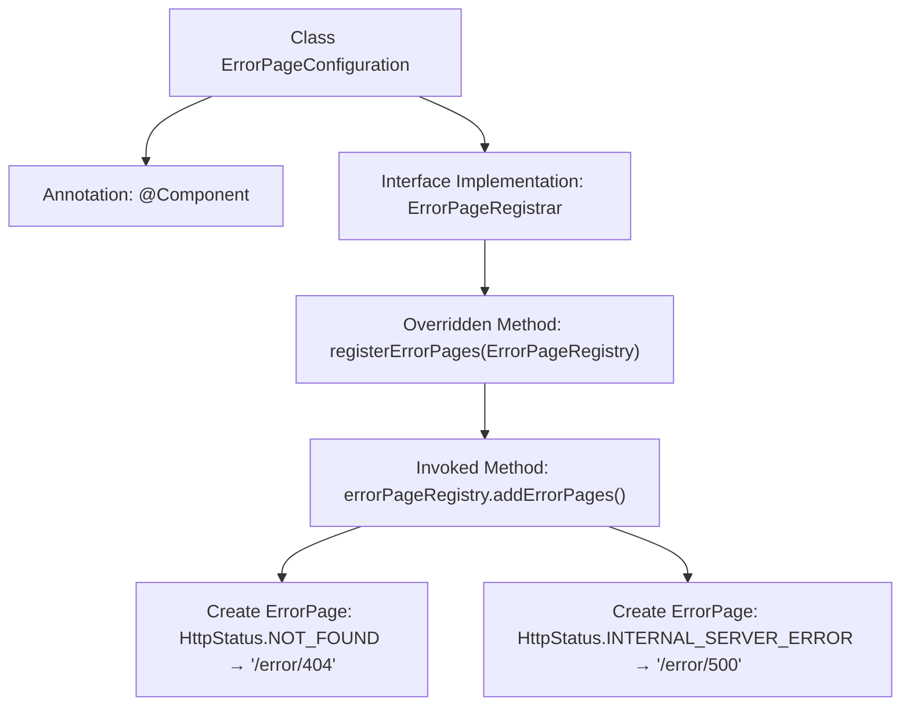

# Basic Information

|      |      |
|------|------|
| Name | ErrorPageConfiguration |
| Language | .java |
| Code Path | weixin-java-miniapp-demo/src/main/java/com/github/binarywang/demo/wx/miniapp/error/ErrorPageConfiguration.java |
| Package Name | com.github.binarywang.demo.wx.miniapp.error |
| Dependencies | ['org.springframework.boot.web.server.ErrorPage', 'org.springframework.boot.web.server.ErrorPageRegistrar', 'org.springframework.boot.web.server.ErrorPageRegistry', 'org.springframework.http.HttpStatus', 'org.springframework.stereotype.Component'] |
| Brief Description | Error page configuration class, registering the handling paths for 404 and 500 errors. |

# Description

The content defines a Spring component class named ErrorPageConfiguration, which implements the ErrorPageRegistrar interface. This class overrides the registerErrorPages method and registers two error page mappings via ErrorPageRegistry: mapping HTTP status code 404 to the path /error/404 and HTTP status code 500 to the path /error/500. This is used to configure the application's error page handling mechanism.

# Class Summary

| Name   | Type  | Description |
|-------|------|-------------|
| ErrorPageConfiguration | class | Define the error page configuration class and register the handling paths for 404 and 500 errors. |


## Class ErrorPageConfiguration

|      |      |
|------|------|
| Access Modifier | @Component;public |
| Type | class |
| Name | ErrorPageConfiguration |
| Description | Define the error page configuration class and register the handling paths for 404 and 500 errors. |


### UML Class Diagram

```mermaid
classDiagram
    class ErrorPageConfiguration {
        +registerErrorPages(ErrorPageRegistry errorPageRegistry) void
    }
    <<interface>> ErrorPageRegistrar {
        <<Interface>>
        +registerErrorPages(ErrorPageRegistry errorPageRegistry) void
    }
    class ErrorPageRegistry {
        +addErrorPages(ErrorPage... errorPages) void
    }
    class ErrorPage {
        +ErrorPage(HttpStatus status, String path)
    }
    class HttpStatus {
        <<enumeration>>
        NOT_FOUND
        INTERNAL_SERVER_ERROR
        //Other status codes...
    }

    ErrorPageConfiguration --|> ErrorPageRegistrar : implements
    ErrorPageConfiguration --> ErrorPageRegistry : depends on
    ErrorPageConfiguration --> ErrorPage : creates
    ErrorPage --> HttpStatus : uses
```

This code defines a Spring component `ErrorPageConfiguration` for registering custom error pages. It implements the `ErrorPageRegistrar` interface and registers two error pages via the `registerErrorPages` method in `ErrorPageRegistry`: a 404 status code mapped to the "/error/404" path and a 500 status code mapped to "/error/500". The class diagram illustrates the inheritance relationship between the component and the interface, as well as its dependencies with other classes (such as `ErrorPage` and the `HttpStatus` enumeration), demonstrating a typical implementation of Spring Boot's error handling mechanism.


### Internal Method Call Graph



This code flowchart illustrates the implementation process of Spring Boot error page configuration. The ErrorPageConfiguration class becomes a Spring component through the @Component annotation and implements the ErrorPageRegistrar interface. The core logic resides in the registerErrorPages method, which registers two error pages via ErrorPageRegistry: the 404 status code maps to the "/error/404" path, and the 500 status code maps to the "/error/500" path. The entire flow demonstrates Spring Boot's exception handling mechanism, where centralized configuration redirects specific HTTP status codes to custom error pages.

### Field List

| Name  | Type  | Description |
|-------|-------|------|

### Method List

| Name  | Type  | Description |
|-------|-------|------|
| registerErrorPages | void | Registration error pages: 404 redirects to /error/404, 500 redirects to /error/500. |


