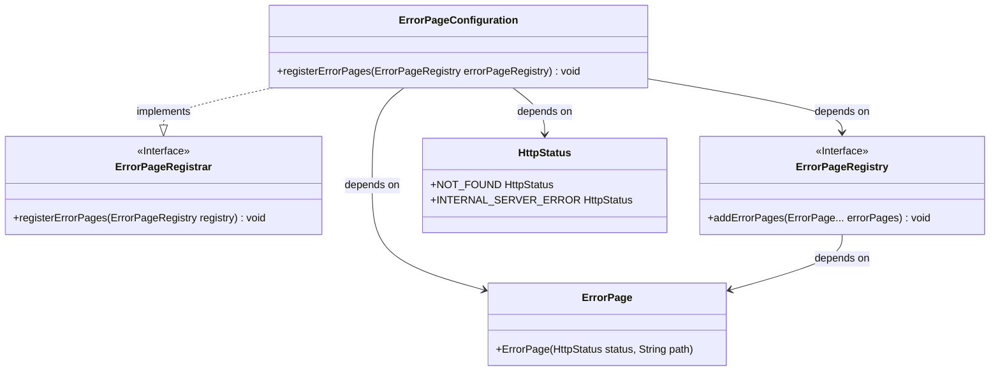
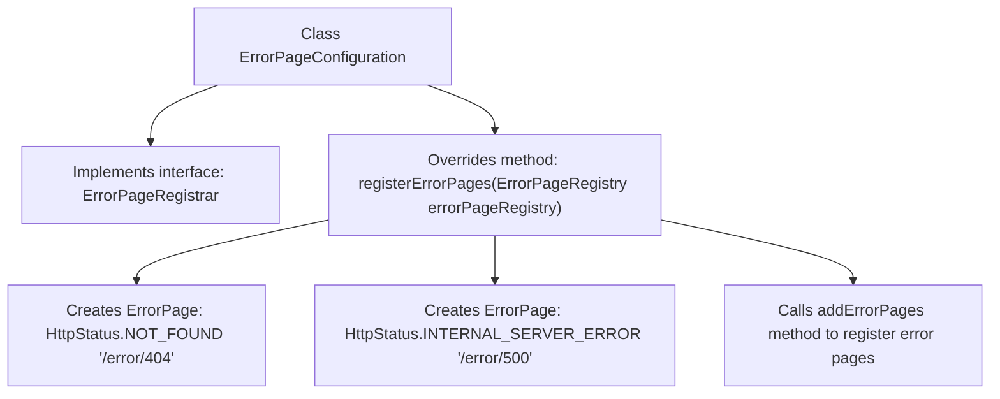

# Basic Information

|      |      |
|------|------|
| Name | ErrorPageConfiguration |
| Language | .java |
| Code Path | weixin-java-miniapp-demo/src/main/java/com/github/binarywang/demo/wx/miniapp/error/ErrorPageConfiguration.java |
| Package Name | com.github.binarywang.demo.wx.miniapp.error |
| Dependencies | ['org.springframework.boot.web.server.ErrorPage', 'org.springframework.boot.web.server.ErrorPageRegistrar', 'org.springframework.boot.web.server.ErrorPageRegistry', 'org.springframework.http.HttpStatus', 'org.springframework.stereotype.Component'] |
| Brief Description | This configuration class implements the error page registration function. When a 404 or 500 error occurs, it will redirect to the /error/404 and /error/500 pages respectively. |

# Description

This is an error page configuration class for a Spring Boot application that implements the ErrorPageRegistrar interface. This component overrides the registerErrorPages method to add two custom error page mappings to the error page registrar: mapping HTTP 404 status code to the /error/404 path, and mapping HTTP 500 status code to the /error/500 path. When the application encounters corresponding errors, it will automatically redirect to the specified error handling pages, implementing unified error page management functionality.

# Class Summary

| Name   | Type  | Description |
|-------|------|-------------|
| ErrorPageConfiguration | class | This configuration class implements the error page registration function. When a 404 or 500 error occurs, it will redirect to the /error/404 and /error/500 pages respectively for processing. |

## Class ErrorPageConfiguration

|      |      |
|------|------|
| Access Modifier | @Component;public |
| Type | class |
| Name | ErrorPageConfiguration |
| Description | This configuration class implements the error page registration function. When a 404 or 500 error occurs, it will redirect to the /error/404 and /error/500 pages respectively for processing. |

### UML Class Diagram

This class diagram shows a component `ErrorPageConfiguration` used for configuring error pages. It implements the `ErrorPageRegistrar` interface and depends on `ErrorPageRegistry`, `ErrorPage`, and `HttpStatus` when registering error pages. Through implementing the interface method, it maps 404 and 500 errors to specified paths.

### Internal Method Call Graph

This flowchart illustrates how the `ErrorPageConfiguration` class implements the `ErrorPageRegistrar` interface and registers custom error page paths for HTTP 404 and 500 status codes through the `registerErrorPages` method. This class is commonly used in Spring Boot applications to uniformly handle common error pages, enhancing user experience and system robustness.

### Field List

| Name  | Type  | Description |
|-------|-------|------|

### Method List

| Name  | Type  | Description |
|-------|-------|------|
| registerErrorPages | void | This code configures the error page handling mechanism for a Spring Boot application. When 404 or 500 errors occur, the system will redirect to the corresponding /error/404 and /error/500 pages. |

