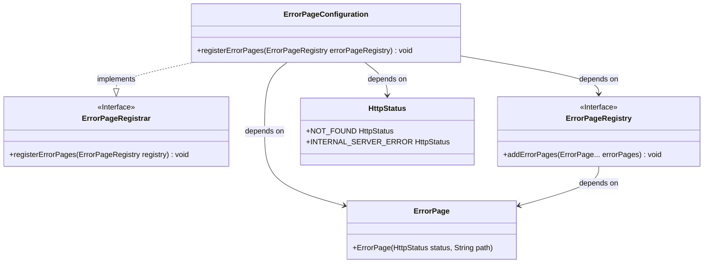

# Basic Information

|      |      |
|------|------|
| Name | ErrorPageConfiguration |
| Language | .java |
| Code Path | weixin-java-miniapp-demo/src/main/java/com/github/binarywang/demo/wx/miniapp/error/ErrorPageConfiguration.java |
| Package Name | com.github.binarywang.demo.wx.miniapp.error |
| Dependencies | ['org.springframework.boot.web.server.ErrorPage', 'org.springframework.boot.web.server.ErrorPageRegistrar', 'org.springframework.boot.web.server.ErrorPageRegistry', 'org.springframework.http.HttpStatus', 'org.springframework.stereotype.Component'] |
| Brief Description | This configuration class implements the error page registration function. When a 404 or 500 error occurs, it redirects to the /error/404 and /error/500 pages respectively for processing. |

# Description

This is an error page configuration class in a Spring Boot application that implements the ErrorPageRegistrar interface. This component registers custom error page handling logic by overriding the registerErrorPages method. When the application encounters a 404 resource not found or 500 server internal error, it will automatically redirect to the corresponding /error/404 and /error/500 paths for unified error handling, thereby providing a better user experience and error notification mechanism.

# Class Summary

| Name   | Type  | Description |
|-------|------|-------------|
| ErrorPageConfiguration | class | This configuration class is used to register custom error pages, redirecting 404 and 500 errors to the /error/404 and /error/500 paths for handling respectively. |

## Class ErrorPageConfiguration

|      |      |
|------|------|
| Access Modifier | @Component;public |
| Type | class |
| Name | ErrorPageConfiguration |
| Description | This configuration class is used to register custom error pages, redirecting 404 and 500 errors to the /error/404 and /error/500 paths for handling respectively. |

### UML Class Diagram

This class diagram shows that the `ErrorPageConfiguration` class implements the `ErrorPageRegistrar` interface, and in its `registerErrorPages` method, it depends on `ErrorPageRegistry`, `ErrorPage`, and `HttpStatus` to register the configuration logic for 404 and 500 error pages.

### Internal Method Call Graph

This flowchart shows how the `ErrorPageConfiguration` class implements error page configuration in Spring Boot. It registers custom 404 and 500 error page paths to the system when the application starts by implementing the `ErrorPageRegistrar` interface, enabling users to be redirected to specified friendly prompt pages when accessing exception pages.

### Field List

| Name  | Type  | Description |
|-------|-------|------|

### Method List

| Name  | Type  | Description |
|-------|-------|------|
| registerErrorPages | void | This code snippet demonstrates how to register custom error pages in a Spring Boot application. By implementing the ErrorPageRegistrar interface, HTTP 404 and 500 errors are mapped to the /error/404 and /error/500 paths respectively, achieving a unified error handling mechanism. |

