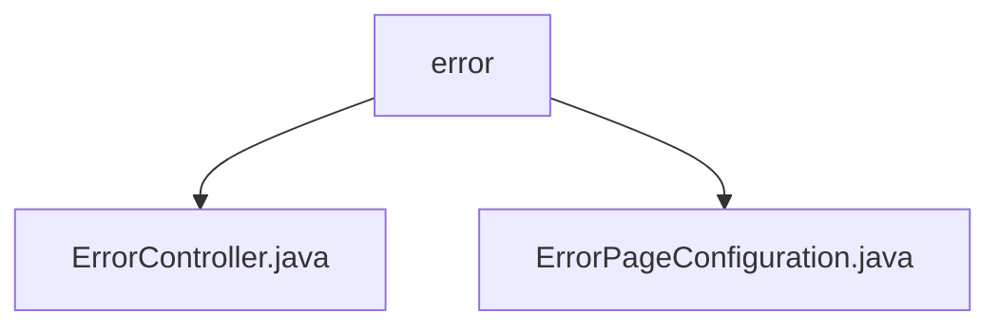

# Basic Information

|      |      |
|------|------|
| Name | error |
| Language | .java |
| Code Path | weixin-java-miniapp-demo/src/main/java/com/github/binarywang/demo/wx/miniapp/error |
| Package Name | docs.src.main.java.com.github.binarywang.demo.wx.miniapp.error |
| Brief Description | This is a Spring Boot error handling system that includes an error controller and configuration class. The controller handles 404 and 500 error requests, returning a unified error view. The configuration class implements the ErrorPageRegistrar interface, mapping HTTP 404 and 500 status codes to corresponding error paths, achieving unified error page management. |

# Description

## Overview  
This module is responsible for uniformly handling HTTP error page redirection and display in Spring Boot applications. It registers custom error paths through a configuration class and renders generic error views via a controller class. In terms of interface specifications, ErrorPageConfiguration implements the ErrorPageRegistrar interface to complete the mapping from status codes to paths, while ErrorController provides view responses under corresponding paths. Key data structures include HttpStatus, ErrorPageRegistry, and ModelAndView, among others. The external dependency is the Spring Boot Web module. For example: 404 errors are mapped to /error/404 and handled by the error() method.

## Main Business Scenarios  
The module integrates common static error page redirection logic in web applications, centrally managing exception entry points similar to an event bus pattern. When users access non-existent resources or internal service errors occur, the system automatically forwards to designated error pages based on status codes, enhancing user experience consistency. It supports API types such as GET request processing and status-driven routing. Typical application scenarios include friendly prompts for illegal paths or server failures in WeChat Mini Program demos. For example: accessing undefined interfaces returns a "page not found" prompt.

### Package Internal Structure View

This flowchart shows the structure of the error handling module in the WeChat Mini Program Demo project. The `error` package contains two Java files, which are class files used for handling error page configuration and controller logic, respectively, demonstrating the exception handling mechanism design in front-end and back-end collaborative development.

# File List

| Name   | Type  | Description |
|-------|------|-------------|
| [ErrorController.java](ErrorController.md) | file | This is a Spring Boot error handling controller that maps 404 and 500 error page requests under the /error path, and uniformly returns the error view. |
| [ErrorPageConfiguration.java](ErrorPageConfiguration.md) | file | This configuration class implements the error page registration function. When a 404 or 500 error occurs, it will redirect to the /error/404 and /error/500 pages respectively. |

