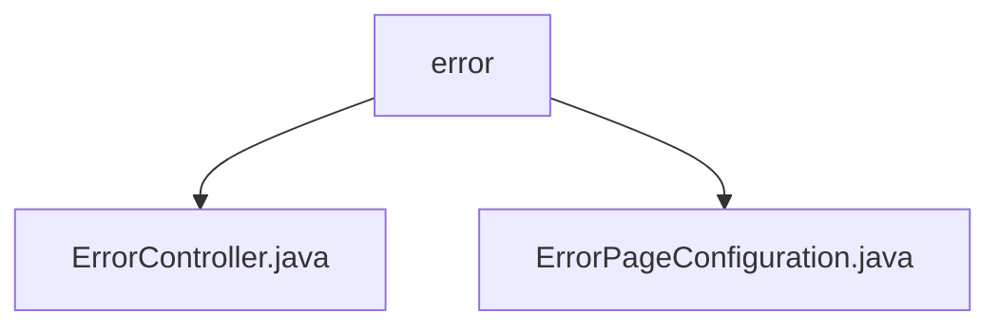

# Basic Information

|      |      |
|------|------|
| Name | error |
| Language | .java |
| Code Path | weixin-java-miniapp-demo/src/main/java/com/github/binarywang/demo/wx/miniapp/error |
| Package Name | docs.src.main.java.com.github.binarywang.demo.wx.miniapp.error |
| Brief Description | This is a Spring Boot error handling system that includes an error controller and configuration class. The controller handles 404 and 500 errors and returns a unified error page, while the configuration class maps HTTP status codes to corresponding error paths for unified management. |

# Description

## Overview  
This module is responsible for the unified handling and page presentation of HTTP errors in Spring Boot applications. It implements routing mapping and view rendering for common error statuses such as 404 and 500 through the collaboration of ErrorController and ErrorPageConfiguration. Its core mechanism resembles an event bus pattern, centrally dispatching different error statuses to a unified entry point for processing.

In terms of interface specifications, ErrorController provides two GET request paths: /error/404 and /error/500 for responding to client access; ErrorPageConfiguration registers the mapping relationship from corresponding HTTP status codes to the aforementioned paths at service startup. Key data structures include the ErrorPage object and HttpStatus enumeration values (such as 404, 500).

External dependencies mainly include the ErrorPageRegistrar interface and related annotation support from the Spring Boot Web module. For example: @Controller, @RequestMapping, and the HttpStatus class all come from the org.springframework package.

## Main Business Scenarios  
When users access non-existent resources or server exceptions occur, the error process is triggered. The system automatically redirects to specific handling methods under /error based on the status code, and ultimately presents a Thymeleaf template page named error. The entire process is transparent to the frontend and possesses good extensibility, suitable for fault tolerance control in various web application scenarios.

The API type primarily integrates Spring MVC-style REST endpoints with built-in error page mechanisms. A typical application pattern allows developers to reuse this structure to quickly build custom error prompt interfaces without additional configuration of global exception handlers. For instance, this structure can be directly reused in WeChat Mini Program backend demo projects to enhance user experience consistency.

### Package Internal Structure View

This flowchart shows the structure of the error handling module in the WeChat Mini Program Demo project. The `error` package contains two Java class files, which are used for error controller and error page configuration respectively. The overall structure is clear, reflecting a separation of concerns design for exception handling.

# File List

| Name   | Type  | Description |
|-------|------|-------------|
| [ErrorController.java](ErrorController.md) | file | This is a Spring Boot error controller that handles 404 and 500 error page requests, returning the error view uniformly. |
| [ErrorPageConfiguration.java](ErrorPageConfiguration.md) | file | This configuration class implements the error page registration function. When a 404 or 500 error occurs, it will redirect to the /error/404 and /error/500 pages respectively. |

