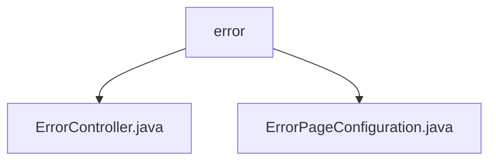

# Basic Information

|      |      |
|------|------|
| Name | error |
| Language | .java |
| Code Path | weixin-java-miniapp-demo/src/main/java/com/github/binarywang/demo/wx/miniapp/error |
| Package Name | docs.src.main.java.com.github.binarywang.demo.wx.miniapp.error |
| Brief Description | Spring MVC error handling controller, mapping the `/error` path, including 404 and 500 error handling methods. The configuration class implements the `ErrorPageRegistrar` interface to register 404 and 500 error page paths. |

# Description

## Overview  
The core responsibility of this module is to uniformly handle HTTP error page responses, including error request routing and error page registration configuration. The interface specification follows the Spring MVC standard, utilizing @Controller and @RequestMapping for path mapping, and the ErrorPageRegistrar interface to bind error status codes with paths. Key data structures include the ErrorPage object and the ErrorPageRegistry registrar. External dependencies are limited to the Spring Web framework. For example, the ErrorController handles /error/404 requests, while ErrorPageConfiguration registers the redirection path for the 404 status code.  

## Primary Business Scenarios  
The module accomplishes error handling through two collaborative components: the controller receives specific error requests, and the configuration class establishes the mapping between status codes and paths. The interaction pattern resembles a routing hub, where error status codes automatically redirect to predefined paths. Typical applications include triggering a 404 redirect when a user accesses a non-existent resource or returning a 500 error page during service exceptions. For instance, when accessing an invalid URL, the system automatically returns a unified error view via /error/404.

### Package Internal Structure View

This flowchart illustrates the hierarchical structure of the error handling module in the WeChat Mini Program demo project. The root node is the error directory, which contains two child nodes: ErrorController.java and ErrorPageConfiguration.java, corresponding to the error controller and error page configuration class respectively. The entire structure is concise and clear, reflecting the core file organization of the error handling module.

# File List

| Name   | Type  | Description |
|-------|------|-------------|
| [ErrorController.java](ErrorController.md) | file | Error controller class, handling 404 and 500 errors, returning error pages. |
| [ErrorPageConfiguration.java](ErrorPageConfiguration.md) | file | Error page configuration class, registering the processing paths for 404 and 500 errors. |

