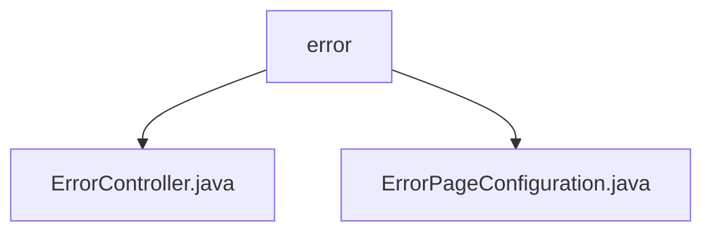

# Basic Information

|      |      |
|------|------|
| Name | error |
| Language | .java |
| Code Path | weixin-java-miniapp-demo/src/main/java/com/github/binarywang/demo/wx/miniapp/error |
| Package Name | docs.src.main.java.com.github.binarywang.demo.wx.miniapp.error |
| Brief Description | This is a Spring Boot error handling system that includes an error controller and configuration class. The controller handles 404 and 500 error requests, uniformly returning the error view; the configuration class registers custom error pages, implementing an elegant error notification mechanism. |

# Description

## Overview  
This module is responsible for uniformly handling common HTTP errors (such as 404, 500) in Spring Boot applications by configuring error pages and controllers to achieve a consistent error display mechanism. Similar to an event bus pattern, it centrally manages exception routing and response views.

The interface specification includes GET request mapping methods error404 and error500 under the /error path, both returning the view name error; meanwhile, the ErrorPageConfiguration class registers corresponding error paths to implement error redirection logic.

Key data structures include the error view model in ErrorController and the registration list of ErrorPage in ErrorPageConfiguration.

External dependencies include Spring Boot framework core components (spring-boot-starter-web) and built-in ErrorPageRegistrar interface support.

Example: When accessing non-existent resources, automatically redirect to /error/404 and render the error page.

## Main Business Scenarios  
When users access illegal addresses or server-side exceptions occur, the error handling process is triggered. The system directs to specified error page paths based on status codes, and ErrorController uniformly renders the feedback interface.

The interaction pattern adopts a standard MVC structure. Frontend requests are dispatched by DispatcherServlet, match error routes, and call corresponding Controller methods to present results.

Functionally, it ensures consistency and maintainability of error prompts, enhancing user experience. For example: internal server errors directly display /error/500 content instead of default stack trace information.

Typical application scenarios cover Web API exception capture, static resource missing feedback, etc., applicable to various service platforms built on Spring Boot.

API types are primarily browser-oriented clients. Integration examples can be seen in cases where global exception handling mechanisms combine with custom ErrorViewResolver extension points.

### Package Internal Structure View

This flowchart shows the structure of the error handling module in the WeChat Mini Program demo project. The `error` package contains two Java files: `ErrorController.java` and `ErrorPageConfiguration.java`, which are used to handle error page logic and configuration.

# File List

| Name   | Type  | Description |
|-------|------|-------------|
| [ErrorController.java](ErrorController.md) | file | This is a Spring Boot error handling controller that maps 404 and 500 error page requests under the /error path, uniformly returning the error view. |
| [ErrorPageConfiguration.java](ErrorPageConfiguration.md) | file | This configuration class implements the error page registration function. When a 404 or 500 error occurs, it redirects to the /error/404 and /error/500 pages respectively for processing. |

