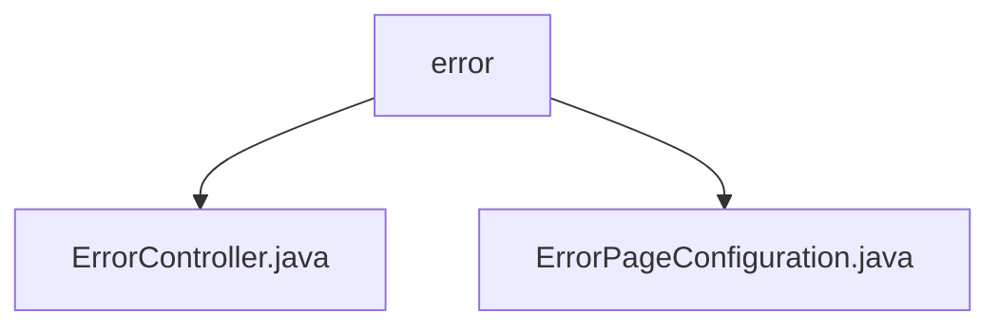

# Basic Information

|      |      |
|------|------|
| Name | error |
| Language | .java |
| Code Path | weixin-java-miniapp-demo/src/main/java/com/github/binarywang/demo/wx/miniapp/error |
| Package Name | docs.src.main.java.com.github.binarywang.demo.wx.miniapp.error |
| Brief Description | This is a Spring Boot error handling system that includes an error controller and a configuration class. The controller handles 404 and 500 errors uniformly through @RequestMapping("/error") and returns the error view page. The configuration class implements the ErrorPageRegistrar interface, mapping the 404 and 500 status codes to the /error/404 and /error/500 paths respectively, achieving unified error page management and redirection functionality. |

# Description

## Overview  
This module is responsible for the unified management of global error handling and page redirection in Spring Boot applications, implemented collaboratively by ErrorController and ErrorPageConfiguration to achieve exception capturing and view rendering. Its core responsibility is to intercept common HTTP errors such as 404 and 500, and guide them to a unified error page for display, thereby enhancing user experience and system robustness.

In terms of interface specifications, ErrorController exposes a GET request handler under the /error path, responding separately to status codes 404 and 500; whereas ErrorPageConfiguration implements the ErrorPageRegistrar interface to register mappings from status codes to paths during WebServer startup.

Key data structures include HttpStatus (representing HTTP status codes), ModelAndView (encapsulating view information), and ErrorPage (used for registering error redirection rules). These components work together to complete the closed-loop process from error identification to page presentation.

External dependencies mainly involve annotations such as @Controller, @RequestMapping, ErrorPageRegistrar, and related HTTP annotations from the Spring Boot Web module, without introducing any third-party libraries.

For example, when a user accesses a non-existent URL, the system triggers a 404 error and redirects to /error/404, which ultimately returns an error view page via ErrorController.

## Main Business Scenarios  
This module covers two primary business processes: runtime exception capture with page feedback, and error route configuration during service startup. Together they form a complete error response mechanism that ensures stability in front-end and back-end interactions.

Regarding interaction patterns, it adopts a design concept similar to the event bus model—whereby various error signals are received through a unified entry point and dispatched to corresponding processing logic for view rendering or redirection operations.

Functional completeness is reflected in its support for both static error page configurations and dynamic controller-based handling approaches, thus meeting diverse error response requirements across different levels. Additionally, extensibility has been reserved to accommodate more types of status codes.

Typical application scenarios include friendly prompt interfaces displayed upon encountering web page not found (404) or server internal errors (500). It also applies to unified control over unexpected statuses during backend API debugging for mini-programs.

The API type focuses on RESTful interface designs in Spring MVC style, with integration examples visible in actual deployments within WeChat Mini-Program demo projects concerning basic fallback strategies for error handling.

### Package Internal Structure View

This flowchart shows the structure of the error handling module in the WeChat Mini Program Java Demo project. The `error` folder serves as the parent node, containing two child files: `ErrorController.java` and `ErrorPageConfiguration.java`, which are used to handle error page logic and configuration.

# File List

| Name   | Type  | Description |
|-------|------|-------------|
| [ErrorController.java](ErrorController.md) | file | This is a Spring Boot error handling controller that maps 404 and 500 error requests under the /error path, and uniformly returns the error view page. |
| [ErrorPageConfiguration.java](ErrorPageConfiguration.md) | file | This configuration class implements the error page registration function. When a 404 or 500 error occurs, it will redirect to the /error/404 and /error/500 pages respectively. |

