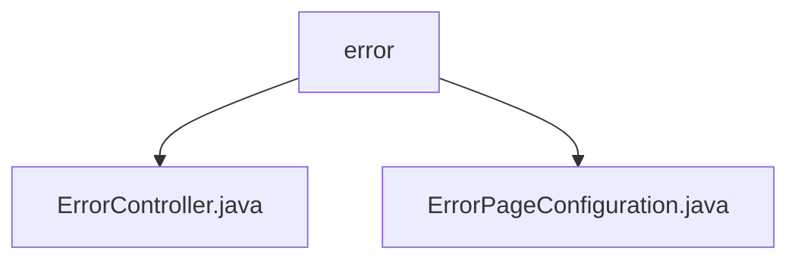

# Basic Information

|      |      |
|------|------|
| Name | error |
| Language | .java |
| Code Path | weixin-java-miniapp-demo\src\main\java\com\github\binarywang\demo\wx\miniapp\error |
| Package Name | docs.src.main.java.com.github.binarywang.demo.wx.miniapp.error |
| Brief Description | The Spring MVC controller handles 404/500 errors and returns a unified view. The configuration class registers error page mappings, directing 404 to /error/404 and 500 to /error/500. |

# Description

## Overview  
The core responsibility of this module is to uniformly handle HTTP error responses for web applications, including error page routing and configuration management. The interface specification follows Spring MVC standards, defining error path mappings through annotations such as @Controller and @RequestMapping, for example, /error/404 and /error/500. Key data structures include ErrorPageRegistry and ErrorPage, which are used to register the mapping relationship between status codes and paths. The only external dependency is the Spring Web framework. For instance, ErrorController returns a unified view template, while ErrorPageConfiguration implements the error path redirection logic.  

## Primary Business Scenarios  
The module primarily handles two types of business scenarios: users accessing non-existent resources triggering 404 errors or server exceptions triggering 500 errors. The interaction mode resembles gateway routing, automatically redirecting status codes to predefined paths. Functional completeness is reflected in the end-to-end processing from error capture to page rendering. A typical application pattern is the extension of the Spring Boot error handling mechanism, such as dynamically configuring error pages via ErrorPageRegistrar. The API types are all server-side routing, and integration examples include standard processing flows for 404/500 errors.

### Package Internal Structure View

This flowchart illustrates the hierarchical structure of the error handling module in the WeChat Mini Program demo project. The root node is the error directory, which contains two child nodes: ErrorController.java and ErrorPageConfiguration.java, corresponding to the error controller and error page configuration class respectively. The entire structure is clear and concise, reflecting the core file organization of the error handling module, and adheres to the typical design pattern of separating controllers and configuration classes in a Spring Boot project.

# File List

| Name   | Type  | Description |
|-------|------|-------------|
| [ErrorController.java](ErrorController.md) | file | The ErrorController handles 404 and 500 errors, returning a unified error page. |
| [ErrorPageConfiguration.java](ErrorPageConfiguration.md) | file | The ErrorPageConfiguration class registers 404 and 500 error pages, mapping them to the /error/404 and /error/500 paths respectively. |

