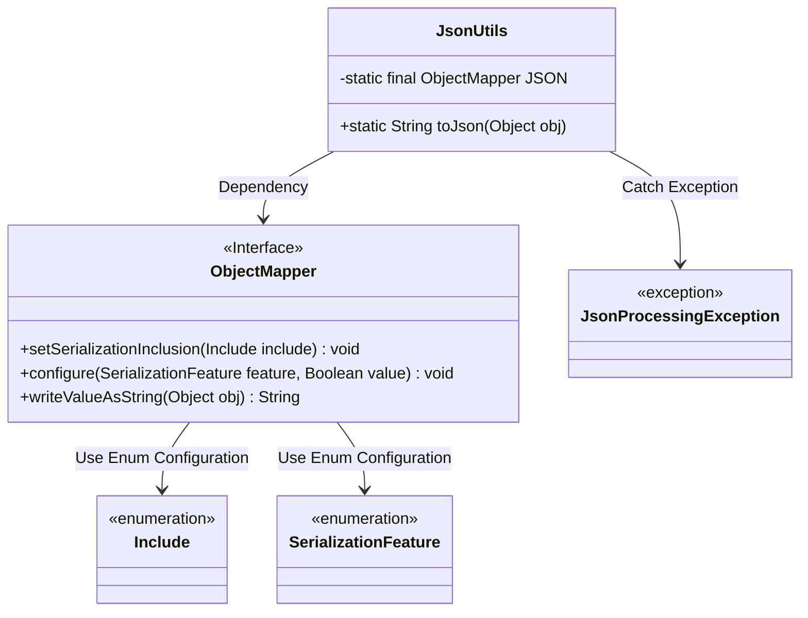
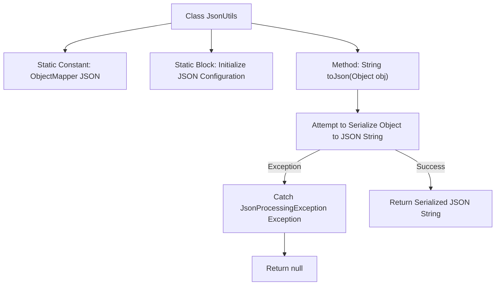

# Basic Information

|      |      |
|------|------|
| Name | JsonUtils |
| Language | .java |
| Code Path | weixin-java-miniapp-demo/src/main/java/com/github/binarywang/demo/wx/miniapp/utils/JsonUtils.java |
| Package Name | com.github.binarywang.demo.wx.miniapp.utils |
| Dependencies | ['com.fasterxml.jackson.annotation.JsonInclude.Include', 'com.fasterxml.jackson.core.JsonProcessingException', 'com.fasterxml.jackson.databind.ObjectMapper', 'com.fasterxml.jackson.databind.SerializationFeature'] |
| Brief Description | The JsonUtils utility class provides JSON serialization functionality, using ObjectMapper to implement object-to-JSON string conversion, configured with non-null field serialization and formatted output, printing stack traces and returning null in case of exceptions. |

# Description

This is a Java utility class named JsonUtils that internally uses Jackson library's ObjectMapper object to handle JSON serialization operations. The class initializes the ObjectMapper instance through a static code block and configures two important properties: first, setting the serialization to ignore null value fields; second, enabling output formatting with indentation to make the JSON string more readable. The toJson method provides the functionality to convert any Java object into a formatted JSON string, and if an exception occurs during the conversion process, it prints the stack trace information and returns null.

# Class Summary

| Name   | Type  | Description |
|-------|------|-------------|
| JsonUtils | class | The JsonUtils utility class provides JSON serialization functionality, using ObjectMapper to convert objects to JSON strings, ignoring null values and formatting the output, returning null in case of exceptions. |

## Class JsonUtils

|      |      |
|------|------|
| Access Modifier | public |
| Type | class |
| Name | JsonUtils |
| Description | The JsonUtils utility class provides JSON serialization functionality, using ObjectMapper to convert objects to JSON strings, ignoring null values and formatting the output, returning null in case of exceptions. |

### UML Class Diagram

This class diagram shows the structure of the `JsonUtils` utility class and its related dependencies. `JsonUtils` holds a static `ObjectMapper` instance and configures it within a static initialization block. Its public method `toJson` serializes objects into JSON strings, catching and printing exceptions if processing fails. The overall design reflects the core usage patterns of the Jackson library and its exception handling mechanism.

### Internal Method Call Graph

This flowchart illustrates the structure of the `JsonUtils` class and the execution logic of the `toJson` method. First, initialize ObjectMapper and configure its properties, then serialize the incoming object into a JSON string via the `toJson` method. If an exception occurs, print the stack trace and return null.

### Field List

| Name  | Type  | Description |
|-------|-------|------|
| JSON = new ObjectMapper() | ObjectMapper | A static immutable ObjectMapper instance is defined for JSON serialization and deserialization operations. |

### Method List

| Name  | Type  | Description |
|-------|-------|------|
| toJson | String | This method converts an object to a JSON string, and if the conversion fails, it prints the exception and returns null. |

