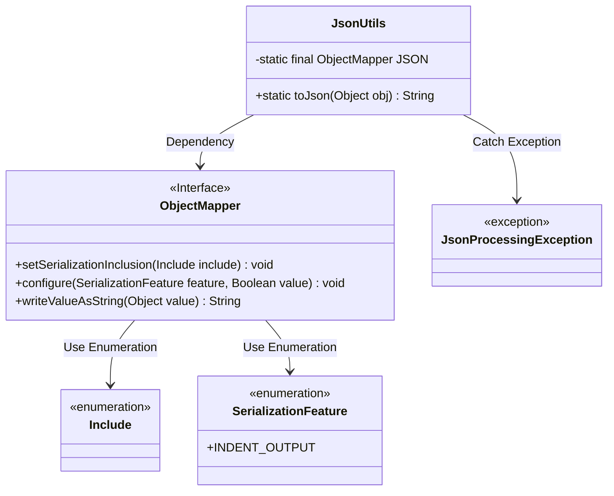
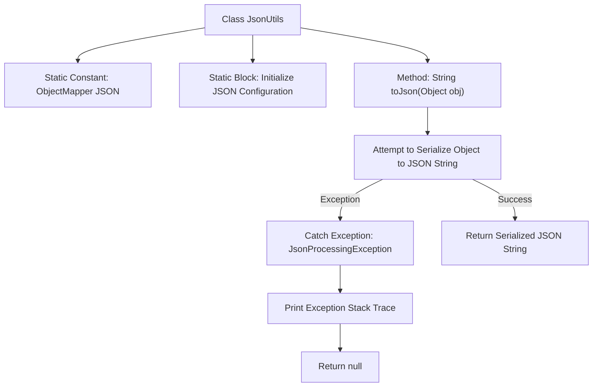

# Basic Information

|      |      |
|------|------|
| Name | JsonUtils |
| Language | .java |
| Code Path | weixin-java-miniapp-demo/src/main/java/com/github/binarywang/demo/wx/miniapp/utils/JsonUtils.java |
| Package Name | com.github.binarywang.demo.wx.miniapp.utils |
| Dependencies | ['com.fasterxml.jackson.annotation.JsonInclude.Include', 'com.fasterxml.jackson.core.JsonProcessingException', 'com.fasterxml.jackson.databind.ObjectMapper', 'com.fasterxml.jackson.databind.SerializationFeature'] |
| Brief Description | The JsonUtils utility class provides JSON serialization functionality, using ObjectMapper to implement the conversion from objects to JSON strings. It is configured with non-null field serialization and formatted output. In case of exceptions, it returns null and prints the stack trace information. |

# Description

This is a Java utility class named JsonUtils that uses the ObjectMapper object from the Jackson library internally to handle JSON serialization operations. The class initializes an ObjectMapper instance named JSON through a static code block and configures two properties: setting the serialization to ignore null value fields, and enabling the formatting output feature to make the JSON string highly readable. The utility class provides a public static method toJson, which is used to convert any Java object into a formatted JSON string representation. If an exception occurs during the conversion process, the stack trace information will be printed and null will be returned.

# Class Summary

| Name   | Type  | Description |
|-------|------|-------------|
| JsonUtils | class | The JsonUtils utility class provides JSON serialization functionality, using ObjectMapper to convert objects to JSON strings, ignoring null values and formatting the output, returning null in case of exceptions. |

## Class JsonUtils

|      |      |
|------|------|
| Access Modifier | public |
| Type | class |
| Name | JsonUtils |
| Description | The JsonUtils utility class provides JSON serialization functionality, using ObjectMapper to convert objects to JSON strings, ignoring null values and formatting the output, returning null in case of exceptions. |

### UML Class Diagram

This class diagram shows the structure and dependencies of the `JsonUtils` utility class. `JsonUtils` holds a static `ObjectMapper` instance and configures its serialization behavior in the static block. The `toJson` method converts an object to a JSON string and handles possible `JsonProcessingException` exceptions. Overall, it reflects the encapsulation design using the Jackson library for JSON operations.

### Internal Method Call Graph

This flowchart illustrates the structure of the `JsonUtils` class and the execution logic of the `toJson` method. First, an `ObjectMapper` instance is defined and initialized, with its serialization features set via a static block; the `toJson` method attempts to convert the incoming object into a formatted JSON string, and returns null after printing the exception if it fails.

### Field List

| Name  | Type  | Description |
|-------|-------|------|
| JSON = new ObjectMapper() | ObjectMapper | A static constant JSON is defined, which is an instance of the ObjectMapper class, used for serialization and deserialization operations of JSON data. |

### Method List

| Name  | Type  | Description |
|-------|-------|------|
| toJson | String | This method converts an object to a JSON string, and if the conversion fails, it prints the exception and returns null. |

