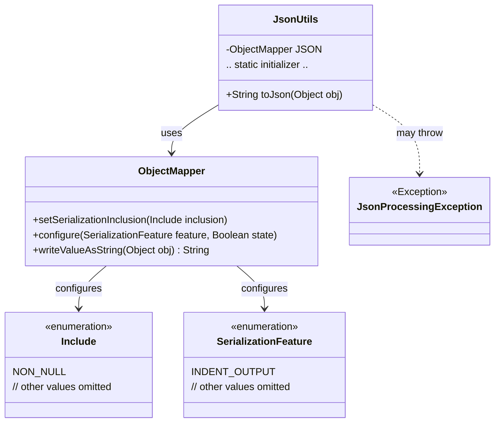
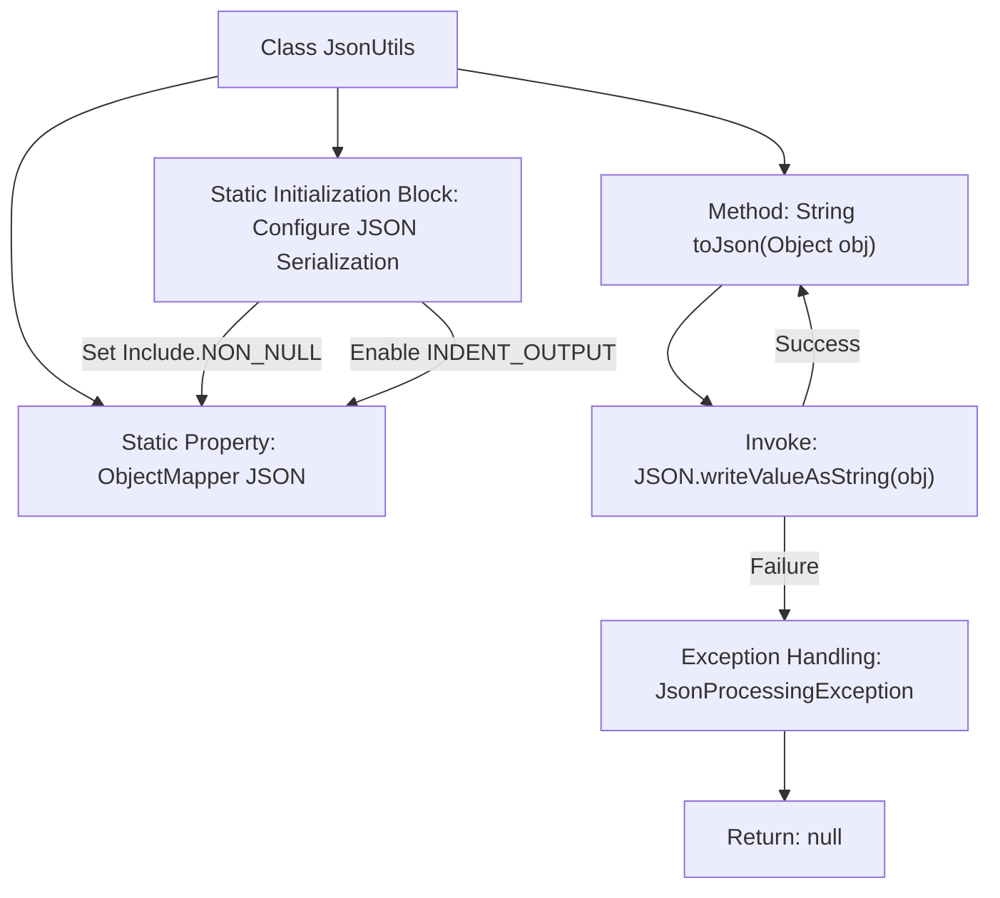

# Basic Information

|      |      |
|------|------|
| Name | JsonUtils |
| Language | .java |
| Code Path | weixin-java-miniapp-demo\src\main\java\com\github\binarywang\demo\wx\miniapp\utils\JsonUtils.java |
| Package Name | com.github.binarywang.demo.wx.miniapp.utils |
| Dependencies | ['com.fasterxml.jackson.annotation.JsonInclude.Include', 'com.fasterxml.jackson.core.JsonProcessingException', 'com.fasterxml.jackson.databind.ObjectMapper', 'com.fasterxml.jackson.databind.SerializationFeature'] |
| Brief Description | The JsonUtils class provides a static method `toJson`, which uses ObjectMapper to convert an object into a JSON string, automatically ignoring null values and formatting the output. Returns null if an exception occurs. |

# Description

JsonUtils is a utility class designed for handling JSON serialization operations. It utilizes ObjectMapper as its core component and configures two key options in the static initialization block: ignoring null fields and enabling indented formatted output. The class provides a static method `toJson`, which accepts any object as a parameter and converts it into a formatted JSON string. If a JsonProcessingException occurs during the conversion process, the exception stack trace is printed and null is returned. The entire class is designed as a concise and practical JSON serialization tool.

# Class Summary

| Name   | Type  | Description |
|-------|------|-------------|
| JsonUtils | class | The JsonUtils utility class uses ObjectMapper to convert objects into JSON strings, configured to ignore null values and format the output, returning null in case of exceptions. |

## Class JsonUtils

|      |      |
|------|------|
| Access Modifier | public |
| Type | class |
| Name | JsonUtils |
| Description | The JsonUtils utility class uses ObjectMapper to convert objects into JSON strings, configured to ignore null values and format the output, returning null in case of exceptions. |

### UML Class Diagram

This code demonstrates a JSON utility class `JsonUtils` that utilizes `ObjectMapper` for serializing objects to JSON strings. The class diagram includes the core class `JsonUtils` along with its dependency `ObjectMapper`, as well as related configuration enums `Include` and `SerializationFeature`. `JsonUtils` configures the `ObjectMapper` through a static initializer block, provides the `toJson` method for handling serialization, and may throw `JsonProcessingException`. The overall design reflects encapsulation of JSON serialization and exception handling mechanisms.

### Internal Method Call Graph

This code demonstrates a JsonUtils utility class primarily used for serializing objects to JSON strings. The core functionality involves configuring a statically initialized ObjectMapper (ignoring null values, enabling indented output), with the toJson method encapsulating the write operation and handling potential JsonProcessingException. The flowchart clearly presents the class structure, initialization configuration, and main method logic branches, particularly highlighting the exception handling path.

### Field List

| Name  | Type  | Description |
|-------|-------|------|
| JSON = new ObjectMapper() | ObjectMapper | Define a private static immutable JSON object mapper instance. |

### Method List

| Name  | Type  | Description |
|-------|-------|------|
| toJson | String | Convert the object to a JSON string, returning null on exception. |

