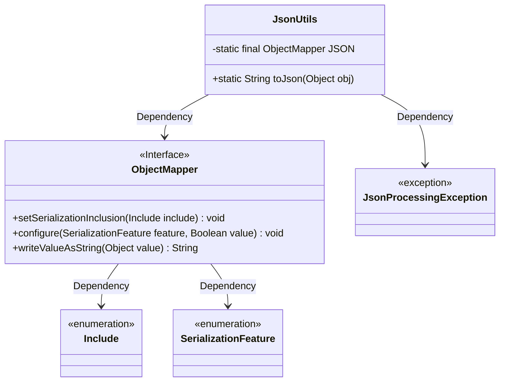
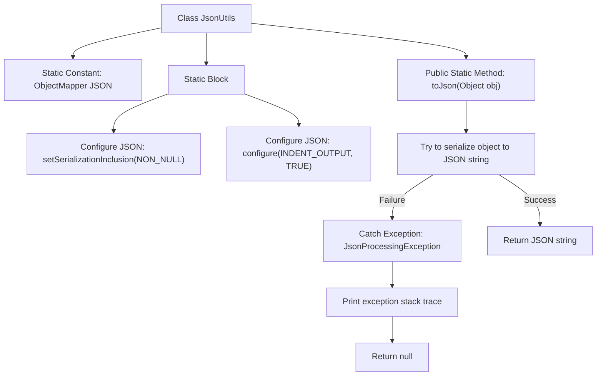

# Basic Information

|      |      |
|------|------|
| Name | JsonUtils |
| Language | .java |
| Code Path | weixin-java-miniapp-demo/src/main/java/com/github/binarywang/demo/wx/miniapp/utils/JsonUtils.java |
| Package Name | com.github.binarywang.demo.wx.miniapp.utils |
| Dependencies | ['com.fasterxml.jackson.annotation.JsonInclude.Include', 'com.fasterxml.jackson.core.JsonProcessingException', 'com.fasterxml.jackson.databind.ObjectMapper', 'com.fasterxml.jackson.databind.SerializationFeature'] |
| Brief Description | The JsonUtils utility class provides JSON serialization functionality, using ObjectMapper to implement the conversion from objects to JSON strings. It is configured with non-null field serialization and formatted output, returning null in case of exceptions. |

# Description

This is a Java utility class named JsonUtils that uses the ObjectMapper object from the Jackson library internally to handle JSON serialization operations. The class initializes an ObjectMapper instance through a static code block and configures two important properties: first, setting the serialization to ignore null value fields; second, enabling the formatting output feature to make the JSON string highly readable. The toJson method provides the functionality to convert any Java object into a JSON formatted string. If an exception occurs during the conversion process, it prints the stack information and returns null.

# Class Summary

| Name   | Type  | Description |
|-------|------|-------------|
| JsonUtils | class | The JsonUtils utility class provides JSON serialization functionality, using ObjectMapper to implement the conversion from objects to JSON strings. It is configured with non-null field serialization and formatted output, returning null in case of exceptions. |

## Class JsonUtils

|      |      |
|------|------|
| Access Modifier | public |
| Type | class |
| Name | JsonUtils |
| Description | The JsonUtils utility class provides JSON serialization functionality, using ObjectMapper to implement the conversion from objects to JSON strings. It is configured with non-null field serialization and formatted output, returning null in case of exceptions. |

### UML Class Diagram

This class diagram shows the structure of the `JsonUtils` utility class and its dependencies. `JsonUtils` holds a static `ObjectMapper` instance and configures its properties in the static block. The `toJson` method serializes an object into a JSON string, and if a `JsonProcessingException` occurs, it prints the stack trace and returns null. Overall, it reflects the core usage pattern of the Jackson library and its exception handling mechanism.

### Internal Method Call Graph

This flowchart illustrates the structure of the `JsonUtils` class and the execution logic of the `toJson` method. First, ObjectMapper is initialized and configured, then the object is serialized into a JSON string through the toJson method. If an exception occurs, the stack trace is printed and null is returned.

### Field List

| Name  | Type  | Description |
|-------|-------|------|
| JSON = new ObjectMapper() | ObjectMapper | A static final ObjectMapper instance named JSON is defined for handling JSON data serialization and deserialization operations. |

### Method List

| Name  | Type  | Description |
|-------|-------|------|
| toJson | String | This method converts an object to a JSON string, returning null and printing the exception stack trace if the conversion fails. |

