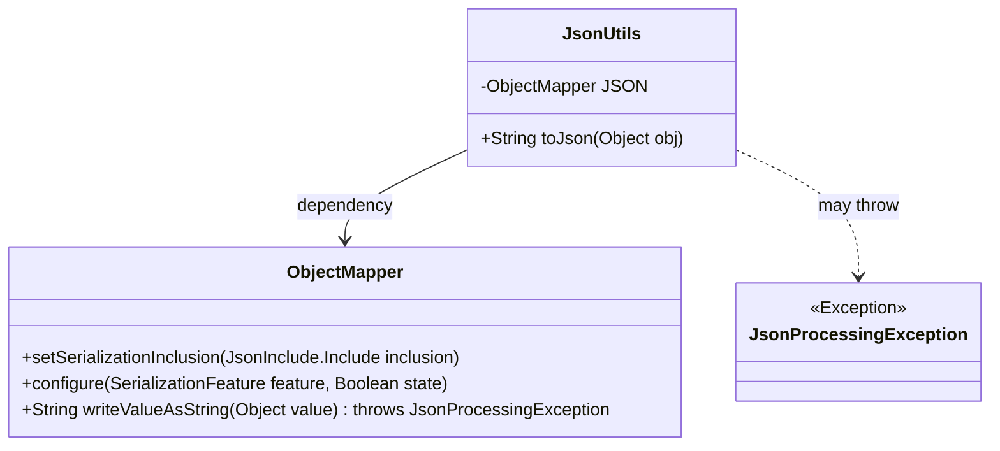
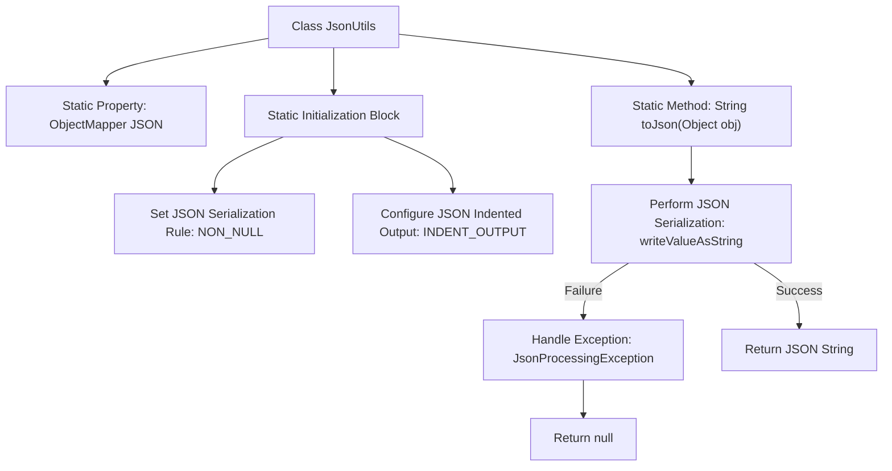

# Basic Information

|      |      |
|------|------|
| Name | JsonUtils |
| Language | .java |
| Code Path | weixin-java-miniapp-demo/src/main/java/com/github/binarywang/demo/wx/miniapp/utils/JsonUtils.java |
| Package Name | com.github.binarywang.demo.wx.miniapp.utils |
| Dependencies | ['com.fasterxml.jackson.annotation.JsonInclude.Include', 'com.fasterxml.jackson.core.JsonProcessingException', 'com.fasterxml.jackson.databind.ObjectMapper', 'com.fasterxml.jackson.databind.SerializationFeature'] |
| Brief Description | The JsonUtils class provides static JSON serialization methods, using ObjectMapper to configure non-null field output and formatting, returning null on exceptions. |

# Description

JsonUtils is a utility class designed for handling JSON serialization operations. It employs a static ObjectMapper instance named JSON and configures serialization behavior in a static initialization block: ignoring null fields and enabling indented output formatting. The class provides a toJson method that converts any object into a formatted JSON string. If a JsonProcessingException occurs during conversion, it prints the stack trace and returns null. The entire class is concisely designed, focusing solely on JSON serialization functionality.

# Class Summary

| Name   | Type  | Description |
|-------|------|-------------|
| JsonUtils | class | The JsonUtils class provides a static method toJson, which uses ObjectMapper to convert an object into a JSON string, automatically ignoring null values and formatting the output. |

## Class JsonUtils

|      |      |
|------|------|
| Access Modifier | public |
| Type | class |
| Name | JsonUtils |
| Description | The JsonUtils class provides a static method toJson, which uses ObjectMapper to convert an object into a JSON string, automatically ignoring null values and formatting the output. |

### UML Class Diagram

This code demonstrates a JSON utility class JsonUtils that utilizes ObjectMapper for conversion between objects and JSON strings. The class diagram consists of three main components: JsonUtils serves as a utility class encapsulating the core toJson method; ObjectMapper provides actual JSON serialization functionality with configurations for non-null value output and indentation formatting; JsonProcessingException represents the potential exception type. This design embodies the Single Responsibility Principle by centralizing JSON processing logic while ensuring default ObjectMapper configuration through a static initialization block.

### Internal Method Call Graph

This code demonstrates a JSON utility class whose core functionality is serializing objects to JSON strings via a static ObjectMapper. The flowchart clearly presents the class structure initialization process (setting non-null serialization and indentation format) and the execution logic of the main method toJson (including normal return and exception handling paths). The static initialization block automatically executes configurations during class loading, while the toJson method encapsulates safe serialization operations, returning null and printing the stack trace in case of exceptions.

### Field List

| Name  | Type  | Description |
|-------|-------|------|
| JSON = new ObjectMapper() | ObjectMapper | Create a static immutable JSON object mapper instance. |

### Method List

| Name  | Type  | Description |
|-------|-------|------|
| toJson | String | Convert the object to a JSON string, returning null on exception. |

