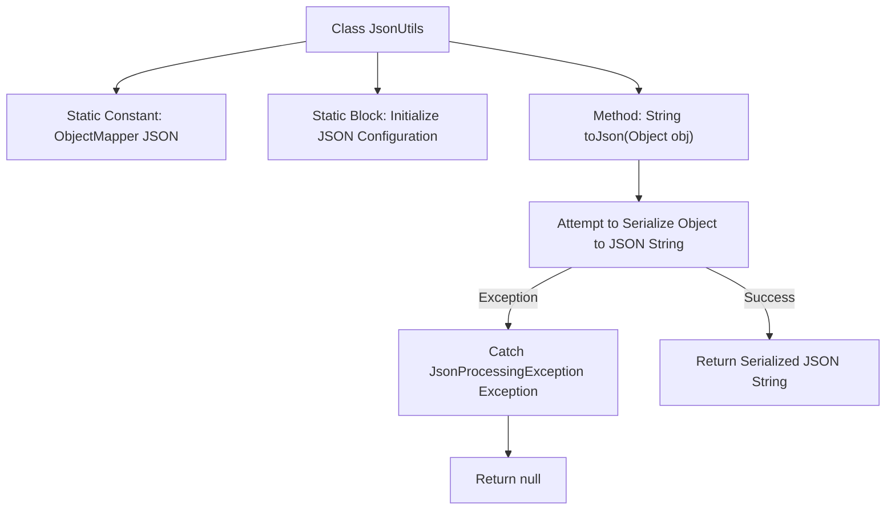

# Basic Information

|      |      |
|------|------|
| Name | JsonUtils |
| Language | .java |
| Code Path | weixin-java-miniapp-demo/src/main/java/com/github/binarywang/demo/wx/miniapp/utils/JsonUtils.java |
| Package Name | com.github.binarywang.demo.wx.miniapp.utils |
| Dependencies | ['com.fasterxml.jackson.annotation.JsonInclude.Include', 'com.fasterxml.jackson.core.JsonProcessingException', 'com.fasterxml.jackson.databind.ObjectMapper', 'com.fasterxml.jackson.databind.SerializationFeature'] |
| Brief Description | The JsonUtils utility class provides JSON serialization functionality, using ObjectMapper to implement the conversion from objects to JSON strings. It is configured with non-null field serialization and formatted output. It returns null and prints stack information when an exception occurs. |

# Description

This is a Java utility class named JsonUtils that uses Jackson library's ObjectMapper object internally to handle JSON serialization operations. The class initializes the ObjectMapper instance through a static code block and configures two important properties: first, setting the serialization to ignore null fields, and second, enabling formatted output functionality to make the JSON string highly readable. The toJson method provides the functionality to convert any Java object into a JSON format string. If a JsonProcessingException occurs during the conversion process, it will print stack information and return null. This utility class adopts the singleton pattern concept, holding the ObjectMapper instance through a static field to improve performance and resource utilization.

# Class Summary

| Name   | Type  | Description |
|-------|------|-------------|
| JsonUtils | class | The JsonUtils utility class provides JSON serialization functionality, using ObjectMapper to implement the conversion from objects to JSON strings. It is configured with non-null field serialization and formatted output, returning null in case of exceptions. |

## Class JsonUtils

|      |      |
|------|------|
| Access Modifier | public |
| Type | class |
| Name | JsonUtils |
| Description | The JsonUtils utility class provides JSON serialization functionality, using ObjectMapper to implement the conversion from objects to JSON strings. It is configured with non-null field serialization and formatted output, returning null in case of exceptions. |

### UML Class Diagram

This class diagram shows the structure of the `JsonUtils` utility class and its related dependencies. `JsonUtils` holds a static `ObjectMapper` instance and configures it during class loading. It provides a method to serialize objects into JSON strings, while depending on types such as `ObjectMapper`, `Include`, and `SerializationFeature` from the Jackson library, and handles potential `JsonProcessingException` exceptions that may be thrown.

### Internal Method Call Graph

This flowchart illustrates the structure of the `JsonUtils` class and the execution logic of the `toJson` method. First, initialize `ObjectMapper` and set serialization configuration, then serialize objects to JSON strings via the `toJson` method. If an exception occurs, print the stack trace and return `null`.

### Field List

| Name  | Type  | Description |
|-------|-------|------|
| JSON = new ObjectMapper() | ObjectMapper | Declared a static final ObjectMapper instance named JSON for handling JSON data serialization and deserialization operations. |

### Method List

| Name  | Type  | Description |
|-------|-------|------|
| toJson | String | This method converts an object to a JSON string, and returns null if the conversion fails, printing the exception. |

