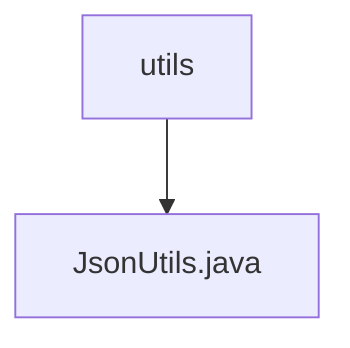

# Basic Information

|      |      |
|------|------|
| Name | utils |
| Language | .java |
| Code Path | weixin-java-miniapp-demo/src/main/java/com/github/binarywang/demo/wx/miniapp/utils |
| Package Name | docs.src.main.java.com.github.binarywang.demo.wx.miniapp.utils |
| Brief Description | The JsonUtils utility class provides JSON serialization functionality, using ObjectMapper to implement the conversion from objects to JSON strings. It is configured with non-null field serialization and formatted output. It returns null and prints stack information when an exception occurs. |

# Description

This is a Java utility class named JsonUtils that internally uses Jackson library's ObjectMapper object to handle JSON serialization operations. The class initializes the ObjectMapper instance through a static code block and configures two important properties: first, setting the serialization to ignore null value fields; second, enabling formatted output functionality to make the JSON string highly readable. The toJson method provides the functionality to convert any Java object into a JSON format string. If a JsonProcessingException occurs during the conversion process, it will print stack information and return null. This utility class adopts the singleton pattern concept, holding the ObjectMapper instance through a static field to improve performance and resource utilization.

### Package Internal Structure View

This flowchart illustrates the utility class structure in the WeChat Mini Program Java development example project. The `utils` package serves as the utility class collection directory, containing the `JsonUtils.java` file used for processing JSON data, demonstrating the organizational approach of basic functional modules in the project.

# File List

| Name   | Type  | Description |
|-------|------|-------------|
| [JsonUtils.java](JsonUtils.md) | file | The JsonUtils utility class provides JSON serialization functionality, using ObjectMapper to implement the conversion from objects to JSON strings. It is configured with non-null field serialization and formatted output. It returns null and prints stack information when an exception occurs. |

