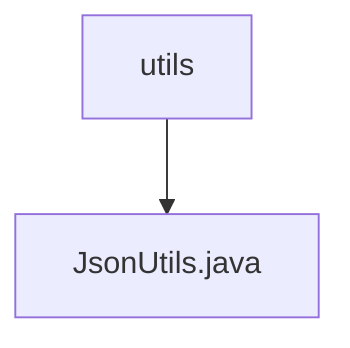

# Basic Information

|      |      |
|------|------|
| Name | utils |
| Language | .java |
| Code Path | weixin-java-miniapp-demo/src/main/java/com/github/binarywang/demo/wx/miniapp/utils |
| Package Name | docs.src.main.java.com.github.binarywang.demo.wx.miniapp.utils |
| Brief Description | The JsonUtils utility class provides JSON serialization functionality, using ObjectMapper to implement the conversion from objects to JSON strings. It is configured with non-null field serialization and formatted output, returning null in case of exceptions. |

# Description

This is a Java utility class named JsonUtils that internally uses Jackson library's ObjectMapper object to handle JSON serialization operations. The class initializes the ObjectMapper instance through a static code block and configures two important properties: first, setting the serialization to ignore null value fields; second, enabling formatted output functionality to make the JSON string highly readable. The toJson method provides the functionality to convert any Java object into a JSON format string. If an exception occurs during the conversion process, it prints the stack information and returns null.

### Package Internal Structure View

This flowchart illustrates the hierarchical relationship between the tool class directory `utils` and the JSON utility file `JsonUtils.java` contained within the WeChat Mini Program Java Demo project. The `utils` directory, as a toolkit folder, encapsulates functionality into specific utility class files, demonstrating a clear module ownership structure. This diagram helps quickly understand the organizational approach and dependency relationships of internal components within the project.

# File List

| Name   | Type  | Description |
|-------|------|-------------|
| [JsonUtils.java](JsonUtils.md) | file | The JsonUtils utility class provides JSON serialization functionality, using ObjectMapper to implement the conversion from objects to JSON strings. It is configured with non-null field serialization and formatted output, returning null in case of exceptions. |

