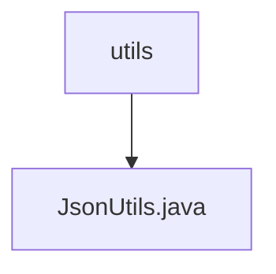

# Basic Information

|      |      |
|------|------|
| Name | utils |
| Language | .java |
| Code Path | weixin-java-miniapp-demo/src/main/java/com/github/binarywang/demo/wx/miniapp/utils |
| Package Name | docs.src.main.java.com.github.binarywang.demo.wx.miniapp.utils |
| Brief Description | The JsonUtils utility class provides JSON serialization functionality, using ObjectMapper to implement the conversion from objects to JSON strings. It is configured with non-null field serialization and formatted output. In case of exceptions, it returns null and prints stack trace information. |

# Description

This is a Java utility class named JsonUtils that internally uses the ObjectMapper object from the Jackson library to handle JSON serialization operations. The class initializes an ObjectMapper instance named JSON through a static code block and configures two properties: setting serialization to ignore null fields, and enabling formatted output functionality to make JSON strings highly readable. The utility class provides a public static method toJson, which is used to convert any Java object into a formatted JSON string representation, printing stack trace information and returning null if an exception occurs during the conversion process.

### Package Internal Structure View

This flowchart shows the tool class structure in the WeChat Mini Program Java development example project, where the `utils` directory contains a JSON processing tool file `JsonUtils.java`, reflecting the organization method of the tool module in the project.

# File List

| Name   | Type  | Description |
|-------|------|-------------|
| [JsonUtils.java](JsonUtils.md) | file | The JsonUtils utility class provides JSON serialization functionality, using ObjectMapper to implement the conversion from objects to JSON strings. It is configured with non-null field serialization and formatted output. In case of exceptions, it returns null and prints the stack trace information. |

