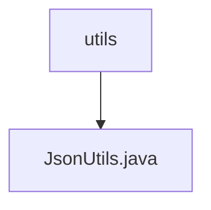

# Basic Information

|      |      |
|------|------|
| Name | utils |
| Language | .java |
| Code Path | weixin-java-miniapp-demo/src/main/java/com/github/binarywang/demo/wx/miniapp/utils |
| Package Name | docs.src.main.java.com.github.binarywang.demo.wx.miniapp.utils |
| Brief Description | The JsonUtils utility class provides JSON serialization functionality, using ObjectMapper to convert objects to JSON strings, configured with non-null field serialization and formatted output, printing stack traces and returning null in case of exceptions. |

# Description

This is a Java utility class named JsonUtils that internally uses the ObjectMapper object from the Jackson library to handle JSON serialization operations. The class initializes an ObjectMapper instance through a static code block and configures two important properties: first, setting the serialization to ignore null-value fields; second, enabling output formatting with indentation to make the JSON string more readable. The toJson method provides the functionality to convert any Java object into a formatted JSON string, returning null and printing stack information if an exception occurs during the conversion process.

### Package Internal Structure View

This flowchart shows the hierarchical relationship between a utility class directory `utils` and its contained file `JsonUtils.java` in the project `weixin-java-miniapp-demo`. The `utils` directory serves as the parent node, with `JsonUtils.java` as its child file, reflecting the typical organization pattern of utility classes in Java projects.

# File List

| Name   | Type  | Description |
|-------|------|-------------|
| [JsonUtils.java](JsonUtils.md) | file | The JsonUtils utility class provides JSON serialization functionality, using ObjectMapper to convert objects to JSON strings, configured with non-null field serialization and formatted output, printing stack traces and returning null in case of exceptions. |

