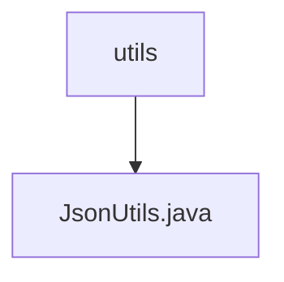

# Basic Information

|      |      |
|------|------|
| Name | utils |
| Language | .java |
| Code Path | weixin-java-miniapp-demo/src/main/java/com/github/binarywang/demo/wx/miniapp/utils |
| Package Name | docs.src.main.java.com.github.binarywang.demo.wx.miniapp.utils |
| Brief Description | The JsonUtils class provides static JSON serialization methods, using ObjectMapper to configure non-null field output and formatting, returning null on exceptions. |

# Description

JsonUtils is a utility class designed for handling JSON serialization operations. It employs a static ObjectMapper instance for JSON processing and configures serialization behavior in a static initialization block: ignoring null fields and enabling indented output formatting. The class provides a toJson method that converts any object into a formatted JSON string. If a JsonProcessingException occurs during conversion, it prints the stack trace and returns null. The entire class is concisely designed, focusing solely on JSON serialization functionality.

### Package Internal Structure View

This flowchart illustrates the hierarchical relationship of utility classes in the WeChat Mini Program demo project. The top-level node is the utils directory, which contains a utility class file JsonUtils.java. This is a typical single-file utility class structure designed for handling JSON-related operations. The entire structure is concise and clear, adhering to the design pattern of utility class modules.

# File List

| Name   | Type  | Description |
|-------|------|-------------|
| [JsonUtils.java](JsonUtils.md) | file | The JsonUtils class provides static JSON serialization methods, using ObjectMapper to configure non-null field output and formatting, returning null in case of exceptions. |

