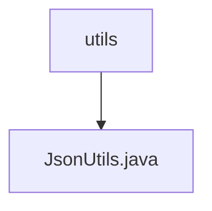

# Basic Information

|      |      |
|------|------|
| Name | utils |
| Language | .java |
| Code Path | weixin-java-miniapp-demo\src\main\java\com\github\binarywang\demo\wx\miniapp\utils |
| Package Name | docs.src.main.java.com.github.binarywang.demo.wx.miniapp.utils |
| Brief Description | The JsonUtils class provides a static method `toJson`, which uses ObjectMapper to convert an object into a JSON string, automatically ignoring null values and formatting the output. Returns null in case of an exception. |

# Description

JsonUtils is a utility class designed for handling JSON serialization operations. It utilizes ObjectMapper as its core component and configures two key options in the static initialization block: ignoring null fields and enabling indented formatted output. The class provides a static method `toJson`, which accepts any object as a parameter and converts it into a formatted JSON string. If a JsonProcessingException occurs during the conversion process, the exception stack trace is printed, and null is returned. The entire class is designed to be a concise and practical JSON serialization tool.

### Package Internal Structure View

This flowchart illustrates the structural relationship within the utils directory of the WeChat Mini Program demo project. The top-level node is the utils directory, which contains only one subordinate file: the JsonUtils.java utility class for handling JSON-related operations. This simple single-layer structure indicates a functionally focused utility module dedicated to providing JSON data processing capabilities.

# File List

| Name   | Type  | Description |
|-------|------|-------------|
| [JsonUtils.java](JsonUtils.md) | file | The JsonUtils class provides a static method `toJson`, which uses ObjectMapper to convert an object into a JSON string, automatically ignoring null values and formatting the output. Returns null in case of exceptions. |

