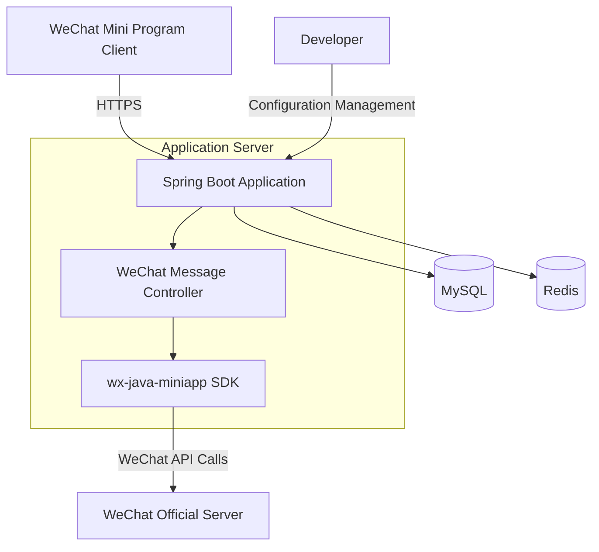

## System Architecture

## System Overview

This section outlines the core functionalities, business domains, and architectural patterns of the WeChat Mini Program Java backend project.

* **Core Functionalities and Business Domains:**  
  The project serves as the backend for a WeChat Mini Program, with core functionalities including integration with the WeChat Mini Program platform, handling message server configuration, user authentication, and data interactions. The business domain focuses on supporting Mini Program development within the WeChat ecosystem.

* **Architectural Pattern:**  
  Adopts a **monolithic application** architecture.

* **Supporting Evidence for Architectural Pattern:**  
    * Based on the `Dockerfile`, the entire application is packaged as a single JAR file (`weixin-java-miniapp-demo-1.0.0-SNAPSHOT.jar`) and launched via a single entry point.
    * The project directory structure lacks `services/` or similar microservice divisions.
    * Application configuration (`application.yml.template`) is centrally managed, with no indication of independent configurations for multiple services.
    * The build process (`mvn clean package`) generates a single deployable unit, consistent with monolithic application characteristics.

## Core Components and Functional Diagram

This section details the system's main components and their responsibilities, supplemented with insights specific to WeChat Mini Program backends.

* **Traffic Entry Layer:**
    * **Components and Responsibilities:**  
      Directly exposes the embedded Tomcat server in Spring Boot as the traffic entry point, handling HTTP/HTTPS requests. The absence of additional API gateways or load balancers suggests a smaller scale or development/demo phase.
    * **Implementation Considerations:**  
      The embedded server simplifies deployment in development environments; production environments may require Nginx as a reverse proxy for load balancing and SSL termination.

* **Application Service Layer:**
    * **Service List and Core Functionalities:**  
      - **WeChat Mini Program Integration Service:**  
        *Primary Responsibilities:* Implements integration with WeChat Mini Program APIs, including message reception/reply, user authentication, and data encryption/decryption.  
        *Technical Foundation:* Java 8 + Spring Boot framework, leveraging the `wx-java-miniapp` SDK for WeChat protocol handling.  
        *Internal Structure Insights:* Logging configurations suggest core package paths as `com.github.binarywang.demo.wx.miniapp` and `cn.binarywang.wx.miniapp`, likely containing controllers, service layers, and WeChat SDK adaptation modules.
    * **Asynchronous Tasks and Background Processing:**  
      No explicit message queue or asynchronous processor configurations are present, but WeChat event handling may require asynchronous tasks (e.g., template message sending). Future enhancements could introduce RabbitMQ or Redis as task queues.

* **Data Management Layer:**
    * **Data Storage Components and Responsibilities:**  
      No explicit database configurations are provided, but a WeChat Mini Program backend typically requires:  
      - **Relational Database (e.g., MySQL):** Stores structured data like user information and session data.  
      - **Redis:** Caches frequently refreshed WeChat API credentials (e.g., `access_token`) due to their short validity periods.  
    * **Data Responsibilities and Selection Rationale:**  
      MySQL offers transactional support for core data, while Redis's high throughput suits credential caching. AESKeys for WeChat message encryption should be managed via secure mechanisms (e.g., Vault) rather than hardcoding.

## Container Configuration Overview

This section summarizes containerization configurations identified from deployment files.

| Service Name | Container Image | Exposed Ports | Mounted Volumes | Key Environment Variables | Startup Command/Entry Point |
|--------------|-----------------|--------------|-----------------|---------------------------|-----------------------------|
| Spring Boot Application | Built on `openjdk:8-jdk-alpine` | Not explicitly exposed (default 8080) | `/tmp` volume | Configures entropy source via `-Djava.security.egd` | `java -jar /app.jar` |

*Note: `docker-compose.yml` is not provided; the table is derived solely from the `Dockerfile`. Production environments require additional database and cache service configurations.*

## Inter-Service Collaboration and Data Flow

This section describes data interaction patterns between internal and external components.

* **Core Communication Paths:**  
  1. WeChat Mini Program Client → (HTTPS) → Spring Boot Application → (WeChat API) → WeChat Server  
  2. Internal application calls to `wx-java-miniapp` SDK for encryption/decryption and API requests.

* **Interaction Patterns and Protocols:**  
  - Primarily synchronous HTTP calls; WeChat Server and backend authenticate messages via preconfigured Token and AESKey.  
  - No explicit inter-service calls, consistent with monolithic architecture characteristics.

* **Sharing and Isolation:**  
  All modules share the same JVM process and potential data sources, lacking microservice-level isolation.

## Overall Architecture Diagram (Mermaid Syntax)



## Architect's Key Insights and Future Outlook

This section analyzes critical architectural considerations and evolution directions.

* **Elasticity and Scalability Strategies:**  
  The current monolithic architecture can handle initial loads via vertical scaling (increasing single-instance resources). Horizontal scaling would require statelessness (e.g., externalizing sessions to Redis).

* **High Availability and Resilience Design:**  
  - WeChat `access_token` synchronization in clustered environments necessitates centralized storage (e.g., Redis).  
  - Production deployments should use multiple application instances with Nginx load balancing.

* **Security Defense Mechanisms:**  
  - WeChat AESKeys and Secrets should be injected via environment variables or key management services to avoid hardcoding.  
  - Enable Spring Security to protect management endpoints.

* **Operational Observability and Automation:**  
  - Supplement with Prometheus + Grafana for JVM and API performance monitoring.  
  - Extend Travis CI builds into a full CI/CD pipeline.

* **Performance Optimization Potential:**  
  - Cache WeChat API responses (e.g., user info) in Redis.  
  - Optimize database connection pools (e.g., HikariCP configurations).

* **Technology Stack Rationale Assessment:**  
  Java 8 + Spring Boot suits stable enterprise development, but upgrading to JDK 11+ is recommended for modern features. The maintainability of `wx-java-miniapp` SDK should be evaluated.

* **Future Evolution Paths:**  
  - If functionalities grow, split into microservices by domain (e.g., user service, message service).  
  - Introduce Spring Cloud components (e.g., Gateway, Config) to manage complexity.  
  - Event-driven expansion: Use Kafka for user behavior events to support real-time analytics.

You are a professional translation assistant. Please accurately translate the following content into the target language.  
Strictly adhere to the following guidelines:  
1. Maintain consistency with the original text's semantics, context, and style.  
2. Preserve the original hierarchical structure and numbering system in full.  
3. Strictly retain all formatting elements from the original text, such as code block identifiers (```text/```, ```mermaid/```), etc.  
4. Translate only the natural language content, without any format adjustments, content additions, or explanatory processing.  
5. Output only the translated result of the original text, without any additional prompt information.  

Content to be translated:  

Target language code: en

