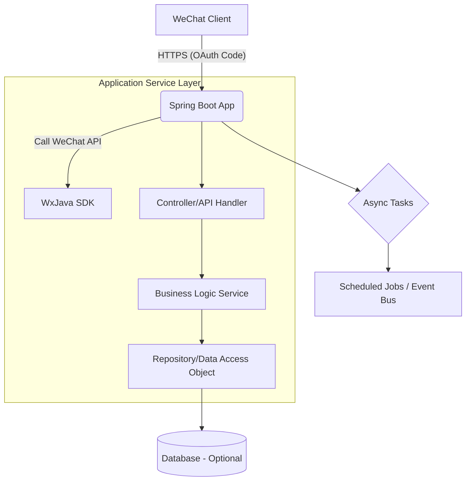

## System Architecture

## System Overview

This section provides a comprehensive overview of the backend system's functional positioning, architectural style, and technology selection, laying the foundation for subsequent in-depth analysis.

* **Core Project Functions and Business Domain:**  
  This project is an example backend service engineering solution targeting the WeChat Mini Program platform. Its primary goal is to demonstrate how to use the Java technology stack to integrate and develop backend services that comply with official WeChat interface specifications, covering modules such as user login authentication, message push handling, and payment integration. The project is suitable for enterprises or developers who need to quickly set up WeChat ecosystem service capabilities.

* **Architectural Pattern:**  
  This project adopts a **monolithic application architecture (Monolithic Architecture)**.

* **Basis Supporting the Architectural Pattern:**  
  - There exists only one main `Dockerfile` located under `/src/main/docker/`, used to build a single executable JAR application;
  - All source code is centralized within a standard Maven project structure without evidence of multiple independent service directories (e.g., `services/user`, `services/order`);
  - Configuration files are centrally managed in `application.yml.template`, indicating centralized rather than distributed configuration across microservices;
  - No clues related to inter-service communication mechanisms were found (such as gRPC, Feign Client, or message middleware configurations);
  - The Travis CI build script shows a single packaging command `"mvn clean package"`, further confirming monolithic deployment characteristics.

---

## Core Components and Functional Spectrum

This section organizes various core components constituting the system and their respective responsibilities from three dimensions: traffic entry layer, application service layer, and data management layer.

* **Traffic Entry Layer:**
    * **Components and Responsibilities:** Currently, there is no explicit definition of reverse proxy or gateway-type container configurations (e.g., Nginx, Traefik). However, considering typical production environments usually place such components upfront to handle duties like SSL termination, routing forwarding, rate limiting, and circuit breaking, these should be assumed to exist on the infrastructure side in this architecture.
    * **Implementation Considerations:** In a monolithic architecture, access control roles are generally undertaken by load balancers combined with Nginx at edge nodes; if directly exposed, it relies on Spring Boot’s embedded Tomcat to process HTTP requests.

* **Application Service Layer:**
    * **Service List and Core Functions:**
        * **Primary Responsibilities:** Encapsulate business logic relevant to WeChat Mini Programs, including but not limited to parsing OAuth login callbacks, sending template messages, receiving and validating payment notifications, etc.
        * **Technical Foundation:** Developed based on **Java 8 + Spring Boot framework**, leveraging the open-source SDK [WxJava](https://github.com/Wechat-Group/WxJava) to rapidly connect with WeChat Public Platform APIs.
        * **Internal Structural Insights:** Although specific package structure code snippets are not provided, namespace naming suggests possible typical module divisions as follows:
            - `controller/`: Interfaces for external HTTP connections
            - `service/`: Encapsulation of business logic
            - `dto/`: Definitions of Data Transfer Objects
            - `config/`: Initialization of WeChat clients and registration of related Beans
    * **Asynchronous Tasks and Background Processing:**
        * At present, there is no trace of asynchronous consumer components such as Celery or RabbitMQ. However, scenarios involving WeChat often include non-real-time operations such as delayed message delivery and scheduled cleanup of expired sessions. Therefore, introducing lightweight scheduling frameworks (Quartz/Spring Task) or event bus support is recommended for future development.

* **Data Management Layer:**
    * **Data Storage Component Identification and Responsibilities:** 
        * Due to the absence of database connection strings and other information, it is temporarily impossible to confirm whether external persistent storage has been enabled. However, combining common practices within the Spring Boot ecosystem strongly suggests using an in-memory database (H2) for demonstration purposes, which would later be replaced with MySQL/PostgreSQL upon formal deployment.
    * **Data Responsibilities and Technology Selection Considerations:**
        * If an external database is enabled, relational databases are recommended to ensure transactional consistency, especially for sensitive tables such as orders and payment logs.
        * Redis can serve as a choice for session storage and caching hot data to improve response speed and concurrent throughput.

---

## Container Configuration Summary

This section aggregates basic containerized service information identified through analyzing deployment descriptors to facilitate understanding of the system's runtime form and resource allocation.

| Service Name            | Container Image                | Exposed Ports          | Volumes      | Key Environment Variables | Startup Command/Entrypoint                             |
| :---------------------- | :----------------------------- | :--------------------- | :----------- | :------------------------ | :----------------------------------------------------- |
| `miniapp-backend`       | `openjdk:8-jdk-alpine`         | Randomly assigned default port | `/tmp`       | `N/A`                     | `["java", "-Djava.security.egd=file:/dev/./urandom", "-jar", "/app.jar"]` |

---

## Inter-Service Collaboration and Data Flow

This section focuses on internal and external interaction behaviors within the system to reveal request chains and service communication methods.

* **Core Communication Pathway:** Users initiate authorization requests via WeChat client → Mini Program calls WeChat Open Interface to obtain code → Backend receives code and exchanges it for access_token/session_key → Returns user identity identifier back to frontend for continued interaction.
* **Interaction Mode and Protocols:** Mainly depends on HTTPS protocol carrying JSON-formatted RESTful API interactions; internal method invocations follow traditional MVC hierarchical calling models.
* **Sharing and Isolation:** As part of a monolithic architecture, all business modules share the same JVM context and database connection pool resources, so there is currently no requirement for service-level isolation.

---

## Overall Architecture Diagram (Mermaid Syntax)



---

## Key Architectural Insights and Future Outlook

This section delves into key advantages, potential risks, and developmental directions surrounding this monolithic architecture.

* **Scalability Strategy:** Current version struggles with horizontal scaling due to its single-process model. Elastic scalability could be achieved by transitioning to a microservices cluster orchestrated by Kubernetes.
* **High Availability and Resilience Design:** High risk of single points of failure makes multi-replica deployments along with health check probe mechanisms advisable for enhanced fault tolerance.
* **Security Defense System:** Basic logging level recording functionality already exists; next steps should involve strengthening JWT/OAuth2 authentication auditing processes and implementing secure transmission measures for sensitive parameters.
* **Observability and Automation Operations:** Missing monitoring hooks for Prometheus/Grafana and lack of ELK log collection solutions hinder troubleshooting and capacity planning efforts.
* **Performance Optimization Potential:** Frequent calls to WeChat interfaces may lead to blocking waits; consider adding local cache layers to reduce repeated request frequency.
* **Reasonableness Evaluation of Tech Stack:** Java + Spring Boot offers mature community support suitable for building stable and reliable backend services.
* **Data Consistency Strategies (if applicable):** Since cross-service transaction coordination issues do not currently arise, special distributed consistency guarantees are unnecessary.
* **Future Evolution Pathways and Technical Introductions:**  
  It is recommended to gradually transition toward a microservices architecture for demand-based scaling; exploring OpenTelemetry adoption can enhance full-link tracing capabilities; long-term goals might include serverless transformation to reduce hosting costs.

You are a professional translation assistant. Please accurately translate the following content into the target language.
Please strictly adhere to the following specifications:
1. Maintain consistency with the original text's meaning, context, and style.
2. Completely preserve the original hierarchical structure and numbering system.
3. Strictly retain all formatting elements of the original text, such as code block identifiers (```text/```,```mermaid/```, etc.).
4. Only translate natural language content; do not perform format adjustments/content supplementation/explanatory processing.
5. Only output the translation result of the original text; do not output any additional prompt information.

Content to be translated:


Target language code: en

