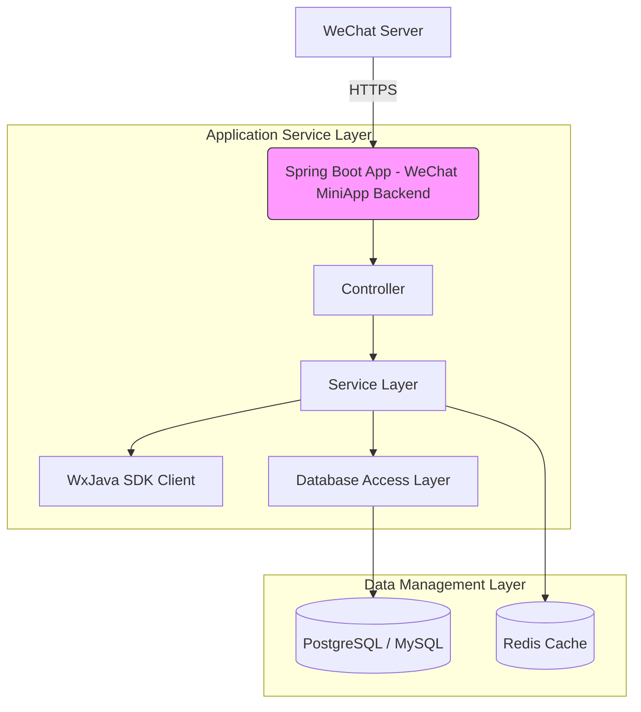

## System Architecture

## System Overview

This project is a Java application designed to demonstrate and support backend services for WeChat Mini Programs, primarily handling message push notifications, API calls, and user behavior-related business logic from the WeChat platform. The system focuses on providing standardized access support for lightweight applications within the WeChat ecosystem.

* **Core Functions and Business Domains:**  
  This project mainly serves developers of WeChat Mini Programs by offering unified and standard backend integration capabilities, including but not limited to:
  - Maintenance of WeChat login sessions;
  - Receiving and responding to messages (text, images, etc.);
  - Parsing and managing user information;
  - Handling payment notification callbacks;
  - Exchanging authorization codes for session_key and openid;

* **Architectural Pattern:**  
  Monolithic Application Architecture (Monolithic Architecture)

* **Rationale Behind Architectural Choice:**  
  - All services are encapsulated within a single standalone application module with no identifiable independent service modules or subdirectory structures;
  - There exists only one Dockerfile indicating that the entire system is packaged into a single container image;
  - Developed using the Spring Boot technology stack, typically used for building integrated web applications rather than distributed microservices;
  - Configuration files are centralized in application.yml, aligning with common configuration management practices in monolithic apps;
  - Lacks traces of typical microservice infrastructure such as service registries or gateway routing;

---

## Core Components and Functional Spectrum

The system consists of three layers: the traffic entry layer responsible for receiving external requests; the application service layer hosting core business logic; and the data management layer used for persistence and temporary storage.

* **Traffic Entry Layer**  
  * **Components and Responsibilities:** Since there's no explicit reverse proxy or API Gateway configured, in production environments, external traffic would first reach load balancers or CDN layers before being forwarded to the application server. In local testing or small deployments, Spring Boot’s embedded Tomcat directly exposes ports to serve externally.
  * **Implementation Considerations:** It is recommended in actual deployment scenarios to introduce Nginx or Traefik as front-end proxies to implement features like TLS termination, rate limiting, and service protection.

* **Application Service Layer**  
  * **Service List and Core Functions:**
    * **WeChat Mini Program Backend Service (`weixin-java-miniapp-demo`)**
      * **Primary Responsibilities:** Implements standard integration workflows required by WeChat Mini Programs such as user authentication, message decryption, and processing payment callback events.
      * **Technical Foundation:** Built upon Java + Spring Boot, leveraging the WxJava SDK to encapsulate interactions with WeChat Open Platform APIs.
      * **Internal Structure Insight:** Code organization may include modules like controller (handling HTTP requests), service (executing business logic), config (initializing WeChat clients).

  * **Asynchronous Tasks and Background Processing:** Current code does not explicitly show background task mechanisms (such as Quartz or ScheduledExecutor). However, real-world scenarios might involve periodic tasks like cleaning up expired sessions or refreshing access tokens. Future enhancements could integrate Spring Task Scheduling for this purpose.

* **Data Management Layer**  
  * **Identified Data Storage Components and Responsibilities:**
    - **Main Database (Assumed):** Possibly MySQL or PostgreSQL for storing user profiles, order records, or other business-related data;
    - **Cache Middleware (Assumed):** Redis can be used for session caching, token caching, and other high-performance read/write needs;
    - **Message Queue (Assumed):** If event-driven models are involved, RabbitMQ/Kafka can handle asynchronous message consumption;
  * **Data Responsibility and Selection Rationale:**  
    - Databases store structured user data and business entities;
    - Caching improves response times for frequently accessed data;
    - Message queues decouple time-consuming operations (e.g., sending emails, logging) to improve overall throughput;

---

## Container Configuration Summary

This section summarizes key containerization parameters extracted from files such as `Dockerfile` and `.travis.yml`:

| Service Name             | Container Image          | Exposed Ports         | Volumes     | Key Environment Variables | Startup Command / Entrypoint                                                                 |
| :------------------------ | :------------------------ | :-------------------- | :---------- | :------------------------- | :-------------------------------------------------------------------------------------------- |
| weixin-java-miniapp-demo | openjdk:8-jdk-alpine     | Default port 8080     | `/tmp`      | `N/A`                      | `["java","-Djava.security.egd=file:/dev/./urandom","-jar","/app.jar"]`                        |

---

## Inter-Service Collaboration and Data Flow

As a monolithic application, internal modules collaborate via function calls, while external traffic enters through HTTP routing into the Controller layer.

* **Core Communication Path:**  
  External request from WeChat servers over HTTPS → Processed by Spring MVC controllers → Invokes Service layer for business logic execution → Writes to database if persistence needed, uses cache for fast responses;

* **Interaction Models and Protocols:**  
  - Communicates with WeChat servers using RESTful HTTP(S);
  - Internal inter-module communication achieved through Spring Bean injection;
  - Logs and debugging info output via SLF4J to console or log files;

* **Sharing vs Isolation:**  
  As it follows a monolithic architecture, there are no concerns regarding resource isolation at the service level—all components share the same JVM instance, class loader, and database connection pool;

---

## Overall Architecture Diagram (Mermaid Syntax)



---

## Architectural Insights and Future Outlook

Although the current system adopts a simple yet efficient monolithic architecture, it still has significant room for evolution and scalability.

* **Scalability and Elasticity Strategy:**  
  Currently deployed as a single node; horizontal scaling via Kubernetes Pods can address short-term peak loads. Long-term improvements should consider transitioning to a microservices architecture for finer-grained scaling control;

* **High Availability and Resilience Design:**  
  High risk of single points of failure; recommend deploying at least two replicas along with health check probes, plus enabling master-slave replication for databases to ensure data reliability;

* **Security Defense Framework:**  
  - Use HTTPS encryption for communications;
  - Store sensitive credentials (appid/secret/aesKey) securely via Vault or Kubernetes Secrets;
  - Implement identity authentication and access control using JWT/OAuth2;

* **Observability and Automation Operations:**  
  - Integrate Prometheus + Grafana for metric collection and visualization;
  - Centralized log aggregation and analysis using ELK Stack;
  - CI/CD pipeline currently implemented via Travis CI; future migration to GitHub Actions with automated Helm chart deployment is advised;

* **Performance Optimization Potential:**  
  - Leverage Redis to cache frequently accessed token/session data;
  - Optimize slow database queries and indexing strategies;
  - Properly configure thread pools and utilize async non-blocking I/O to enhance concurrent performance;

* **Evaluation of Technology Stack Suitability:**  
  - Java + Spring Boot represents a mature enterprise-grade solution suitable for medium-to-large teams;
  - WxJava SDK provides robust and convenient integration with WeChat platforms;
  - Ideal for rapid deployment of small-to-medium scale WeChat ecosystem applications;

* **Data Consistency Strategy (if applicable):**  
  Not currently involving cross-service transactions; however, when migrating toward multiple services, patterns like Saga or Event Sourcing can help resolve distributed consistency challenges;

* **Future Evolution Path and Technology Adoption:**  
  - Evolve towards microservices architecture by splitting into domain-specific sub-services (e.g., auth-service, order-service);
  - Adopt Istio service mesh for enhanced governance;
  - Combine with Serverless Functions for event-driven computing;
  - Gradually introduce AI/ML modules tailored for personalized recommendations and data analytics use cases;

You are a professional translation assistant. Please accurately translate the following content into the target language.
Please strictly adhere to the following specifications:
1. Maintain consistency with the original text's semantics, context, and style.
2. Completely preserve the original hierarchical structure and numbering system.
3. Strictly retain all formatting elements of the original text, such as code block identifiers (```text/```,```mermaid/```, etc.).
4. Only translate natural language content; do not perform format adjustments/content supplementation/explanatory processing.
5. Only output the translation result of the original text; do not output any additional prompt information.

Content to be translated:


Target language code: en

