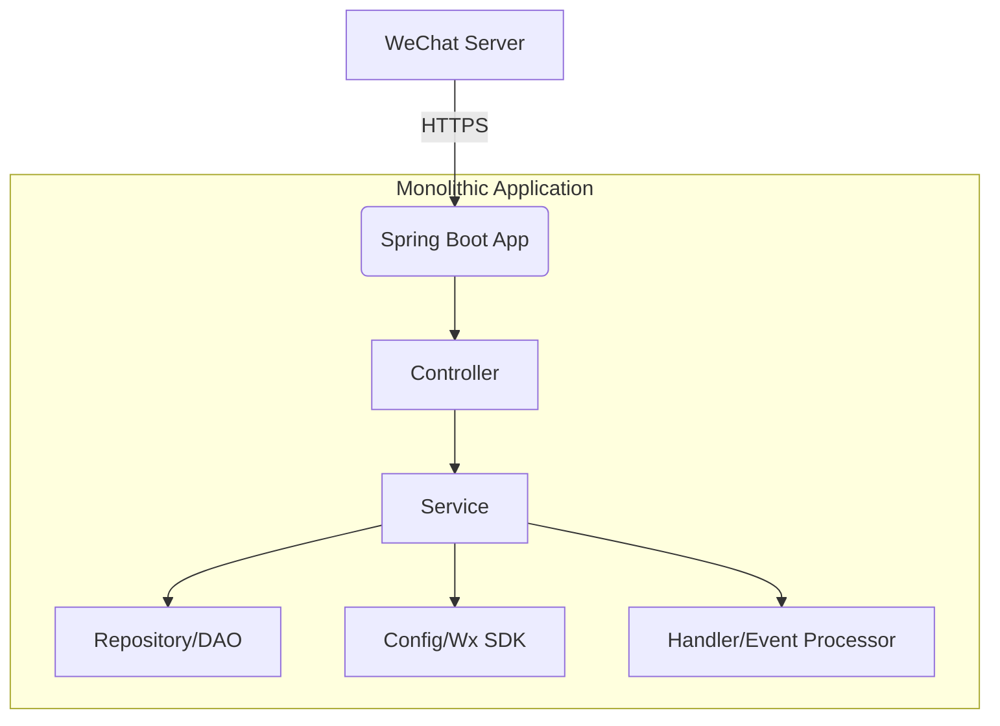

## System Architecture

## System Overview

This backend project is a Java microservice application targeting the WeChat Mini Program platform, primarily used to access and process messages and service requests from the WeChat ecosystem. Built on Spring Boot, it exhibits standard enterprise-level web application characteristics and leverages Docker for containerized deployment support.

* **Core Functions and Business Domains:**
  This project focuses on providing backend service capabilities for WeChat Mini Programs, including but not limited to:
  - Receiving and responding to various event notifications pushed by the WeChat platform;
  - Handling user login, authorization, and session management;
  - Supporting data interaction and business logic execution through API calls initiated from the Mini Program client;

  The relevant business domains include social e-commerce, O2O, local life services, and other applications requiring deep integration with WeChat's open capabilities.

* **Architectural Pattern:**
  The current architecture of this project manifests as a **monolithic application**, although its namespace or module structure may imply potential migration towards a microservices approach.

* **Basis for Architectural Pattern Support:**
  - Only one `Dockerfile` exists at `/src/main/docker/`, indicating that the entire application is packaged into a single JAR and runs within a single service instance;
  - There are no multiple independent service directories (e.g., `services/user`, `services/order`) or distinct services defined in multiple `docker-compose.yml` files;
  - A unified Spring Boot configuration file (`application.yml`) is used to centrally manage all configurations;
  - No traces of typical microservice infrastructure such as service discovery, load balancing, or distributed tracing are present;

## Core Components and Functional Spectrum

The system consists of several key layers responsible for receiving external traffic, executing core business logic, and managing data resources.

* **Traffic Entry Layer:**
    * **Components and Responsibilities:**
      Currently, the project itself acts as an HTTP request receiver without explicit reverse proxy or API gateway configurations. However, in production environments, gateways like Nginx or Traefik are typically placed upfront to handle SSL termination, routing forwarding, etc.
    * **Implementation Considerations:**
      It is recommended to add external traffic control nodes during actual deployment to enhance security, rate limiting capability, and support for grayscale releases.

* **Application Service Layer:**
    * **Service List and Core Functions:**
        * **Primary Responsibilities:**
          Providing fundamental service capabilities tailored for WeChat Mini Programs, covering user authentication, message parsing and response, payment callback handling, etc.
        * **Technical Foundation:**
          Developed using Java 8 + Spring Boot, with Maven employed for dependency management and packaging. An OpenJDK image based on Alpine Linux is selected to reduce container size and improve startup speed.
        * **Internal Structural Insights:**
          Based on the typical Spring Boot structure, it likely includes the following modules:
          - `controller/`: Exposing RESTful interfaces externally;
          - `service/`: Implementing specific business logic;
          - `config/`: Configuration classes loading WeChat credentials;
          - `handler/`: Custom handlers interfacing with WeChat platform events;
          - `dto/`: Data Transfer Objects encapsulating request/response parameters;

    * **Asynchronous Tasks and Background Processing:**
      Since there is no clear indication of task scheduling or message middleware configuration, asynchronous task mechanisms have not yet been enabled in the current version. However, considering possible long-running processes required by the WeChat platform (such as template message sending, analytics reporting), future enhancements might involve introducing lightweight job queues (e.g., RabbitMQ + Spring Task) for decoupling purposes.

* **Data Management Layer:**
    * **Identified Data Storage Components and Their Roles:**
      No database or persistence components are explicitly shown in the current configuration. However, given WeChat-related features, it is highly probable that the following types of storage will be involved:
      - User state caching (Session/Cookie mapping) → Redis cache;
      - Mini Program user profiles, order records → MySQL or PostgreSQL;
      - Log archiving → Elasticsearch/Kibana;
    * **Data Responsibility and Selection Considerations:**
      If expanded later, appropriate data sources can be chosen according to factors such as access frequency and transactional requirements:
      - Internal state maintenance should prioritize Redis for high-performance read/write operations;
      - Structured business data tends toward relational databases to ensure ACID properties;
      - Asynchronous communication could utilize Kafka/RabbitMQ to address coupling issues between upstream and downstream systems;

## Container Configuration Summary

This section summarizes container-related information extracted from the project:

| Service Name            | Container Image         | Exposed Ports      | Volumes   | Key Environment Variables | Startup Command / Entrypoint                                                                                   |
| :---------------------- | :---------------------- | :----------------- | :-------- | :------------------------ | :------------------------------------------------------------------------------------------------------------- |
| `weixin-miniapp-service` | `openjdk:8-jdk-alpine`   | Not mapped by default | `/tmp`    | None explicitly declared  | `["java", "-Djava.security.egd=file:/dev/./urandom", "-jar", "/app.jar"]`                                      |

> Note: The above table reflects known information only. If additional services (e.g., DB, Cache) are introduced in actual deployments, updates here would be necessary.

## Inter-Service Collaboration and Data Flow

Currently, the project functions as a monolithic application where internal modules coordinate via function calls or the Spring IoC container, without involving cross-network service invocations.

* **Core Communication Path:**
  External clients (WeChat servers) initiate HTTPS requests to the Controller layer of the Spring Boot application, which routes them to designated methods via HandlerMapping. Subsequently, these requests proceed into the Service layer to execute business logic before returning results back to the client.

* **Interaction Patterns and Protocols:**
  Mainly adopts synchronous REST-over-HTTP interactions, aligning with traditional Web MVC patterns.

* **Sharing and Isolation:**
  All business logic executes within the same process, sharing memory address space; hence, inter-service isolation concerns need not be specially addressed during development phases.

## Overall Architecture Diagram (Mermaid Syntax)



## Key Architectural Insights and Future Outlook

With business growth and technological evolution, while the existing architecture meets initial needs, gradual progression toward more elastic and governable directions remains essential.

* **Scalability and Elasticity Strategies:**
  The current application design relies on states (session and local caches), making horizontal scaling difficult. Subsequent improvements could involve integrating Redis Session Store or adopting JWT Tokens instead of Cookies to achieve stateless services.

* **High Availability and Resilience Design:**
  Single points of failure pose significant risks. Multi-replica deployment strategies should be planned alongside health check probes and Kubernetes self-healing mechanisms to enhance stability.

* **Security Defense Framework:**
  Placeholder fields for WeChat secrets exist but lack encryption protection measures. It is advisable to adopt tools like Vault or AWS Secrets Manager to strengthen sensitive information safeguards.

* **Operational Observability and Automation:**
  Basic compilation workflows have been configured using Travis CI, yet missing elements include test coverage reports, static scanning toolchains, and one-click deployment scripts. Incorporating monitoring suites like Prometheus + Grafana is recommended.

* **Performance Optimization Potential:**
  Extensive debug-level logging impacts throughput and should be adjusted accordingly. Additionally, frequent calls to WeChat APIs could benefit from local caching to reduce latency.

* **Technology Stack Rationality Assessment:**
  Java + Spring Boot represents a mature and stable combination suitable for enterprise-grade WeChat backend construction, offering relatively low learning curves for teams.

* **Data Consistency Strategy (if applicable):**
  No distributed transaction scenarios currently exist. Should the system evolve into microservices, reevaluation of Saga workflow controls and compensation mechanism designs becomes necessary.

* **Future Evolution Path and Technology Adoption:**
  Later stages may consider abstracting core functionalities into reusable SDKs or offloading frequently accessed endpoints into BFF (Backend For Frontend) microservices. In the longer term, exploring serverless computing models for lightweight event processing tasks holds promise.

You are a professional translation assistant. Please accurately translate the following content into the target language.
Please strictly adhere to the following specifications:
1. Maintain consistency with the original text's semantics, context, and style.
2. Completely preserve the original hierarchical structure and numbering system.
3. Strictly retain all formatting elements of the original text, such as code block identifiers (```text/```,```mermaid/```, etc.).
4. Only translate natural language content; do not perform format adjustments/content supplementation/explanatory processing.
5. Only output the translation result of the original text; do not output any additional prompt information.

Content to be translated:


Target language code: en

