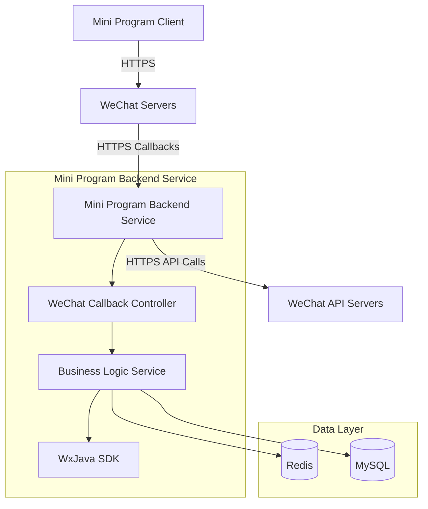

## System Architecture

## System Overview

This section outlines the core functionalities, business domains, and architectural patterns of the WeChat Mini Program Java backend project.

* **Core Functionalities and Business Domains:**  
  This project is a Java-based backend service for WeChat Mini Programs, with core functionalities including:  
  * Integration with WeChat Mini Program APIs (message server configuration, user authentication, data interaction)  
  * Mini Program business logic processing  
  * Secure communication with WeChat servers (Token and AESKey validation)  
  * Logging and debugging support  

* **Architectural Pattern:**  
  The project adopts a **monolithic application architecture**.  

* **Supporting Evidence for Architectural Pattern:**  
  * The `Dockerfile` builds only a single executable JAR file (`app.jar`), indicating all functional modules are packaged into one application  
  * The project structure does not exhibit microservices characteristics (e.g., no standalone `services/` directory)  
  * Uses the Spring Boot framework (confirmed via `application.yml` configuration), a typical monolithic application technology stack  
  * Deployment configuration (Travis CI) targets only a single build artifact  
  * No evidence of inter-service communication or service discovery in configuration files  

## Core Components and Functional Map

This section details the system's main components and their responsibilities, supplemented with best practices for WeChat Mini Program backends.

* **Traffic Entry Layer:**  
    * **Components and Responsibilities:**  
        * WeChat servers: Serve as the sole entry point for external traffic, communicating with the backend service via HTTPS  
        * Potential reverse proxy (e.g., Nginx): Although not explicitly configured, may be used in production for load balancing and SSL termination  
    * **Implementation Considerations:**  
        * WeChat Mini Programs mandate HTTPS, requiring effective SSL certificate management  
        * Message server validation must handle WeChat's GET requests (Token validation)  

* **Application Service Layer:**  
    * **Service Inventory and Core Functionalities:**  
        * WeChat Mini Program backend service (monolithic):  
            * **Primary Responsibilities:**  
                * Process messages and events pushed by WeChat servers  
                * Implement Mini Program business logic  
                * Manage WeChat API calls (e.g., fetching user information, sending template messages)  
                * Handle encryption/decryption logic (AES-256-CBC)  
            * **Technical Foundation:**  
                * Java 8 (OpenJDK)  
                * Spring Boot framework  
                * WxJava library (`cn.binarywang.wx.miniapp` package)  
            * **Internal Structure Insights:**  
                * Typical Spring Boot layered architecture:  
                    * `controller/`: Handles WeChat server callbacks and Mini Program APIs  
                    * `service/`: Business logic and WeChat API encapsulation  
                    * `config/`: WeChat configuration management  
                    * `util/`: Utility classes for encryption/decryption  

    * **Asynchronous Tasks and Background Processing:**  
        * Current configuration shows no explicit asynchronous processing components  
        * Potential requirements:  
            * Asynchronous sending of WeChat template messages  
            * Background processing for time-consuming operations (e.g., report generation)  
        * Possible expansion directions:  
            * Introduce Spring's `@Async` annotation  
            * Integrate RabbitMQ or Kafka for event-driven processing  

* **Data Management Layer:**  
    * **Data Storage Components and Responsibilities:**  
        * Current configuration does not explicitly show database integration  
        * Based on typical WeChat Mini Program requirements, may include:  
            * Redis: Caching WeChat access_token (to avoid frequent API calls)  
            * MySQL/PostgreSQL: Storing user data and Mini Program business data  
    * **Data Responsibilities and Selection Considerations:**  
        * WeChat access_token requires caching (Redis is ideal, with a 2-hour validity period)  
        * User data requires relational databases for consistency  
        * Message logs may require Elasticsearch for search and analysis  

## Container Configuration Overview

This section lists containerized service configurations identified through deployment file analysis.

| Service Name | Container Image | Exposed Ports | Mounted Volumes | Key Environment Variables | Startup Command/Entry Point |  
|-------------|----------------|--------------|----------------|--------------------------|-----------------------------|  
| WeChat Mini Program Service | Built on `openjdk:8-jdk-alpine` | Not specified (typically 8080) | `/tmp` volume | Configured via `application.yml`:<br>- `wx.miniapp.configs`<br>- Logging levels | `java -jar /app.jar` |  

## Service Collaboration and Data Flow

This section describes data movement and interaction patterns between internal system components and external users.

* **Core Communication Paths:**  
    1. WeChat servers → (HTTPS) → Mini Program backend service  
    2. Mini Program client → (HTTPS) → WeChat servers → Mini Program backend service  
    3. Backend service → (HTTPS) → WeChat API servers  

* **Interaction Patterns and Protocols:**  
    * With WeChat servers: Synchronous HTTPS request-response  
    * Internal components: In-process method calls (monolithic architecture)  
    * Potential expansion: Asynchronous message queues (e.g., for template message processing)  

* **Sharing and Isolation:**  
    * Monolithic architecture shares the same JVM and memory space  
    * Configuration is centrally managed via Spring `Environment`  
    * Database connection pooling is shared (if integrated)  

## Overall Architecture Diagram



## Key Architect Insights and Future Outlook

This section analyzes critical architectural considerations and future evolution directions.

* **Resilience and Scalability Strategies:**  
    * Current monolithic architecture suits small-scale applications  
    * Horizontal scaling must account for WeChat message deduplication (messages may be processed by multiple instances)  
    * Recommendation: Implement scaling via Nginx load balancing + stateless design  

* **High Availability and Fault Tolerance:**  
    * WeChat access_token must be shared across clusters (Redis solution)  
    * WeChat message idempotency must be implemented  
    * Recommendation: Add health checks and automatic recovery mechanisms  

* **Security Defenses:**  
    * HTTPS is mandatory (WeChat requirement)  
    * Sensitive configurations (appid/secret) must be injected via secure channels  
    * Message encryption/decryption is implemented via WxJava  
    * Recommendation: Add request signature verification and rate limiting  

* **Operational Observability and Automation:**  
    * Current configuration includes granular logging (`cn.binarywang.wx.miniapp: debug`)  
    * Recommendation: Integrate Prometheus + Grafana for JVM and business metrics monitoring  
    * CI/CD is already automated via Travis CI  

* **Performance Optimization Potential:**  
    * WeChat access_token caching is critical  
    * Recommendation: Optimize database queries (if integrated)  
    * Potential bottleneck: Message encryption/decryption performance (AES-256-CBC)  

* **Technology Stack Rationale:**  
    * Java + Spring Boot is suitable for enterprise-level WeChat ecosystem integration  
    * WxJava is a mature WeChat SDK  
    * The stack is slightly conservative (still uses Java 8)  

* **Future Evolution Paths and Technology Adoption:**  
    * Microservices candidates:  
        - Authentication service  
        - Message processing service  
        - Business logic service  
    * Introduce Spring Cloud ecosystem (e.g., Gateway, Config Server)  
    * Consider reactive programming (WebFlux) to improve concurrency

You are a professional translation assistant. Please accurately translate the following content into the target language.  
Please strictly adhere to the following guidelines:  
1. Maintain consistency with the original text in terms of semantics, context, and style.  
2. Preserve the complete hierarchical structure and numbering system of the original text.  
3. Strictly retain all formatting elements of the original text, such as code block identifiers (```text/```, ```mermaid/```), etc.  
4. Only translate natural language content; do not perform format adjustments, content additions, or explanatory processing.  
5. Output only the translated result of the original text, without any additional prompt information.  

Content to be translated:  

Target language code: en

