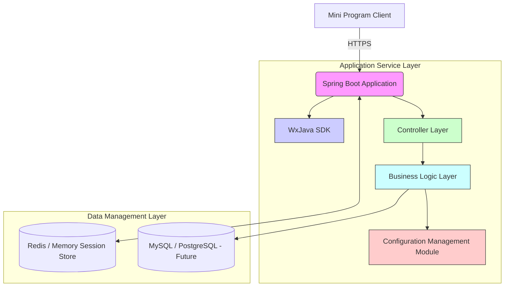

## System Architecture

## System Overview

This project is a backend service developed based on the Java technology stack, primarily designed to interface with the WeChat Mini Program platform and provide the necessary backend API support for the mini program. Its core functionalities include handling message pushes from the WeChat server, user authentication, session management, and encapsulation of related business logic. From an architectural perspective, this is a typical **monolithic application**, featuring clear functional boundaries and service capabilities.

### Core Project Functions and Business Domains:

- Support for WeChat Mini Program integration: completing fundamental communication mechanisms such as identity verification, message decryption, and Token management on the WeChat platform;
- User Authentication and Authorization: providing OAuth-like login state maintenance and user information retrieval for the mini program client;
- Log Debugging and Configuration Management: facilitating quick startup and troubleshooting in local or production environments;
- Standard web applications deployable in containerized environments: compatible with CI/CD processes and achieving standardized delivery through Docker.

### Architectural Pattern:

The system adopts a **Monolithic Architecture**. The basis for judgment includes:

- There exists a unified application entry point (the main class of Spring Boot), centrally hosting all business logic;
- All modules share one set of dependency management and build scripts (Maven);
- Only one `Dockerfile` exists for packaging the entire application;
- No evidence of inter-service network calls or cross-process communication mechanisms was found;
- Infrastructure commonly seen in microservices—such as service registry centers, API gateways, and Remote Procedure Call (RPC)—is absent.

### Supporting Evidence for the Architectural Pattern:

- The single `Dockerfile` build artifact indicates that the application is deployed as a whole;
- The Maven project structure does not reflect a multi-module separation characteristic of microservice organization;
- No clues regarding service splitting were observed in configuration files;
- The Travis CI automation workflow also revolves around a single project, aligning with monolithic build characteristics.

---

## Core Components and Functional Map

Although it follows a monolithic architecture, it can still be logically divided into different layers and component units according to their responsibilities.

### Traffic Entry Layer

#### Components and Responsibilities:

- **Reverse Proxy / Load Balancer (Implicit)**: Although components like Nginx or Traefik are not explicitly present, they typically reside at the front end during actual deployment, responsible for SSL termination, routing forwarding, etc.
- **Embedded Tomcat Container in Spring Boot**: Acts as the actual receiver of HTTP requests, exposing RESTful APIs externally.

#### Implementation Considerations:

- In containerized deployment scenarios, alternatives can be implemented using Kubernetes Ingress Controller or cloud provider ALBs;
- If higher-performance gateway control is needed for future expansion, dedicated API Gateways such as Kong or Zuul could be considered.

### Application Service Layer

#### Service List and Key Features:

##### weixin-java-miniapp-demo Application Service

- **Main Responsibilities:**
  - Handling various API requests initiated by the WeChat Mini Program;
  - Parsing and responding to messages pushed from the WeChat server (text, images, event notifications);
  - Providing functions such as user login, session management, permission validation;
  - Supporting developer-defined custom business logic extension points.

- **Technical Foundation:**
  - Programming Language: Java 8
  - Main Framework: Spring Boot + Spring MVC
  - Third-party SDK: WxJava (cn.binarywang.wx.miniapp)
  - Build Tool: Apache Maven
  - Containerization Solution: Alpine Linux + OpenJDK 8

- **Internal Structural Insights:**
  - Controller Layer: Exposes REST interfaces and handles requests from the mini program side;
  - Service Layer: Encapsulates specific business logic, such as user authentication and message parsing;
  - Configuration Loading Module: Reads application.yml and initializes WxMaConfig;
  - Logging and Exception Handling Module: Facilitates online tracking and error feedback.

#### Asynchronous Tasks and Background Processing:

Since there is currently no evident asynchronous task scheduling mechanism (like Celery or Quartz), nor any trace of message middleware, we infer:

- The current version has no heavy background task requirements;
- Scenarios such as integrating with WeChat Pay callbacks or sending template messages might later incorporate scheduled tasks or asynchronous queues.

### Data Management Layer

#### Identified Data Storage Components and Their Roles:

No database connection pool, ORM framework, or other persistence middleware information was found in the configurations. Therefore, we deduce:

- **Default State Storage:** Uses in-memory sessions or optional Redis for temporary data storage;
- **External Data Source Integration:** Should structured data like user profiles or order records need to be persisted, relational databases such as PostgreSQL or MySQL will be introduced in future expansions.

#### Data Responsibilities and Selection Considerations:

- **Cache (Potential):** Redis can be used for high-frequency access data such as session management and token caching;
- **Primary Database (Pending):** If structured data like user behavior or transaction logs needs to be stored in the future, MySQL or PostgreSQL would likely be chosen;
- **Logging System (Indirectly):** Logs will be outputted via files or STDOUT for easy collection into systems like ELK Stack or Fluentd.

---

## Container Configuration Overview

| Service Name            | Container Image                        | Exposed Ports         | Mounted Volumes      | Key Environment Variables                                                                                     | Startup Command/Entrypoint                                               |
| :---------------------- | :------------------------------------- | :-------------------- | :------------------- | :------------------------------------------------------------------------------------------------------------ | :----------------------------------------------------------------------- |
| `weixin-miniapp-app`    | `openjdk:8-jdk-alpine`                 | Not exposed by default| `/tmp` (temporary mount)| No explicit declaration; but parameters can be injected via JVM options (e.g., `-Dspring.profiles.active=prod`) | `["java", "-Djava.security.egd=file:/dev/./urandom", "-jar", "/app.jar"]`|

> Note: This table is generated based on the sole `Dockerfile` build result. Actual deployments may dynamically pass arguments via the `docker run` command.

---

## Inter-Service Collaboration and Data Flow

As a monolithic architecture, there's no requirement for internal cross-service communication. All requests are directly processed by the Spring Boot application, routed to corresponding Controllers, and ultimately execute relevant business logic.

### Core Communication Path:

```
[Mini Program Client] -- HTTPS --> [Spring Boot Application]
                                   ↓
                          [WxJava SDK Parses Messages]
                                   ↓
                    [Controller -> Service Layer -> Response Returned]
```

### Interaction Model and Protocols:

- **Synchronous Request-Response Model:** Mini program clients initiate API requests over HTTPS, receiving immediate responses;
- **JSON Format for Data Exchange:** Compliant with official recommended data formats from WeChat;
- **No Internal Distributed Calls Within Services:** All functionality executes within the same process.

### Sharing and Isolation:

- **Shared Library Usage:**
  - WxJava SDK serves as the core dependency package, offering comprehensive abstraction for WeChat Mini Program integration;
  - Broad reuse of Spring Framework-related components forms a stable technical foundation.
- **Data Isolation Strategy:**
  - Currently, multi-tenant or multi-instance data isolation is not involved;
  - Session states are managed by Spring Session, defaulting to memory or Redis storage.

---

## Overall Architecture Diagram (Mermaid Syntax)



---

## Key Architectural Insights and Future Outlook

### Elasticity and Scalability Strategies:

- **Limited Horizontal Scaling Capability:** Current monolithic design makes fine-grained scaling difficult;
- **Recommended Directions:**
  - Introduce external session storage (e.g., Redis Cluster) to enhance concurrent processing capability;
  - Offload compute-intensive tasks into asynchronous workers to reduce pressure on the main thread;
  - Gradually refactor toward a microservices architecture to support demand-based scaling.

### High Availability and Resilience Design:

- **Weak Fault Tolerance Mechanisms:** Lacking circuit breakers, rate limiting, and fallback strategies;
- **Improvement Opportunities:**
  - Add Resilience4j or Hystrix for failure protection;
  - Combine Prometheus + Grafana to build monitoring and alerting systems;
  - Utilize K8s Deployments for rolling updates and graceful restarts.

### Security Defense System:

- **Basic Protection Implemented:** Using HTTPS encryption, JWT signature verification, and similar methods enhances security;
- **Potential Risk Points:**
  - Sensitive fields like AppSecret should not be hardcoded in configuration files;
  - It’s advised to strengthen credential protection using secret management systems like Vault/KMS;
  - Implement request frequency limits and IP blacklists against malicious requests.

### Observability and Automation Operations:

- **Weak Log Collection:** Reliance on stdout output hinders long-term analysis;
- **Optimization Suggestions:**
  - Integrate ELK Stack or Loki for real-time log search;
  - Use Micrometer + Prometheus for collecting application metrics;
  - Deploy CI/CD pipelines (GitHub Actions/Jenkins) to accelerate iteration cycles.

### Performance Optimization Potential:

- **Hotspot Resource Contention:** Concentrated requests on a few controllers may cause bottlenecks;
- **Optimization Approaches:**
  - Enable HTTP Keep-Alive to reduce handshake overhead;
  - Employ local caching to avoid redundant computations;
  - Gradually split hot methods to improve code reusability.

### Evaluation of Technology Stack Rationality:

- **Prominent Advantages:**
  - Mature and stable Java ecosystem suitable for enterprise projects;
  - Rapid development with Spring Boot improves productivity;
  - Comprehensive encapsulation in WxJava significantly simplifies integration efforts.
- **Limitations:**
  - Slow JVM startup unsuitable for Serverless scenarios;
  - Monolithic structure不利于团队协同开发;
  - Requires more supporting components to meet complex demands.

### Data Consistency Strategy (if applicable):

- **Currently No Challenges with Distributed Transactions;**
- **Future Evolution Recommendations:**
  - Adopt Event Sourcing/CQRS patterns to handle high-concurrency writes;
  - Design Saga pattern to coordinate consistency across services.

### Future Evolution Path and Technology Introduction:

- **Short-Term Goals:**
  - Introduce asynchronous task queues (e.g., RabbitMQ/Celery alternatives) for delayed tasks;
  - Add distributed tracing (OpenTelemetry) for debugging assistance;
- **Mid-Term Planning:**
  - Decompose domain-specific services (e.g., user center, order system) towards microservices;
  - Integrate GraphQL instead of traditional REST APIs for enhanced flexibility;
- **Long-Term Vision:**
  - Explore AI-assisted customer service bots and intelligent data analytics modules;
  - Migrate to Serverless architectures to lower operational costs;
  - Construct a polyglot microservices ecosystem (Go/Python/Node.js).

You are a professional translation assistant. Please accurately translate the following content into the target language.
Please strictly adhere to the following specifications:
1. Maintain consistency with the original text's meaning, context, and style.
2. Completely preserve the original hierarchical structure and numbering system.
3. Strictly retain all formatting elements of the original text, such as code block identifiers (```text/```,```mermaid/```, etc.).
4. Only translate natural language content; do not perform format adjustments/content supplementation/explanatory processing.
5. Only output the translation result of the original text; do not output any additional prompt information.

Content to be translated:


Target language code: en

