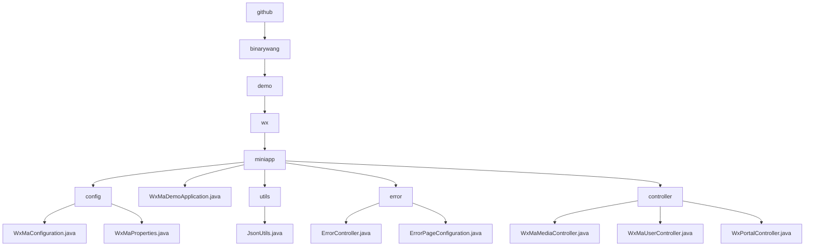

# 基础信息

|      |      |
|------|------|
| 名称 | github |
| 编码语言 | .java |
| 代码路径 | weixin-java-miniapp-demo\src\main\java\com\github |
| 包名 | docs.src.main.java.com.github |
| 概述说明 | 微信小程序后端系统，含多账号管理、消息路由、错误处理、媒体文件管理及用户会话功能，基于Spring Boot和微信SDK实现。 |

# 说明

## 概述  
该模块是微信小程序后端综合系统，核心职责包括多账号服务配置、消息路由分发和HTTP错误处理，类似网关路由与错误处理中枢。通过WxMaProperties实现多账号管理，关键数据结构含Config类（Appid/Secret）、消息路由Map及ErrorPage注册表。依赖微信SDK、Spring Web和Lombok。例如@ConfigurationProperties注入配置，MsgRouter预置五种处理器，ErrorController统一渲染错误页。

## 主要业务场景  
模块覆盖小程序全生命周期：初始化校验配置→构建多账号服务→处理消息/错误。交互模式采用事件驱动，如文本消息触发客服回复，404错误重定向预设页。完整支持微信协议（如订阅消息分发）和HTTP状态处理，典型流程包含媒体文件上传（返回media_id）、用户登录（AES解密信息）和门户交互（GET/POST双模式）。API集成案例包括二维码生成和会话维护，均基于AppID隔离实现多租户架构。

### 包内部结构视图

该流程图展示了微信小程序Demo项目的目录结构，从根目录github开始，逐级展开到binarywang、demo、wx和miniapp目录。miniapp目录下包含config、utils、error和controller等子目录，以及WxMaDemoApplication.java主程序文件。每个子目录下又包含具体的配置文件、工具类、错误处理类和控制器类，清晰地呈现了项目的模块化组织方式。

# 文件列表

| 名称   | 类型  | 说明 |
|-------|------|-------------|
| [binarywang](binarywang/_module.md) | package | 微信小程序后端系统，含多账号管理、消息路由、错误处理、媒体文件管理及用户会话功能，基于Spring Boot和微信SDK实现。 |

