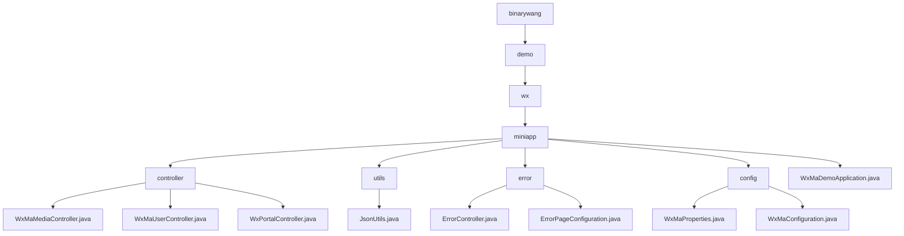

# 基础信息

|      |      |
|------|------|
| 名称 | binarywang |
| 编码语言 | .java |
| 代码路径 | weixin-java-miniapp-demo/src/main/java/com/github/binarywang |
| 包名 | docs.src.main.java.com.github.binarywang |
| 概述说明 | 该模块为微信小程序提供后端支持，涵盖媒体上传下载、用户登录、消息处理等功能。基于Spring Boot与WXJava SDK实现多小程序管理、接口路由及安全通信，支持JSON/XML解析、异常统一处理和配置动态加载，适用于企业级微信生态对接场景。 |

# 说明

## 概述

该模块为微信小程序提供后端核心支撑，涵盖用户登录、媒体资源管理、消息接收与多实例路由等功能。通过集成WXJava SDK和Spring Boot框架，实现RESTful API风格接口及多租户配置管理。例如：使用WxMaService处理凭证校验，WxMaConfig支持多小程序切换。

模块统一暴露HTTP接口，支持GET/POST请求，采用JSON/XML格式交互，并内置加解密与异常处理机制。关键数据结构包括MediaId、JSCode、Echostr、HttpStatus、ModelAndView等，配合ThreadLocal清理机制保障服务稳定性。

外部依赖项主要有WXJava Miniapp SDK、Spring Boot Web模块、Jackson库及相关日志组件。例如：JsonUtils利用ObjectMapper实现对象到JSON的格式化转换。

## 主要业务场景

模块覆盖三类核心业务流程：一是媒体上传下载（如图片获取MediaId），二是用户身份验证（如JSCode换取OpenId），三是消息订阅与事件分发（如文本消息自动回复）。系统通过Appid路由实现多小程序接入，支持明文/AES传输及多种消息类型解析。

错误处理机制统一接管404/500等异常状态，结合ErrorController与ErrorPageRegistrar实现页面跳转或响应输出。例如访问非法路径时跳转至/error/404视图。

典型应用场景包括第三方平台托管多个小程序、企业门户对接微信生态、以及需安全传递用户敏感信息的合规场景。API类型涵盖Controller层HTTP接口、SDK调用及配置注入，支持与Nginx、HTTPS网关等基础设施集成。整体架构类似事件总线模式，具备良好的扩展性和动态路由能力。

### 包内部结构视图

该流程图展示了微信小程序Java Demo项目的包结构与主要类文件之间的组织关系，涵盖了控制器、工具类、错误处理和配置等模块。

# 文件列表

| 名称   | 类型  | 说明 |
|-------|------|-------------|
| [demo](demo/_module.md) | package | 该模块为微信小程序提供后端支持，涵盖媒体上传下载、用户登录、消息处理等功能。基于Spring Boot与WXJava SDK实现多小程序管理、接口路由及安全通信，支持JSON/XML解析、异常统一处理和配置动态加载，适用于企业级微信生态对接场景。 |

