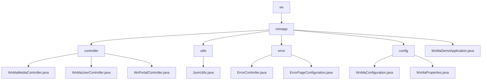

# 基础信息

|      |      |
|------|------|
| 名称 | wx |
| 编码语言 | .java |
| 代码路径 | weixin-java-miniapp-demo/src/main/java/com/github/binarywang/demo/wx |
| 包名 | docs.src.main.java.com.github.binarywang.demo.wx |
| 概述说明 | 该模块为微信小程序提供后端支持，涵盖用户认证、媒体管理、消息处理等功能，支持多应用配置切换与安全访问控制，采用RESTful API和JSON响应格式，依赖weixin-java-miniapp SDK，具备良好的扩展性和稳定性。 |

# 说明

## 概述  
该模块为微信小程序提供后端核心支撑，涵盖用户认证、媒体管理、消息路由及多应用配置切换功能。统一通过RESTful API提供服务，采用JSON交互格式并在请求结束时清理ThreadLocal变量以防止内存泄漏。例如：WxMaUserController处理登录与信息解密，WxPortalController负责消息分发。

模块接口规范统一基于Spring MVC风格设计，支持GET/POST方法调用，并兼容明文与AES加密传输方式。关键数据结构包括WxMaJscode2SessionResult（登录凭证结果）、WxMaUserInfo（用户敏感信息）和WxMpXmlMessage（微信推送消息）。外部依赖主要包括weixin-java-miniapp SDK、Spring Boot Web组件及相关HTTP客户端库。

## 主要业务场景  
模块支撑三大典型流程：用户身份验证与会话管理、临时素材上传下载、微信平台消息订阅与事件响应。交互模式类似MVC架构，前端请求经Controller解析后调用Service层处理，最终返回统一格式响应。例如：扫码登录由UserController处理，头像上传交由MediaController执行。

功能上实现了从配置加载、消息监听到客服消息推送的全链路闭环，具备良好的扩展性与集成能力。典型应用场景如企业级多租户小程序平台，可通过本模块快速搭建标准化通信入口。API类型覆盖配置注入接口与消息回调接口，支持灵活拓展新消息类型。例如：收到图片消息时自动上传并回传处理结果。

### 包内部结构视图

该流程图展示了微信小程序 Demo 项目的模块结构，其中 `wx` 作为根目录下分出 `miniapp` 子模块，`miniapp` 中包含了控制器、工具类、错误处理、配置以及主应用入口等核心组件。各模块之间层次清晰，便于理解项目整体架构与代码组织关系。

# 文件列表

| 名称   | 类型  | 说明 |
|-------|------|-------------|
| [miniapp](miniapp/_module.md) | package | 该模块为微信小程序提供后端支持，涵盖用户认证、媒体管理、消息处理等功能，支持多应用配置切换与安全访问控制，采用RESTful API和JSON响应格式，依赖weixin-java-miniapp SDK，具备良好的扩展性和稳定性。 |

