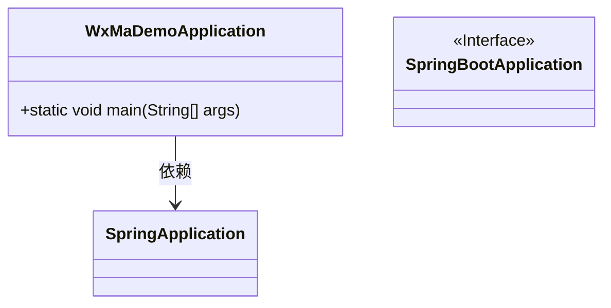
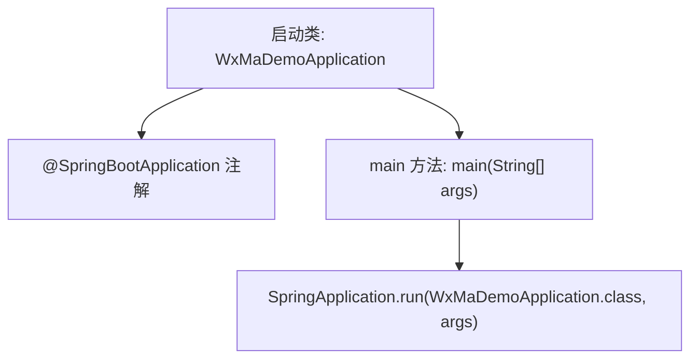

# 基础信息

|      |      |
|------|------|
| 名称 | WxMaDemoApplication |
| 编码语言 | .java |
| 代码路径 | weixin-java-miniapp-demo/src/main/java/com/github/binarywang/demo/wx/miniapp/WxMaDemoApplication.java |
| 包名 | com.github.binarywang.demo.wx.miniapp |
| 依赖项 | ['org.springframework.boot.SpringApplication', 'org.springframework.boot.autoconfigure.SpringBootApplication'] |
| 概述说明 | 这是一个Spring Boot应用程序的启动类，使用@SpringBootApplication注解标记，通过main方法启动Spring应用上下文。 |

# 说明

这是一个Spring Boot应用程序的主启动类，名为WxMaDemoApplication。该类使用@SpringBootApplication注解标记，表明这是一个Spring Boot应用的入口点。main方法中通过SpringApplication.run()方法启动整个应用程序，将WxMaDemoApplication类作为参数传入，同时传递命令行参数args。此类作为微信小程序相关功能的演示项目启动入口。

# 类列表 Class Summary

| 名称   | 类型  | 说明 |
|-------|------|-------------|
| WxMaDemoApplication | class | 这是一个Spring Boot应用程序的启动类，名为WxMaDemoApplication。该类使用@SpringBootApplication注解标记，包含main方法用于启动Spring应用上下文。 |

## 类 WxMaDemoApplication

|      |      |
|------|------|
| 访问范围 | @SpringBootApplication;public |
| 类型 | class |
| 名称 | WxMaDemoApplication |
| 说明 | 这是一个Spring Boot应用程序的启动类，名为WxMaDemoApplication。该类使用@SpringBootApplication注解标记，包含main方法用于启动Spring应用上下文。 |

### UML类图

该类图展示了一个基于Spring Boot的微信小程序应用启动类`WxMaDemoApplication`，它依赖于`SpringApplication`来运行应用上下文，并通过`@SpringBootApplication`注解标识为一个标准的Spring Boot应用程序配置入口。此类图体现了典型的Spring Boot项目启动结构。

### 内部方法调用关系图

该流程图展示了 Spring Boot 应用的启动过程。`WxMaDemoApplication` 类通过 `@SpringBootApplication` 注解标识为 Spring Boot 应用入口，`main` 方法中调用 `SpringApplication.run()` 启动应用上下文并初始化 Spring 容器。整个流程体现了标准的 Spring Boot 启动机制。

### 字段列表 Field List

| 名称  | 类型  | 说明 |
|-------|-------|------|

### 方法列表

| 名称  | 类型  | 说明 |
|-------|-------|------|
| main | void | 这是一个Spring Boot应用程序的主启动类，通过SpringApplication.run()方法启动WxMaDemoApplication应用。 |

